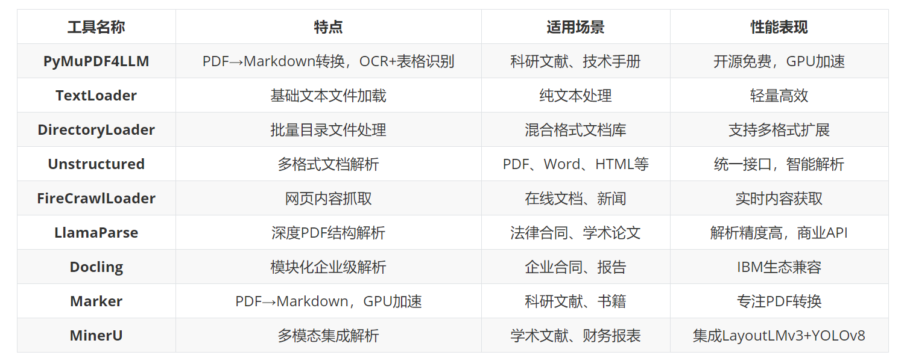
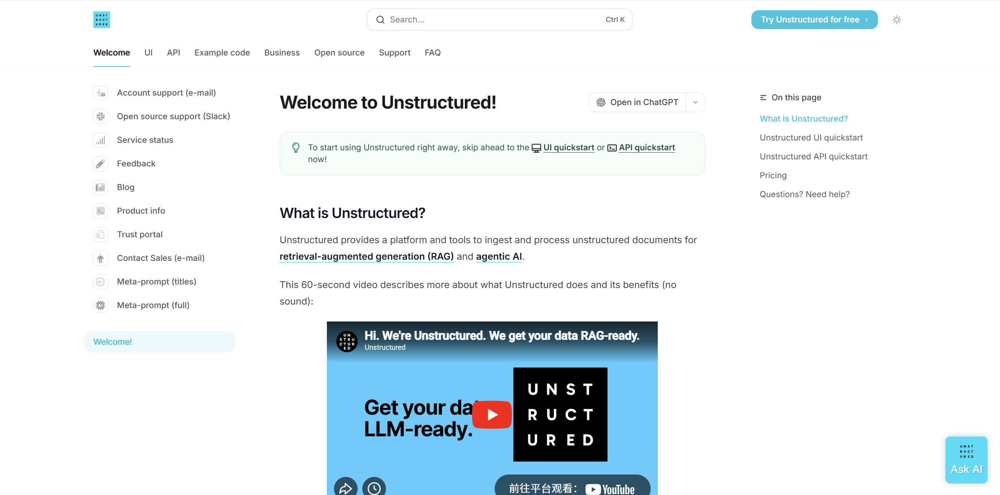

# 第一节 数据加载

虽然本节内容在实际应用中非常重要，但是由于各种文档加载器的迭代更新，以及各类 AI 应用的不同需求，具体选择需要根据实际情况。本节仅作简单引入，但请务必**重视数据加载**环节，**“垃圾进，垃圾出 (Garbage In, Garbage Out)”** ——高质量输入是高质量输出的前提。

>### 结构化数据
>
>- **定义**：格式固定、有统一字段、能直接放进**二维表格**的数据。
>- **特征**：每个字段都有明确类型和意义，可以用 `SQL` 等标准语言精确查询。
>- **常见例子**：
>  - `Excel` 表格、`CSV` 文件。
>  - 数据库中的用户表（字段：ID、姓名、年龄、性别）。
>  - 账单记录、库存清单。
>- **检索方式**：按字段精确匹配或聚合（如 `SELECT * FROM users WHERE age > 18`）。
>
>### 非结构化数据
>
>- **定义**：没有固定格式、不遵循统一数据模型的数据，**RAG的主力处理对象**。
>- **特征**：数据长度和内容自由，人类能看懂，但机器难以直接按字段理解。
>- **常见例子**：
>  - **文本**：Word 文档、PDF 论文、邮件、聊天记录、Markdown 文件（就像你代码里读取的 `easy-rl-chapter1.md`）。
>  - **多媒体**：图片、音频、视频。
>  - **其他**：网页源码、日志信息。
>- **检索方式**：需要先用 NLP、嵌入模型、语音识别等技术**提取语义**，将其转化为“向量”等可计算的形式。

## 一、文档加载器

### 1.1 主要功能

RAG 系统中，**数据加载**是整个流水线的第一步，也是不可或缺的一步。**文档加载器负责将各种格式的非结构化文档（如`PDF`、`Word`、`Markdown`、`HTML`等）转换为程序可以处理的结构化数据。**数据加载的质量会直接影响后续的索引构建、检索效果和最终的生成质量。

**文档加载器**在 RAG 的数据管道中一般需要完成三个核心任务，**一是解析不同格式的原始文档**，将 `PDF`、`Word`、`Markdown` 等内容提取为可处理的纯文本，**二是在解析过程中同时抽取文档来源、页码、作者等关键信息作为元数据**，**三是把文本和元数据整理成统一的数据结构**，方便后续进行切分、向量化和入库，其整体流程与传统数据工程中的抽取、转换、加载相似，目标都是把杂乱的原始文档清洗并对齐为适合检索和建模的标准化语料。

### 1.2 当前主流RAG文档加载器

<div align="center">
<table border="1" style="margin: 0 auto;">
  <tr>
    <th style="text-align: center;">工具名称</th>
    <th style="text-align: center;">特点</th>
    <th style="text-align: center;">适用场景</th>
    <th style="text-align: center;">性能表现</th>
  </tr>
  <tr>
    <td style="text-align: center;"><strong>PyMuPDF4LLM</strong></td>
    <td style="text-align: center;">PDF→Markdown转换，OCR+表格识别</td>
    <td style="text-align: center;">科研文献、技术手册</td>
    <td style="text-align: center;">开源免费，GPU加速</td>
  </tr>
  <tr>
    <td style="text-align: center;"><strong>TextLoader</strong></td>
    <td style="text-align: center;">基础文本文件加载</td>
    <td style="text-align: center;">纯文本处理</td>
    <td style="text-align: center;">轻量高效</td>
  </tr>
  <tr>
    <td style="text-align: center;"><strong>DirectoryLoader</strong></td>
    <td style="text-align: center;">批量目录文件处理</td>
    <td style="text-align: center;">混合格式文档库</td>
    <td style="text-align: center;">支持多格式扩展</td>
  </tr>
  <tr>
    <td style="text-align: center;"><strong>Unstructured</strong></td>
    <td style="text-align: center;">多格式文档解析</td>
    <td style="text-align: center;">PDF、Word、HTML等</td>
    <td style="text-align: center;">统一接口，智能解析</td>
  </tr>
  <tr>
    <td style="text-align: center;"><strong>FireCrawlLoader</strong></td>
    <td style="text-align: center;">网页内容抓取</td>
    <td style="text-align: center;">在线文档、新闻</td>
    <td style="text-align: center;">实时内容获取</td>
  </tr>
  <tr>
    <td style="text-align: center;"><strong>LlamaParse</strong></td>
    <td style="text-align: center;">深度PDF结构解析</td>
    <td style="text-align: center;">法律合同、学术论文</td>
    <td style="text-align: center;">解析精度高，商业API</td>
  </tr>
  <tr>
    <td style="text-align: center;"><strong>Docling</strong></td>
    <td style="text-align: center;">模块化企业级解析</td>
    <td style="text-align: center;">企业合同、报告</td>
    <td style="text-align: center;">IBM生态兼容</td>
  </tr>
  <tr>
    <td style="text-align: center;"><strong>Marker</strong></td>
    <td style="text-align: center;">PDF→Markdown，GPU加速</td>
    <td style="text-align: center;">科研文献、书籍</td>
    <td style="text-align: center;">专注PDF转换</td>
  </tr>
  <tr>
    <td style="text-align: center;"><strong>MinerU</strong></td>
    <td style="text-align: center;">多模态集成解析</td>
    <td style="text-align: center;">学术文献、财务报表</td>
    <td style="text-align: center;">集成LayoutLMv3+YOLOv8</td>
  </tr>
</table>
<p><em>表 2-1 当前主流 RAG 文档加载器</em></p>
</div>


## 二、Unstructured文档处理库

### 2.1 Unstructured 的核心优势

**Unstructured** [^1]是一个专业的文档处理库，专门设计用于RAG和AI微调场景的非结构化数据预处理。提供了统一的接口来处理多种文档格式，是目前应用较广泛的文档加载解决方案之一。Unstructured 在格式支持和内容解析方面具有明显优势，它一方面支持 PDF、Word、Excel、HTML、Markdown 等多种文档格式，并通过统一的 API 接口避免为不同格式分别编写代码，另一方面可以自动识别标题、段落、表格、列表等文档结构，同时保留相应的元数据信息。

<div align="center">
  
  <p>图 2-1 Unstructured 官网界面</p>
</div>

### 2.2 支持的文档元素类型

Unstructured 能够识别和分类以下文档元素 [^2]：

<div align="center">
<table border="1" style="margin: 0 auto;">
  <tr>
    <th style="text-align: center;">元素类型</th>
    <th style="text-align: center;">描述</th>
  </tr>
  <tr>
    <td style="text-align: center;"><code>Title</code></td>
    <td style="text-align: center;">文档标题</td>
  </tr>
  <tr>
    <td style="text-align: center;"><code>NarrativeText</code></td>
    <td style="text-align: center;">由多个完整句子组成的正文文本，不包括标题、页眉、页脚和说明文字</td>
  </tr>
  <tr>
    <td style="text-align: center;"><code>ListItem</code></td>
    <td style="text-align: center;">列表项，属于列表的正文文本元素</td>
  </tr>
  <tr>
    <td style="text-align: center;"><code>Table</code></td>
    <td style="text-align: center;">表格</td>
  </tr>
  <tr>
    <td style="text-align: center;"><code>Image</code></td>
    <td style="text-align: center;">图像元数据</td>
  </tr>
  <tr>
    <td style="text-align: center;"><code>Formula</code></td>
    <td style="text-align: center;">公式</td>
  </tr>
  <tr>
    <td style="text-align: center;"><code>Address</code></td>
    <td style="text-align: center;">物理地址</td>
  </tr>
  <tr>
    <td style="text-align: center;"><code>EmailAddress</code></td>
    <td style="text-align: center;">邮箱地址</td>
  </tr>
  <tr>
    <td style="text-align: center;"><code>FigureCaption</code></td>
    <td style="text-align: center;">图片标题/说明文字</td>
  </tr>
  <tr>
    <td style="text-align: center;"><code>Header</code></td>
    <td style="text-align: center;">文档页眉</td>
  </tr>
  <tr>
    <td style="text-align: center;"><code>Footer</code></td>
    <td style="text-align: center;">文档页脚</td>
  </tr>
  <tr>
    <td style="text-align: center;"><code>CodeSnippet</code></td>
    <td style="text-align: center;">代码片段</td>
  </tr>
  <tr>
    <td style="text-align: center;"><code>PageBreak</code></td>
    <td style="text-align: center;">页面分隔符</td>
  </tr>
  <tr>
    <td style="text-align: center;"><code>PageNumber</code></td>
    <td style="text-align: center;">页码</td>
  </tr>
  <tr>
    <td style="text-align: center;"><code>UncategorizedText</code></td>
    <td style="text-align: center;">未分类的自由文本</td>
  </tr>
  <tr>
    <td style="text-align: center;"><code>CompositeElement</code></td>
    <td style="text-align: center;">分块处理时产生的复合元素*</td>
  </tr>
</table>
<p><em>表 2-2 Unstructured 支持的文档元素类型</em></p>
</div>

> `CompositeElement` 是通过分块处理产生的特殊元素类型，由一个或多个连续的文本元素组合而成。例如，多个列表项可能会被组合成一个单独的块。

## 三、从 LangChain 封装到原始 Unstructured

在第一章的示例中，我们使用了LangChain的`UnstructuredMarkdownLoader`，它是 LangChain 对 Unstructured 库的封装。接下来展示如何直接使用 Unstructured 库，这样可以获得更大的灵活性和控制力。

> [本节完整代码](https://github.com/datawhalechina/all-in-rag/blob/main/code/C2/01_unstructured_example.py)

### 3.1 代码示例

创建一个简单的示例，尝试使用 Unstructured 库加载并解析一个PDF文件。

```python
from unstructured.partition.auto import partition

# PDF文件路径
pdf_path = "../../data/C2/pdf/rag.pdf"

# 使用Unstructured加载并解析PDF文档
elements = partition(
    filename=pdf_path,
    content_type="application/pdf"
)

# 打印解析结果
print(f"解析完成: {len(elements)} 个元素, {sum(len(str(e)) for e in elements)} 字符")

# 统计元素类型
from collections import Counter
types = Counter(e.category for e in elements)
print(f"元素类型: {dict(types)}")

# 显示所有元素
print("\n所有元素:")
for i, element in enumerate(elements, 1):
    print(f"Element {i} ({element.category}):")
    print(element)
    print("=" * 60)
```

> 若代码运行出现报错 `ImportError: libgl.so.1 cannot open shared object file no such file or directory`, 执行 `sudo apt-get install python3-opencv` 安装依赖库。

**partition 函数参数解析：**

- `filename`: 文档文件路径，支持本地文件路径；
- `content_type`: 可选参数，指定MIME类型（如"application/pdf"），可绕过自动文件类型检测；
- `file`: 可选参数，文件对象，与 filename 二选一使用；
- `url`: 可选参数，远程文档 URL，支持直接处理网络文档；
- `include_page_breaks`: 布尔值，是否在输出中包含页面分隔符；
- `strategy`: 处理策略，可选 "auto"、"fast"、"hi_res" 等；
- `encoding`: 文本编码格式，默认自动检测。

`partition`函数使用自动文件类型检测，内部会根据文件类型路由到对应的专用函数（如PDF文件会调用`partition_pdf`）。如果需要更专业的PDF处理，可以直接使用`from unstructured.partition.pdf import partition_pdf`，它提供更多PDF特有的参数选项，如OCR语言设置、图像提取、表格结构推理等高级功能，同时性能更优。

> 在实际应用中，针对 pdf 的处理，目前更多选用的是 PaddleOCR、MinerU 等模型或工具。

## 练习

- 使用`partition_pdf`替换当前`partition`函数并分别尝试用`hi_res`和`ocr_only`进行解析，观察输出结果有何变化。

## 参考文献

[^1]: [*Unstructured Open-Source Documentation*](https://docs.unstructured.io/open-source/)

[^2]: [*Unstructured Open-Source: Document Elements*](https://docs.unstructured.io/open-source/concepts/document-elements)
