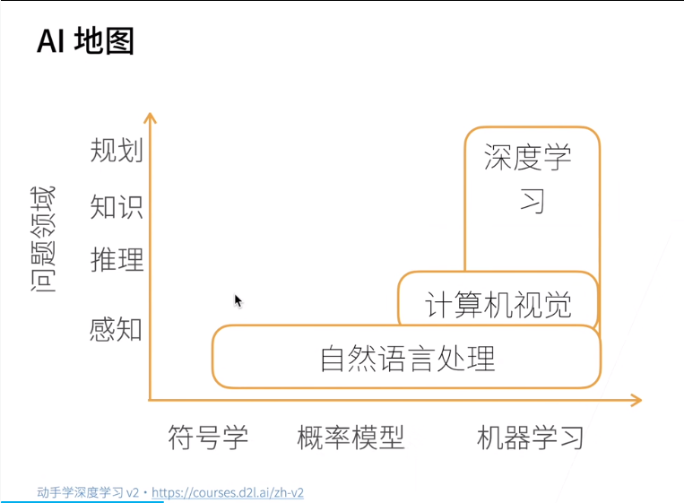
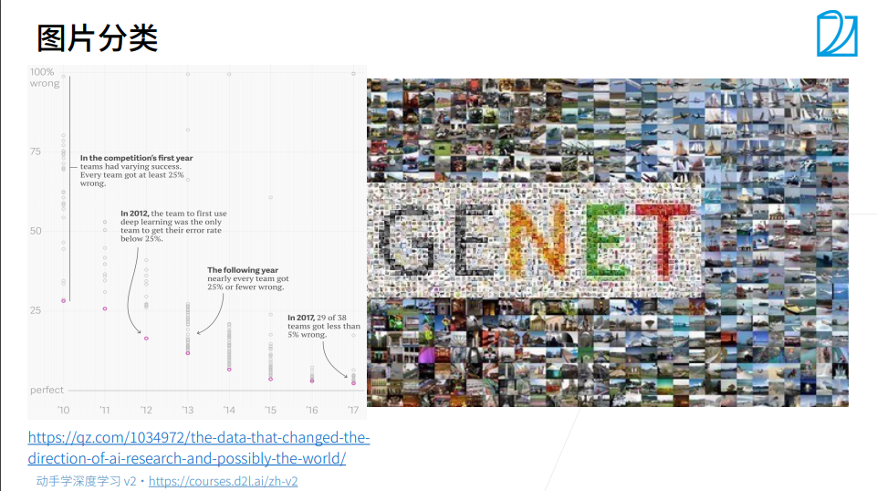
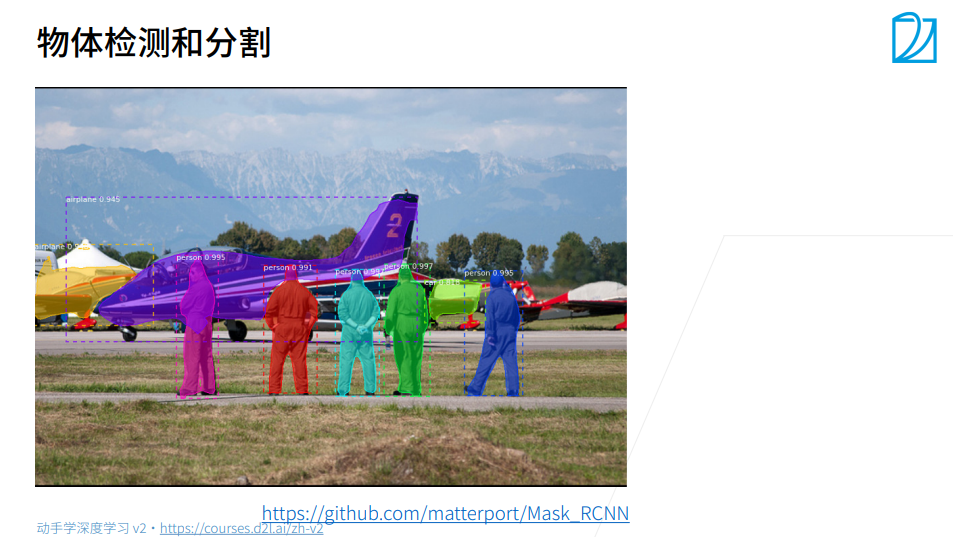
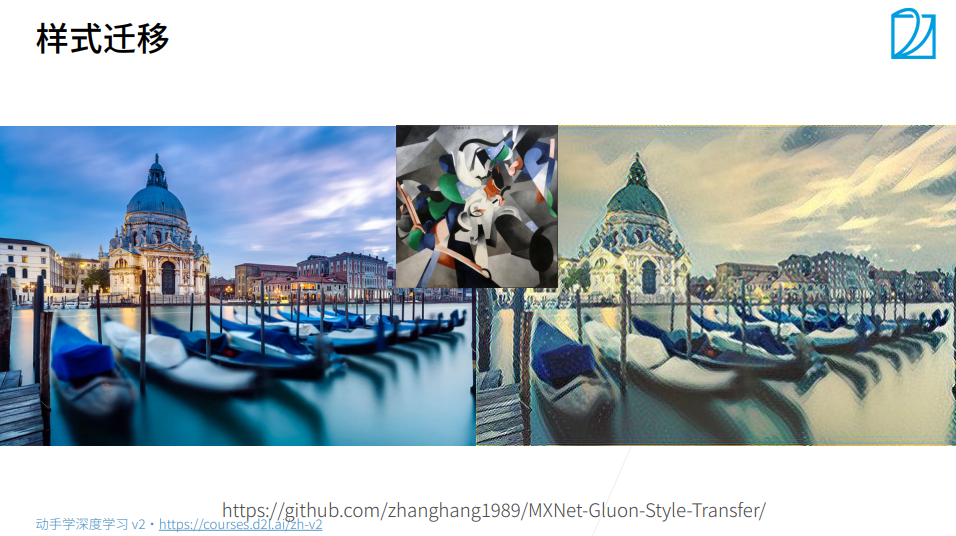
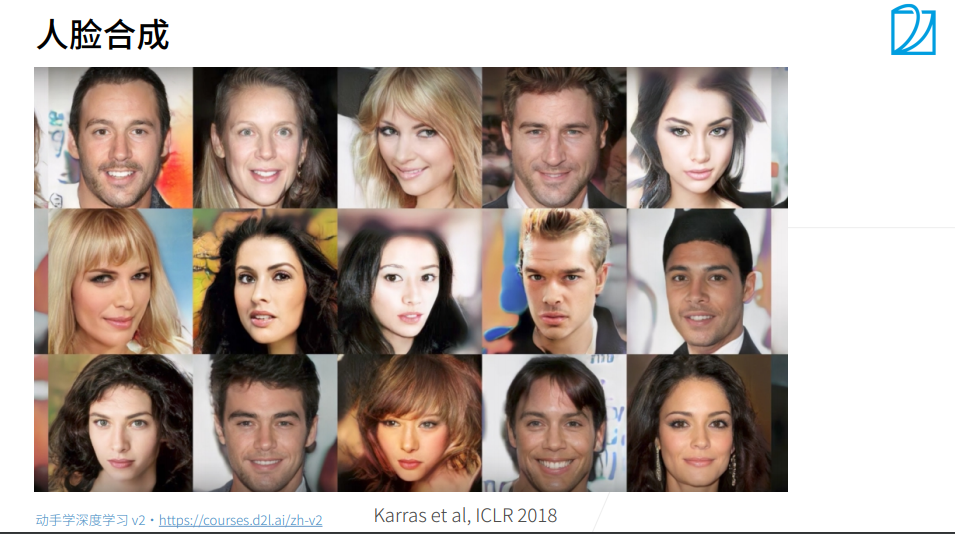
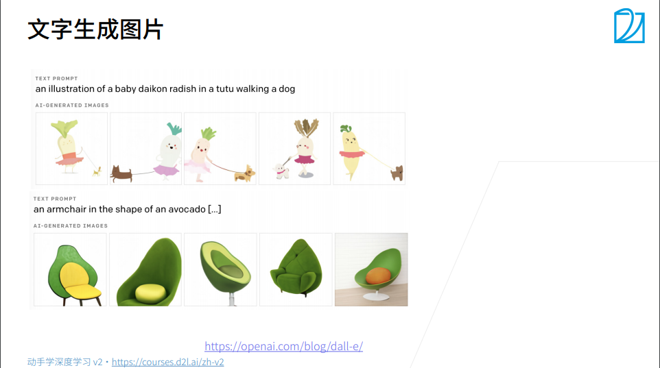
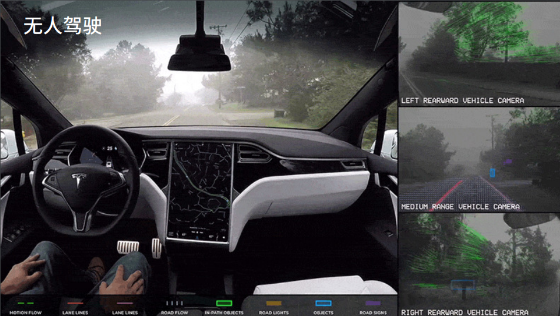
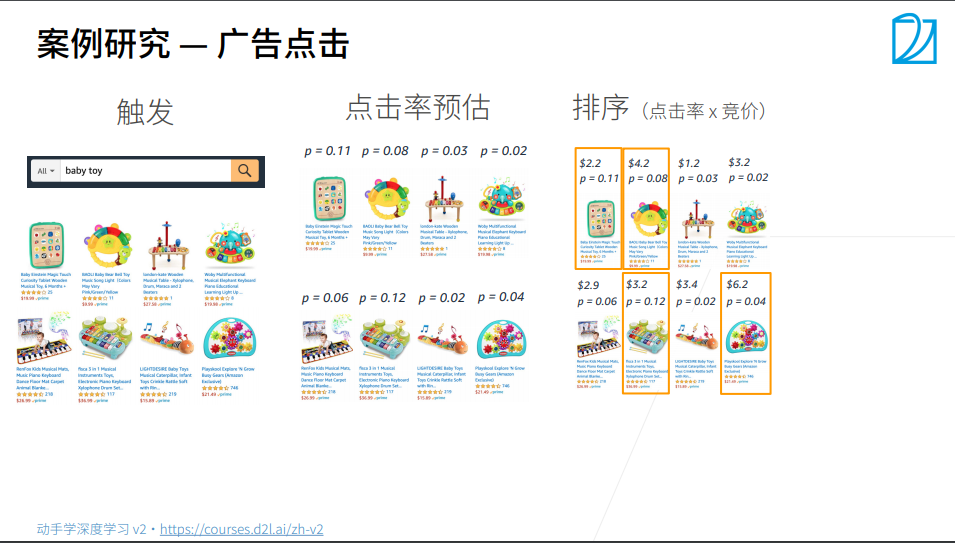
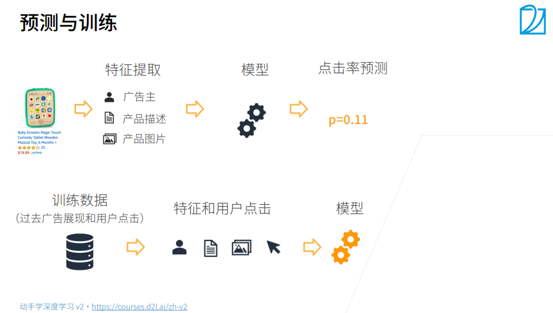
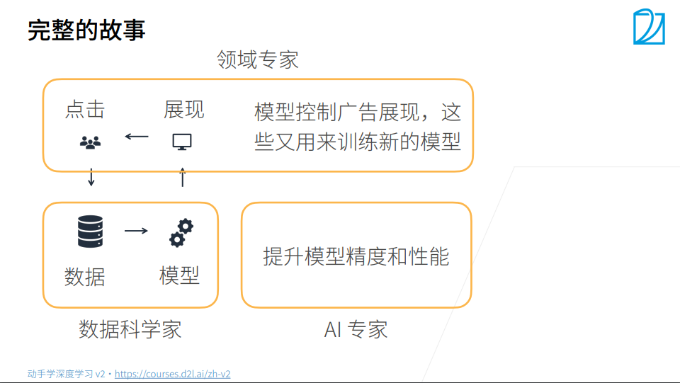

#  1. 【动手学深度学习v2】深度学习介绍

> 李沐
>
> B站：https://space.bilibili.com/1567748478/channel/seriesdetail?sid=358497
>
> 课程主页：https://courses.d2l.ai/zh-v2/
>
> 教材：https://zh-v2.d2l.ai/
>
> 课件：https://courses.d2l.ai/zh-v2/assets/pdfs/part-0_2.pdf

## 1. `AI`发展

① 自然语言处理目前还是停留在感知上，人几秒钟能反应过来的东西都属于感知范围，即使像中文翻译成英文，英文翻译成中文那种。

② 计算机视觉可以在图片里面可以做一些推理。

③ 自然语言处理里面有符号，所以有符号学，并且还可以用概率模型、机器学习。计算机视觉面对的是图片，图片里面都是一个个像素，像素很难用符号学来解释，所以计算机视觉大部分用概率模型、机器学习来解释。

④ 深度学习是计算机视觉中的一种方法，它还有其他应用方法。

## 2. 应用

### 2.1 图片分类

 深度学习最早在图片分类上做了比较大的突破。`IMAGENET`是比较大的图片分类数据集，如下图所示，它包括了一千类的自然物体的图片，它大概有一百万张图片。

2017年的时候，几乎所有的团队都可以做到5%以内的错误率，基本上可以达到人类在图片识别上的精度了

### 2.2 物体检测和分割

+ 物体检测：知道图片是内容，是什么？在什么地方？

+ 物体分割：指每个像素它到底是飞机还是人。

### 2.3 样式迁移

 内容图片结合样式图片(滤镜)，可以把内容图片映射到其他风格。

### 2.4 人脸合成

所有图都为算法合成的假人脸。

### 2.5  文字生成图片

由上面的文字生成出来的图片。

### 2.6 文字生成

根据人的问题，机器回答

### 2.7 无人驾驶

计算机视觉应用

## 3. 案例研究

根据用户的点击，给用户反馈一些广告； `P`是点击率

步骤：触发广告-->点击率预估-->排序

### 3.1 预测与训练

### 3.2 完整故事

## 4. 问题

+ 模型的可解释性
+ 模型为什么有效？

