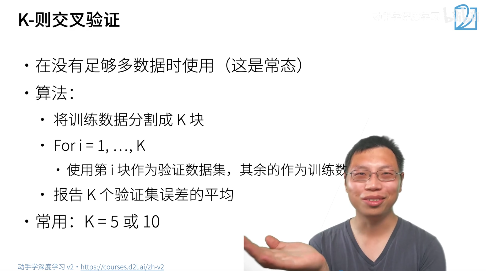
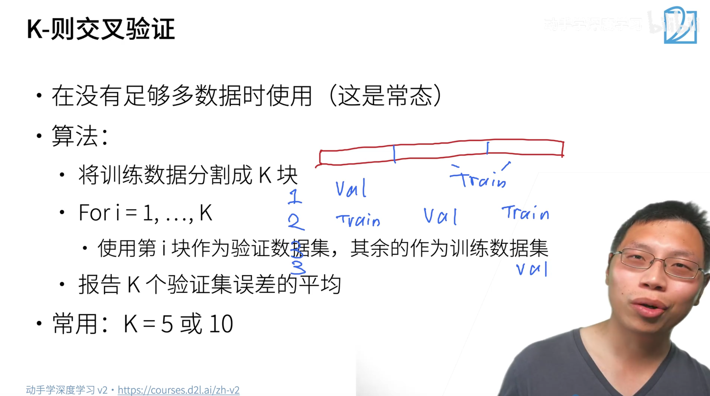
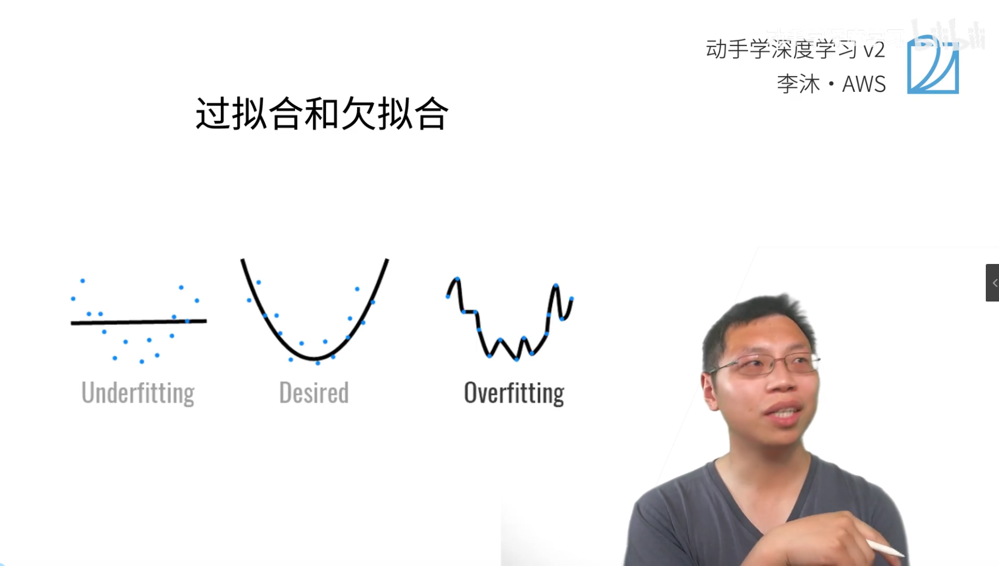
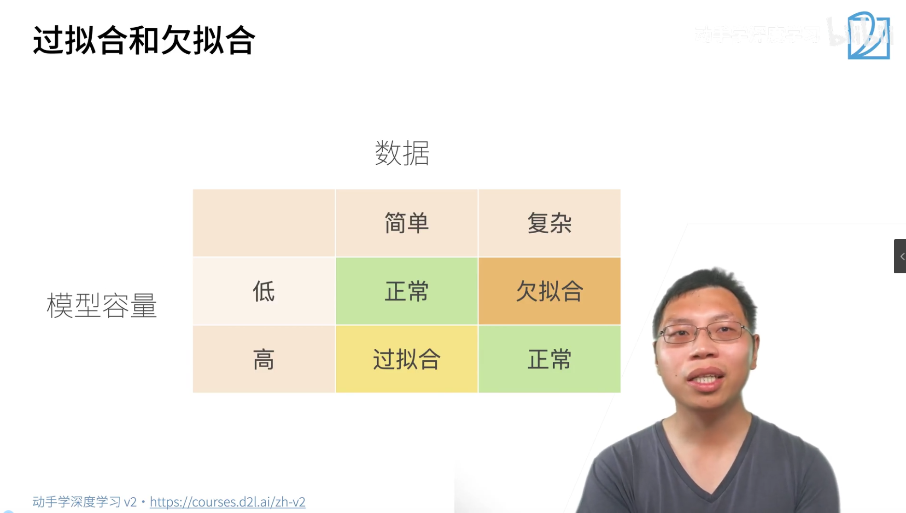
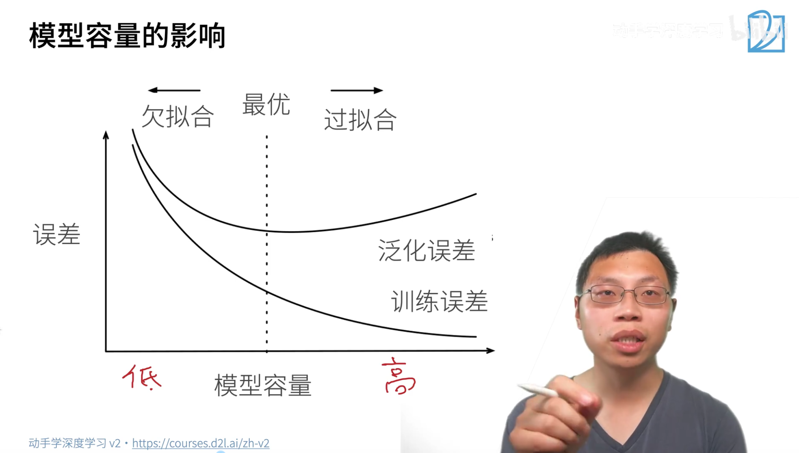
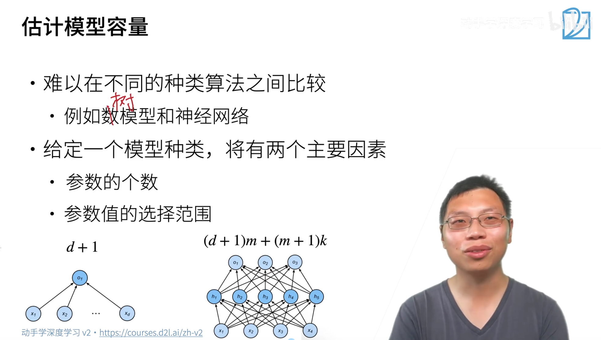
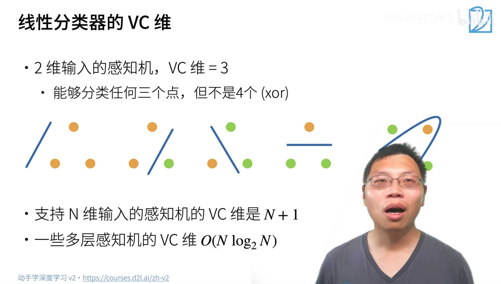
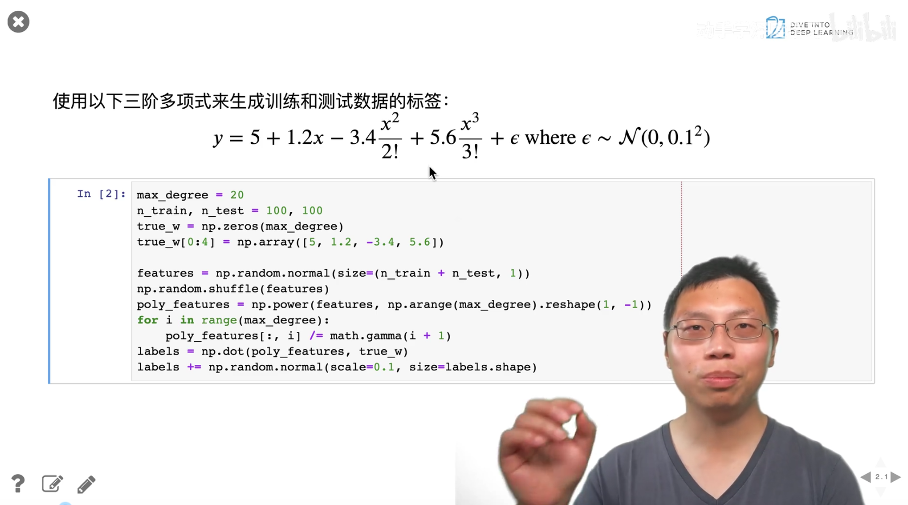

## 模型选择

+ 训练误差：模型在训练数据上的误差

模型在**训练数据集**上计算出来的误差 / 准确率。

就是你每一轮用训练集图片算出来的 loss、`train acc`。

+ 泛化误差（关心）：模型在新数据上的误差

模型在**从未见过的测试集 / 新数据**上的误差，对应代码里的 `test acc`。

代表模型**真实的预测能力、通用能力**，这才是我们训练模型的最终目标。

+ 过拟合

训练集准确率越来越高，甚至逼近 100%

**测试集准确率上升到最高点后停滞、甚至开始下降**。本质：模型把训练集的**噪声、随机细节、个别像素特征**都记住了，不是学规律，只是死记训练样本，放到新数据完全不好用。

+ 欠拟合

训练误差本身就很高，测试误差同样很高，两条曲线都偏低。

原因：**模型容量太小**（网络太简单），连训练数据的底层规律都学不会。

不要使用测试数据集进行调超参数。

K折交叉验证。随机打散，分成K块，三个验证误差，取平均

N折：最大的使用数据集，常用取5,10

 

##  过拟合和欠拟合

欠拟合：

过拟合：

模型容量：

低容量模型难以拟合训练数据

高容量模型可以技术所有训练的数据

数据可能含有大量的误差。

过拟合本身不是坏事，为了降低泛化误差降低，可以让模型过拟合

第一层:输入$d$个神经元，隐藏层$m$，则权重总数为$d*m$

偏置项为$m$

第一层:隐藏层$m$,输出$k$个神经元，，则权重总数为$m*k$

偏置项为$k$
$$
(d+1)m+(m+1)k
$$

VC维最大等于数据集的大小

手动做一个数据集，并且进行评估

