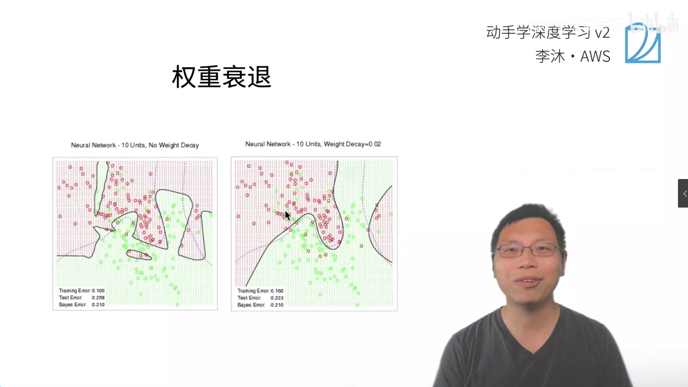
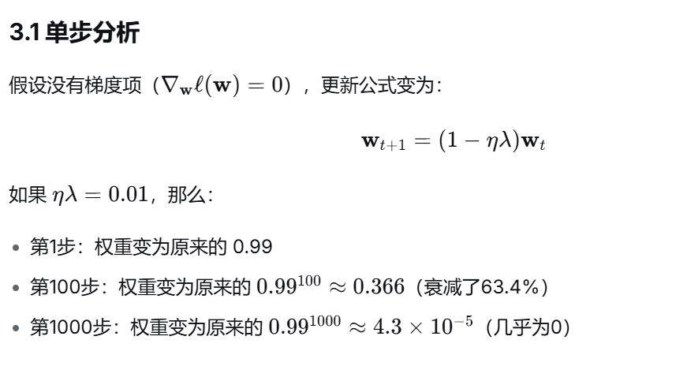
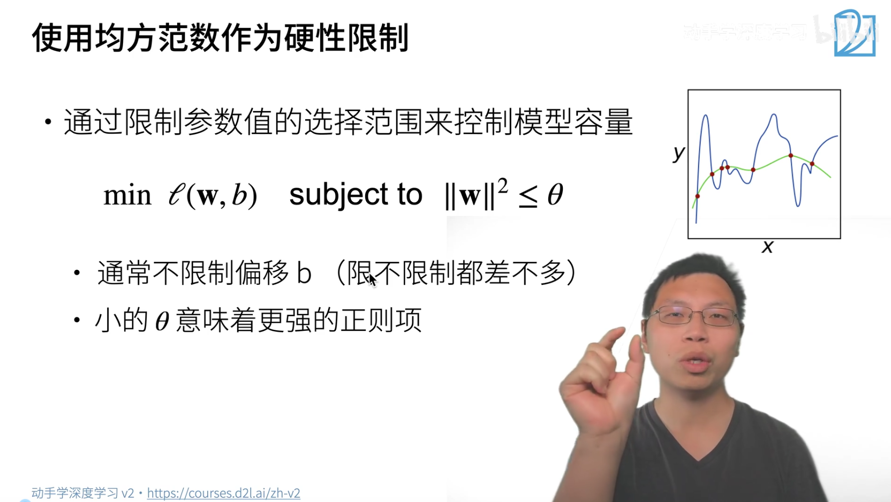
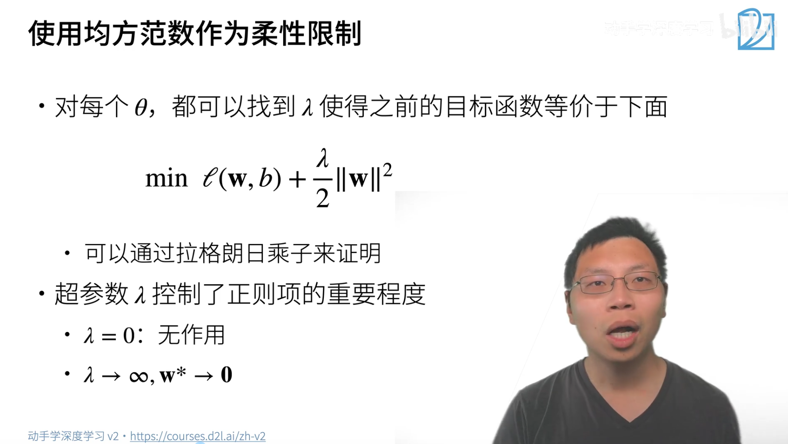
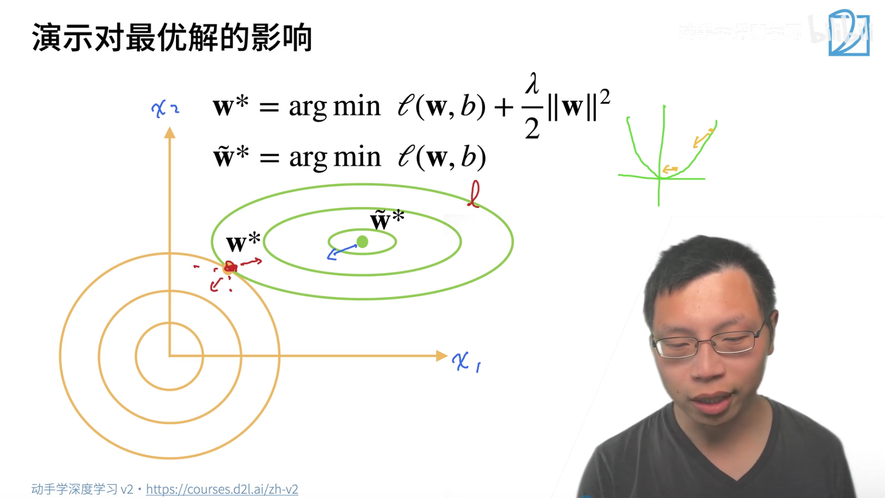
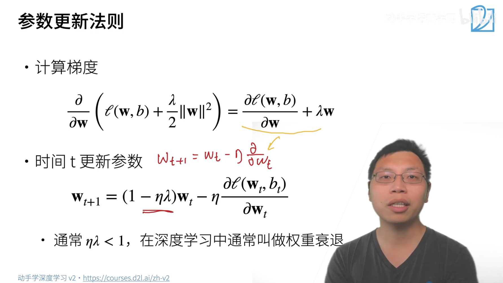

# 12 权重衰退

权重衰退：一种**正则化技术**，通过在损失函数中添加一个惩罚项来限制模型权重的过大增长。

- 不仅让模型在训练数据上表现好
- 还要让模型的权重保持"小"的状态
- 小权重意味着模型更"平滑"，对新数据更友好

比喻：

- **没有权重衰退**：你疯狂练习投篮，记住了每一个球的出手角度和力度，在训练场上百发百中。但换个球场，你就完全投不进了（**过拟合**）。
- **有权重衰退**：你只练习核心的投篮技巧，虽然训练时命中率可能低一点，但在任何球场都能保持稳定发挥（**泛化能力强**）

原始损失函数：
$$
\ell(\mathbf{w}, b) = \frac{1}{n} \sum_{i=1}^{n} \left(y_i - \hat{y}_i\right)^2
$$

$$
L(\mathbf{w}, b) = \ell(\mathbf{w}, b) + \frac{\lambda}{2} \|\mathbf{w}\|^2
$$

+ $||\mathbf{w}\|^2$:权重的平方和

+ $\lambda>0$ 正则化系数

权重衰退也从**约束优化**的角度理解:

> 为什么要加约束：
>
> 1.为了解决"过拟合"这个根本问题:
>
> 最开始的目标确实是 $min ℓ(w)$，即**最小化训练误差**。但机器学习的目的远不止于此，我们真正想要的是让模型在**未见过的数据**上表现好，也就是拥有**泛化能力**。如果你完全不加限制地让模型去最小化训练误差，模型就会"不择手段"——它会把每一个训练样本的特征都记得清清楚楚，包括其中的噪声和异常值。结果就是，它在训练集上表现完美，但在测试集上一塌糊涂，这就是**过拟合**。因此，我们意识到：**我们必须主动地对模型施加一些"束缚"，阻止它学习得过于精细。** 这个"束缚"在数学上，就体现为在优化问题中加入一个**约束条件**。
>
> 2.约束条件
>
> **小权重 = 平滑模型**：权重越小，输入特征的变化对输出的影响就越小。**限制探索空间**：这个约束将 w 的搜索空间从整个无限大的平面，限制在了一个半径为$\theta$  的圆（或球）内。

>

$$
\min_{\mathbf{w}} \ell(\mathbf{w}) \quad \text{s.t.} \quad \|\mathbf{w}\|^2 \le \theta
$$

$$
\mathcal{L}(\mathbf{w}, \lambda) = \ell(\mathbf{w}) + \lambda\left(\|\mathbf{w}\|^2 - \theta\right)
$$

`KKT`条件：

+ 梯度为零： $\nabla_{\mathbf{w}} \ell(\mathbf{w}^*) + 2\lambda \mathbf{w}^* = 0$

+ 互补松弛：$\lambda\left(\|\mathbf{w}^*\|^2 -\theta\right) = 0$

$$
\mathbf{w}^* = \arg\min_{\mathbf{w}} \left[ \ell(\mathbf{w}) + \frac{\lambda}{2}\|\mathbf{w}\|^2 \right]
$$

**计算正则化项的梯度**：
$$
\frac{\partial}{\partial \mathbf{w}} \left( \frac{\lambda}{2}\|\mathbf{w}\|^2 \right)
= \frac{\lambda}{2} \cdot \frac{\partial}{\partial \mathbf{w}} \left( \mathbf{w}^\top \mathbf{w} \right)
= \lambda \mathbf{w}
$$
**完整损失函数的梯度**：
$$
\nabla_{\mathbf{w}} L(\mathbf{w}) = \nabla_{\mathbf{w}} \ell(\mathbf{w}) + \lambda \mathbf{w}
$$
**无正则化的梯度下降**：
$$
\mathbf{w}_{t+1} = \mathbf{w}_t - \eta \nabla_{\mathbf{w}} \ell(\mathbf{w}_t)
$$
**有正则化的梯度下降**
$$
\mathbf{w}_{t+1} = \mathbf{w}_t - \eta \left( \nabla_{\mathbf{w}} \ell(\mathbf{w}_t) + \lambda \mathbf{w}_t \right)
$$
整合后：
$$
\mathbf{w}_{t+1} = \mathbf{w}_t - \eta \nabla_{\mathbf{w}} \ell(\mathbf{w}_t) - \eta \lambda \mathbf{w}_t
\\
\mathbf{w}_{t+1} = (1 - \eta \lambda)\mathbf{w}_t - \eta \nabla_{\mathbf{w}} \ell(\mathbf{w}_t)
$$

处理过拟合的方法

模型比较小，参数比较少

权重衰退控制值的选择范围

偏移$b$不做限制

正则项是什么？

$$
\min \ell(\mathbf{w},b) \quad \text{subject to} \quad \|\mathbf{w}\|^2 \le \theta \\
\min \ell(\mathbf{w},b) + \frac{\lambda}{2}\|\mathbf{w}\|^2
$$

- **椭圆**代表的是**损失函数**（你要优化的主要目标）。
- **正圆**代表的是**正则化约束**（你施加的限制条件）。

椭圆（图中红色的线）是损失函数$\ell(\mathbf{w},b)$ 的**等高线**。

- **它是什么？** 想象一下你站在一个山谷里，椭圆就是把所有“海拔高度”（即损失值）相同的点连起来的线。椭圆的**中心**（即 $\mathbf{w}^*$）就是山谷的**最低点**，也就是无约束时损失最小的位置。
- **为什么是椭圆？** 因为我们常用的损失函数（如均方误差）是权重的二次函数，它的等高线在二维平面上天然就是椭圆形状。越靠近中心，损失越小；越往外，损失越大。

正圆：正则化约束$\frac{\lambda}{2}\|\mathbf{w}\|^2$ 的**等高线**

+ 它告诉我们：模型的权重向量$\|\mathbf{w}\|^2$只能在这个圆内部或边界上活动，不能越界。圆的大小，由我们设定的超参数$\lambda$决定（或者说，由约束阈值$\theta$决定）。

