## 全连接到卷积

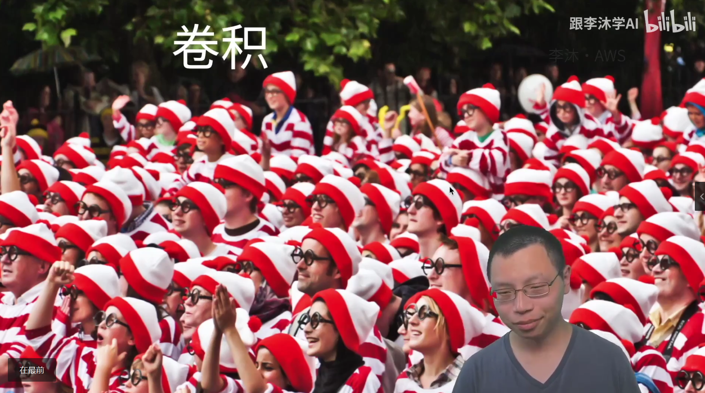

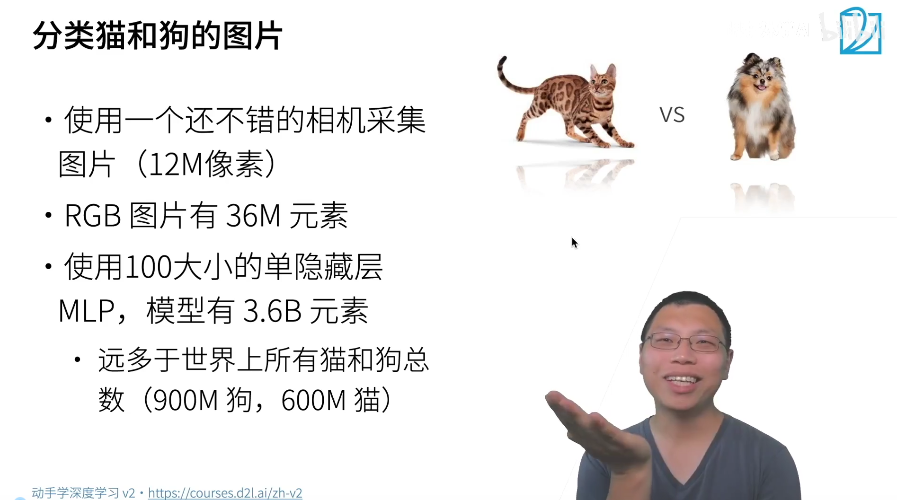

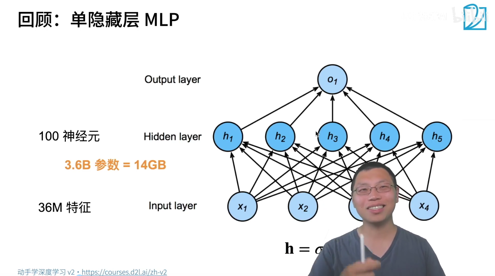

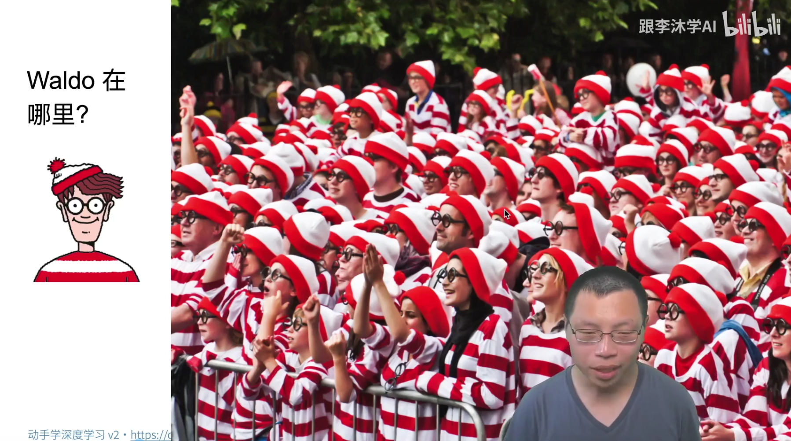

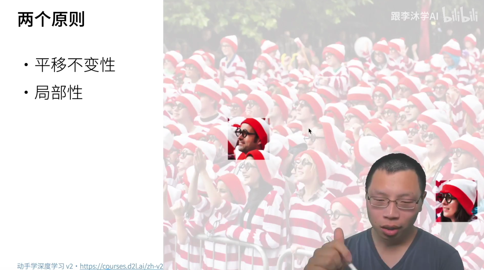

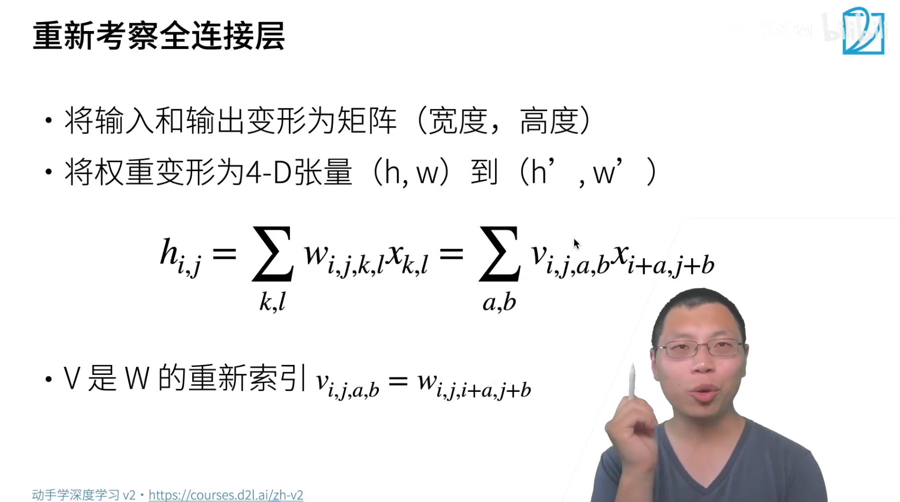

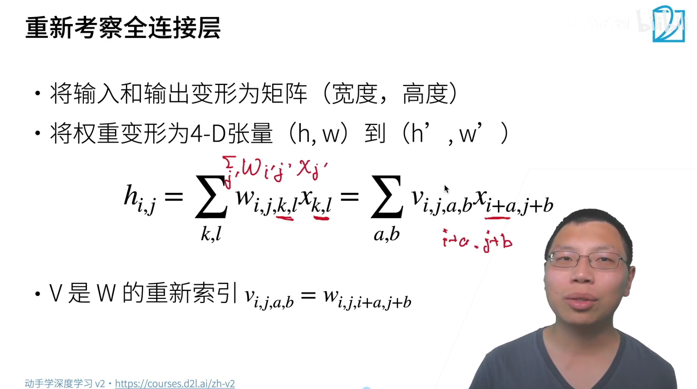

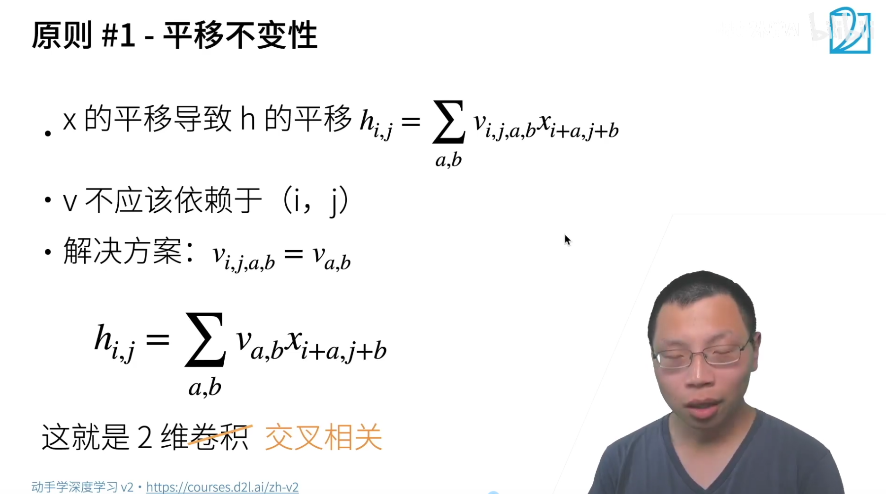
$$
h_{i,j} = \sum_{a,b} v_{i,j,a,b} \cdot x_{i+a,j+b}
$$

+ 输入$x$,输出$h$
+ 输出中位于$(i,j)$的像素由输入中所有可能的位置$(i+a,j+b)$的像素，通过权重$v_{i,j,a,b}$加权求和得到。
+ 权重$v$依赖于四个下标，同时取决于输出位置$(i,j)$和输入偏移$(a,b)$

**权重只关心输入像素之间的相对位置$(a,b)$，而不关心它们绝对坐标$(i,j)$**。
$$
h_{i,j} = \sum_{a,b} v_{a,b} \cdot x_{i+a,j+b}
$$

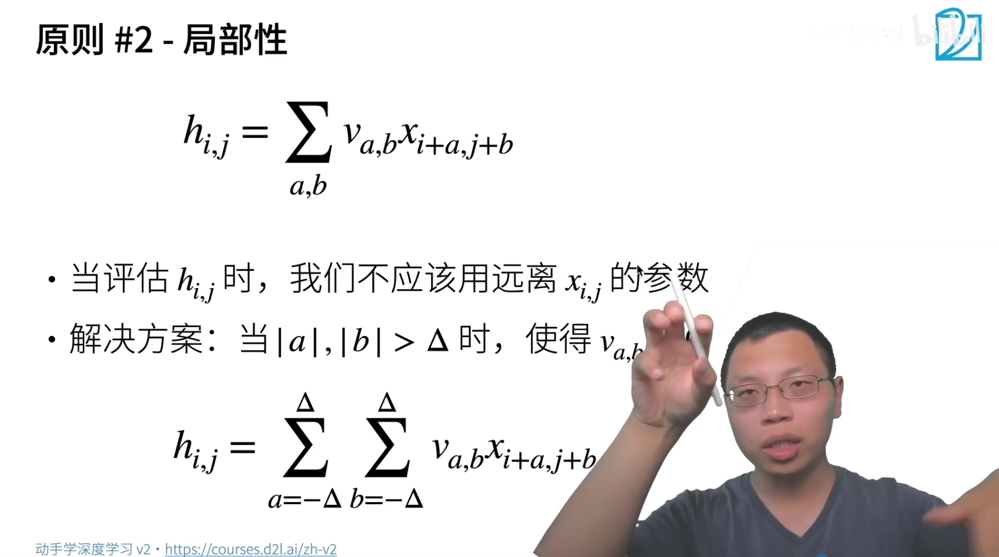输出位置$(i,j)$的值，**只应该由输入中距离它很近的像素来决定**。
$$
h_{i,j} = \sum_{a,b} v_{a,b} x_{i+a,j+b}

\\

h_{i,j} = \sum_{a=-\Delta}^{\Delta} \sum_{b=-\Delta}^{\Delta} v_{a,b} x_{i+a,j+b}
$$

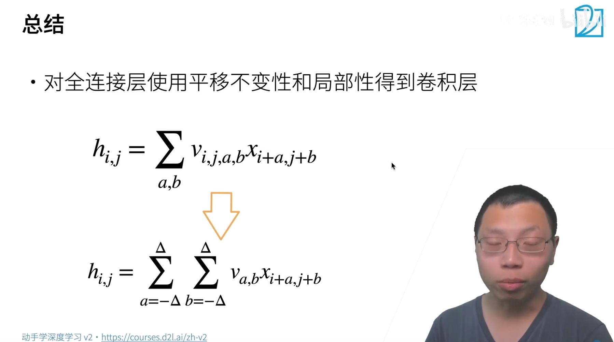

## 卷积

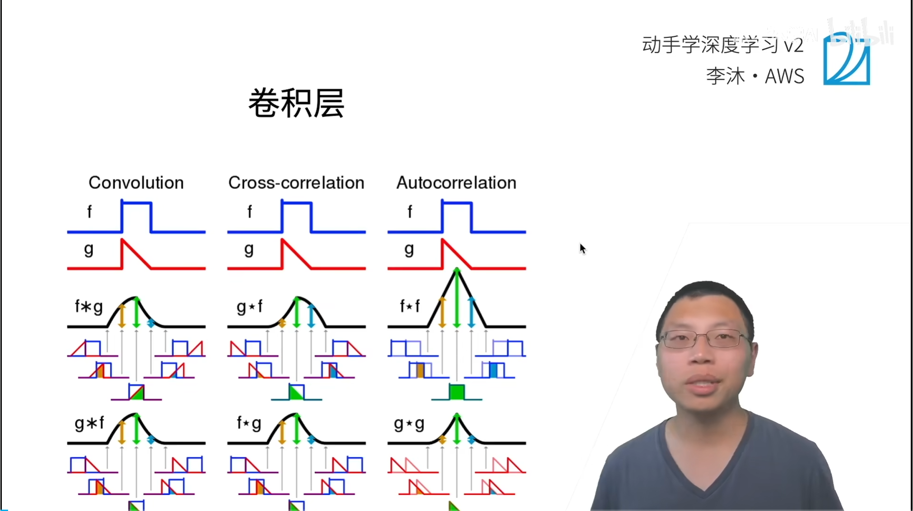

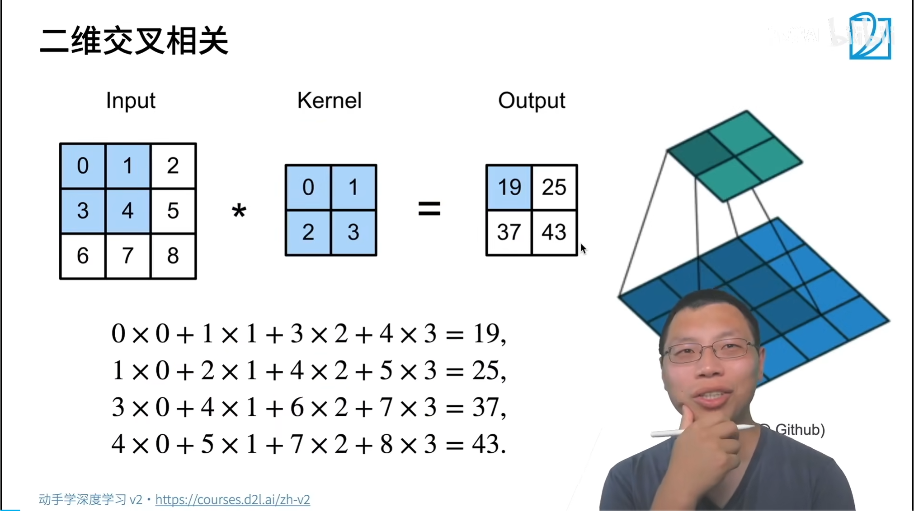

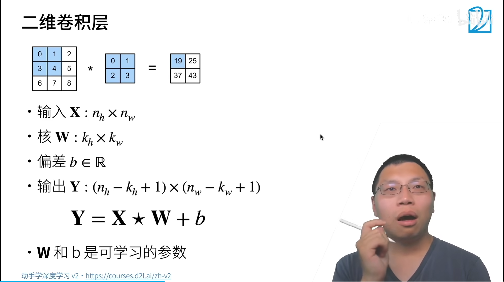

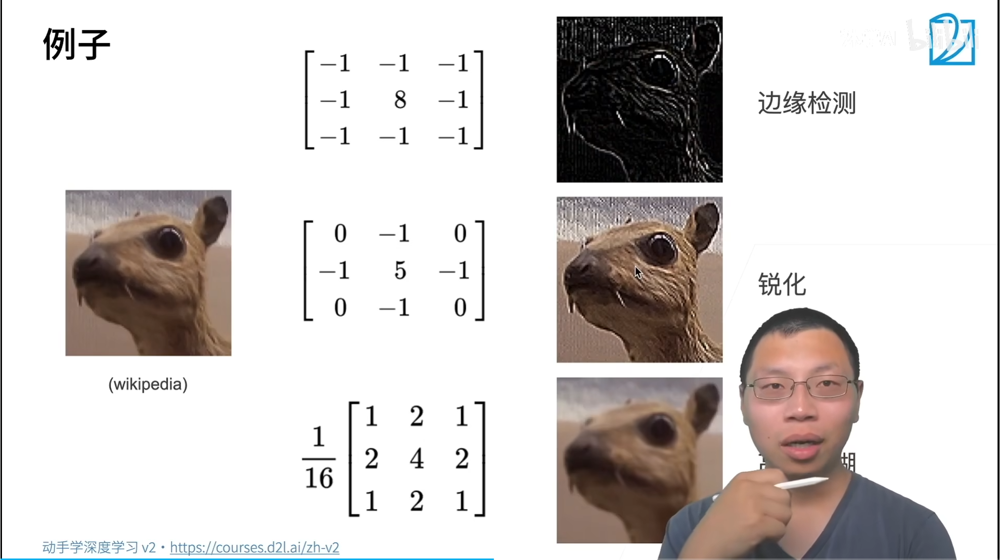

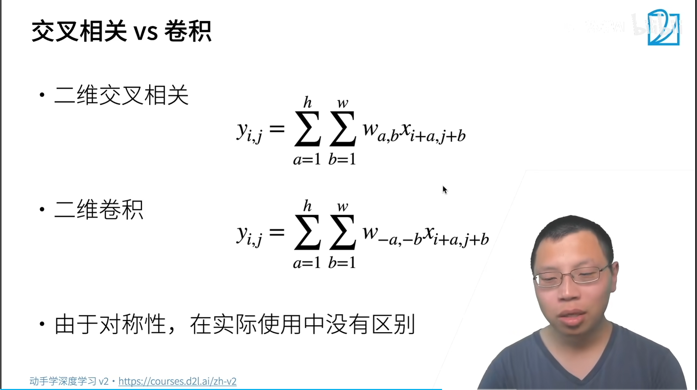

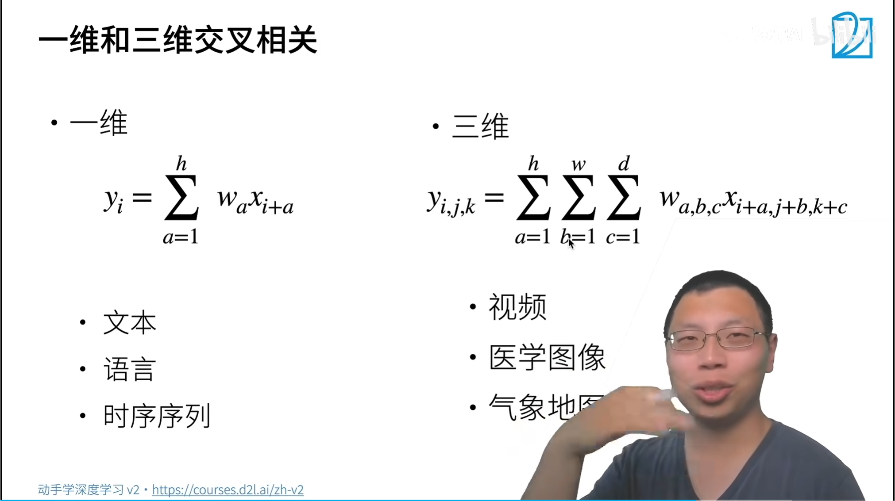

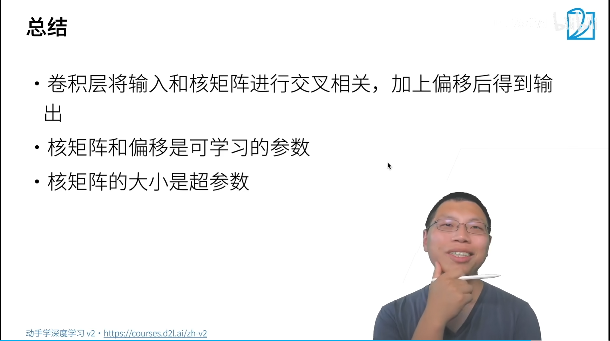