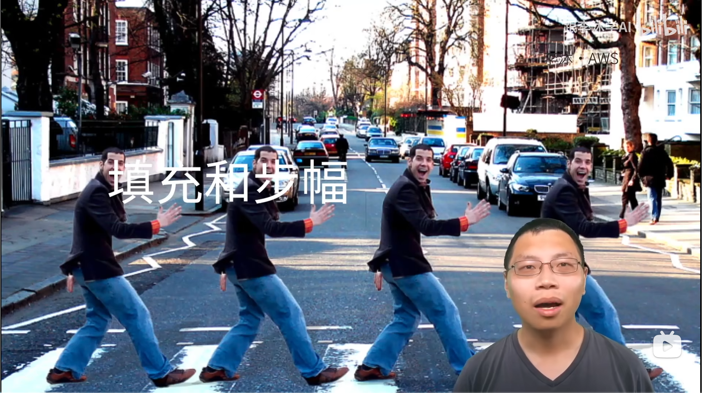
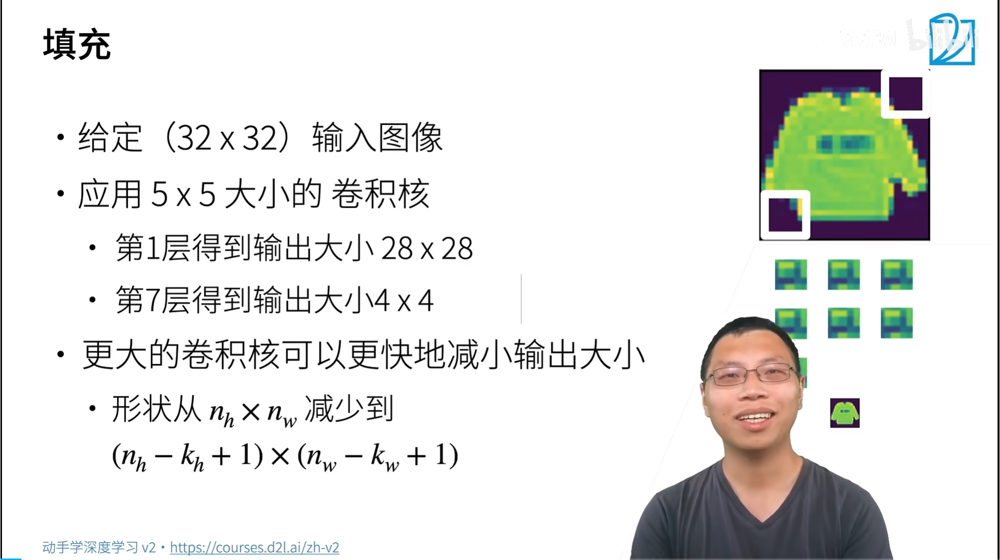
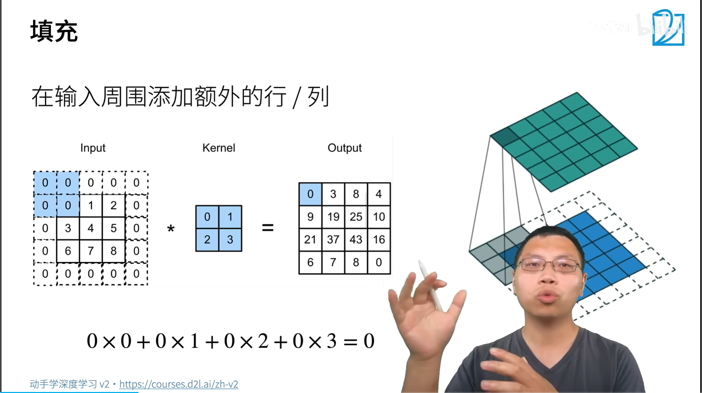
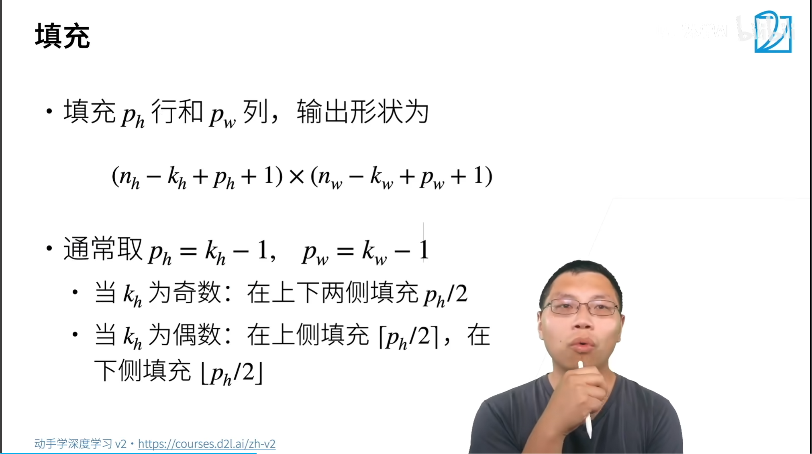
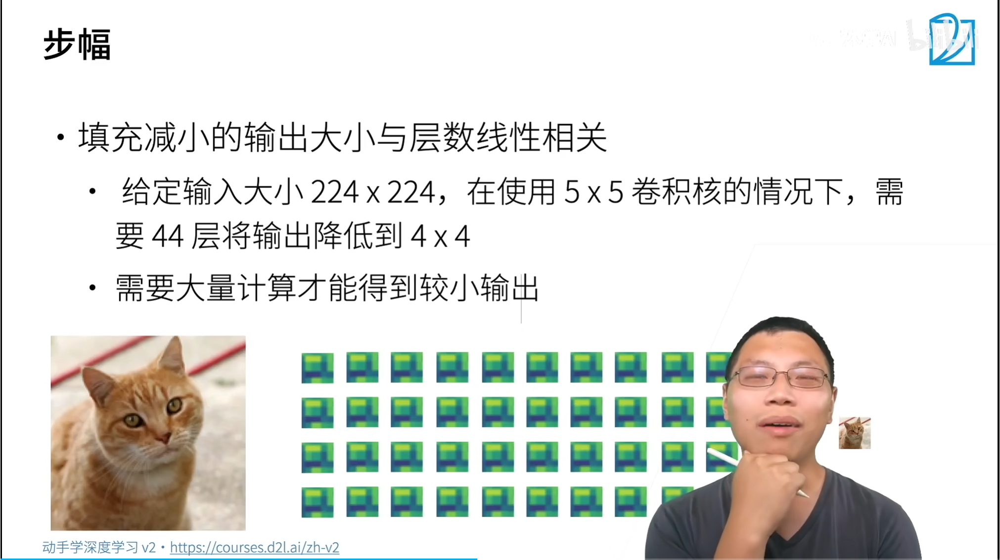
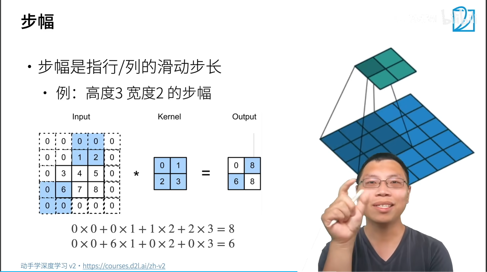
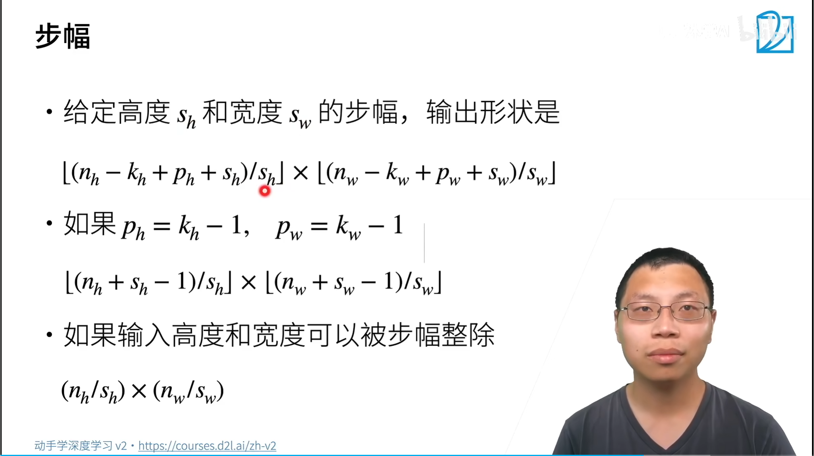
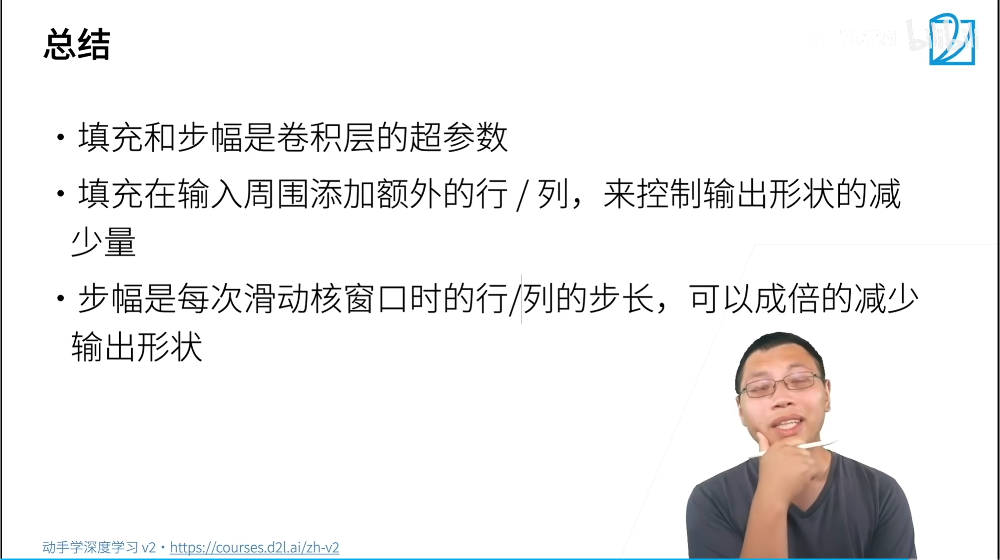
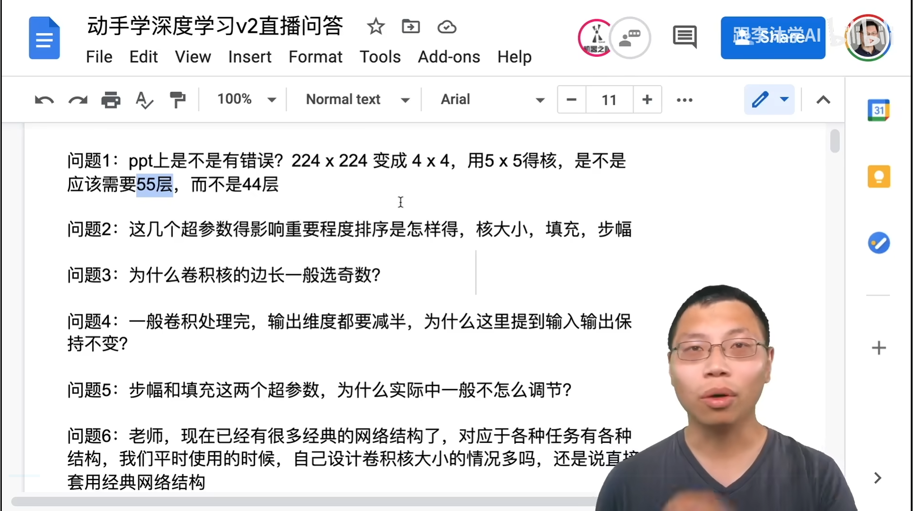

## 填充

$$
(n_h - k_h + 1) \times (n_w - k_w + 1)
$$
四周填充零，填充后在进行卷积计算.

填充大小，通常取核宽高减1

$p_{h} = k_{h}-1$

$p_{w} = k_{w}-1$

$k_{h}=3$
$p_{h} =2$
左右填充为1

$$
(n_h - k_h+p_h + 1) \times (n_w - k_w + p_w+ 1)
$$

## 步幅

> 2. 超参数的影响程度，怎么排序？
>
>    填充通常是核减1。
>
>    步幅：通常为1最好，不选步幅为1，是因为计算量最大。把图片降成3 * 3、 5 * 5、 7 * 7大小，输入尺寸很大的话，不想用很多层，通常使用步幅2，每次减半。步幅为2 
>
>    核大小最关键，填充默认，步幅一般看模型复杂度控制程度。
>
> 3. 卷积核边长为奇数
>
>    对称，好计算。卷积核 3 * 3 
>
> 4.   步幅、填充超参数，为什么实际中不怎么调节？
>
>    不敏感，是网络架构的一部分，
>
> 5. 老师，现在已经有很多经典的网络结构了，对应于各种任务有各种结构，我们平时使用的时候，自己设计卷积核大小的情况多吗，还是说直接套用经典网络结构？
>
>    直接使用resnet系列网络。输入特别特殊，需要设计。参考经典的网络设计
>
> 6. 一般调用卷积层的时候，只有一个padding参数和一个stride参数，怎么应用老师提到的分别高度填充和宽度填充，以及分别高度步幅和宽度步幅?
>
> 7. 问题9:老师，形状通常是个整数，那么如果不是整数怎么处理?
>
>    
>
> 8. 问题10:为什么通常用3x3的卷积核呢?3个像素的视野感觉很小
>
>    计算简单，更容易使用，
>
> 9. 问题15:自动训练参数的话，是否会更容易过拟合?
>
> 10. 问题16:老师，那多层的3*3卷积是不是和用不同大小的卷积核分别对原始图像做处理以后，再联合这些算出来的特征进行分类这种情况等价?
>
>     3*3 更快
>
> 11. 问题17:底层用大kernel，上层用小kernel，相比都用同样宽度的kernel，哪种方案更适合目标有多尺度的情况?
>
>     底层使用相对较大11* 11 7 * 7  5 * 5，后续用3 * 3。
>
>     简单的更容易使用。
>
> 12. 问题18:老师，多层卷积算出来的是不是可以理解成是图像的多种不同的纹理特征?
>
> 13. 

为什么深度学习主流都用 3×3 卷积核 核心四点：**最小能捕捉空间特征的奇数核、参数量效率最高、多层堆叠等效大核、多非线性提升表达力**，下面逐条拆开讲清楚。 

> 1. 3×3 是能捕捉「空间邻域信息」的最小奇数卷积核 - 
>    + 1×1 卷积：只能做通道融合，**没有空间感受野**，看不到相邻像素，提取不了边缘、纹理； 
>    + 2×2 偶数核：没有中心像素，上下/左右对称偏移，padding 对齐麻烦，无法精准定位中心特征； -
>    + 3×3：有中心像素，能一次性覆盖当前像素 + 上下左右 + 四个斜角邻域，是**能捕捉边缘、角点、纹理的最小尺寸**。 图像最基础的视觉单元（横竖边、拐角、渐变），3×3 刚好能完整捕获。 
> 2.  堆叠多层 3×3 可以等效大尺寸卷积，参数量更小、计算更省 举例子：
>    - 想要达到 5×5 的感受野 - 方案1：直接一层 5l×5 卷积  单个卷积核权重：$5 \times 5 = 25$ 个参数 
>    -  方案2：两层连续 3×3 卷积  两层总权重：$3 \times 3 + 3 \times 3 = 18$ 个参数 同理，想要7×7感受野： 单层7×7：49个参数；三层3×3堆叠仅27个参数。 层数越多，相比直接用大核，参数节省优势越明显，显存、算力开销更低。
> 3.  多层3×3堆叠引入更多非线性，模型表达能力更强 每一层卷积后都会搭配 ReLU 等激活函数： 
>    -  单层大核（如5×5）：只有**1次非线性变换**； -
>    - 两层3×3堆叠：中间多一层激活，有**2次非线性变换**。 更多非线性层能让网络拟合更复杂的图像分布，更容易区分细微视觉差异，分类、检测效果远好于单纯一层大卷积核。 
> 4. 奇数尺寸天然适配 Same Padding，输出尺寸稳定 3、5、7都是奇数，设 `padding = k//2`（3//2=1），就能做到输入输出长宽完全不变： 输入 $H \times W$，3×3、padding=1、stride=1，输出还是 $H \times W$。 偶数2×2做same填充会出现像素错位，不利于深层特征对齐；3×3padding逻辑简单，工程实现友好。

