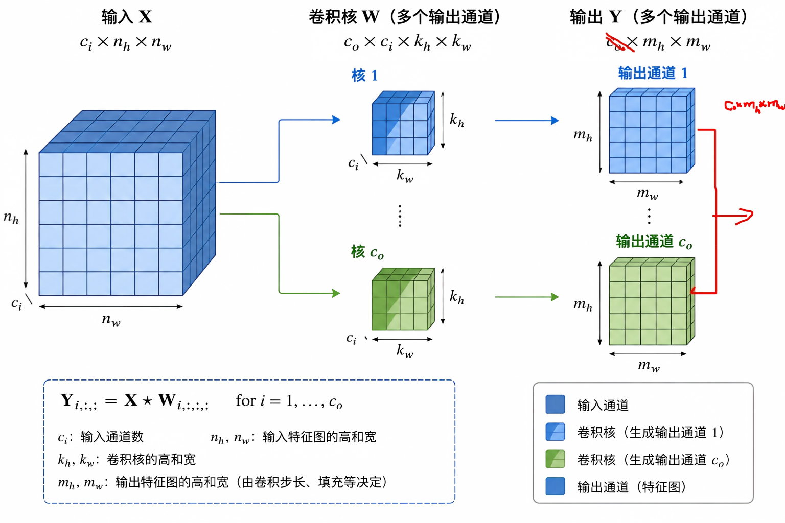

## 通道

> 200* 200* 3
>
> 

每个通道都有一个卷积核

输入通道：`channel`: $c_i$

图像大小为$(n_h,n_w)$，通道数$c_i$，对应的卷积核大小$(k_h,k_w)$，通道数$c_i$，但是卷积核不是同一个，是通过学习得到。

输出图像为单通道$(m_h,m_w)$:对应通道的输入与对应通道的卷积核对应相乘，求和。
$$
Y = \sum_{i=0}^{c_i} X_{i,:,:} \times W_{i,:,:}
$$

图像大小为$(n_h,n_w)$，通道数$c_i$，对应的卷积核大小$(k_h,k_w)$，通道数$c_i$，但是卷积核不是同一个，是通过学习得到。

输入：$c_i \times n_h \times n_w$

卷积核：$c_o \times c_i \times k_h \times k_w$

输出：$c_o \times m_h \times m_w$

多输出通道：每个输出通道学习一种模式。

多输入通道，将多个模式进行组合，

>多输出通道：每个输出通道学习一种模式（Feature）
>
>假设输入是一张图片，第一层卷积有 **64 个输出通道**。
>
>这意味着网络学习了 **64 组不同的卷积核**：
>
>输出通道1  —— 检测水平边缘
>输出通道2  —— 检测垂直边缘
>输出通道3  —— 检测45°边缘
>输出通道4  —— 检测纹理
>输出通道5  —— 检测角点
>……
>输出通道64 —— 检测其它局部模式
>
>**每一个输出通道就是一种特征（Feature Map）,多输出通道 = 学习多种不同的特征模式。。**

>第一层已经输出了64个Feature Map,第二层要生成一个新的输出通道。
>
>Y1
>
>= X1 * W1 + X2 * W2 +  X3 * W3+...+ X64 * W64
>
>同一个输出通道同时利用所有输入通道的信息。

参考多输出

复杂度计算：
$$
O(c_i \times c_o \times k_h \times k_w \times m_h \times m_w)
$$

