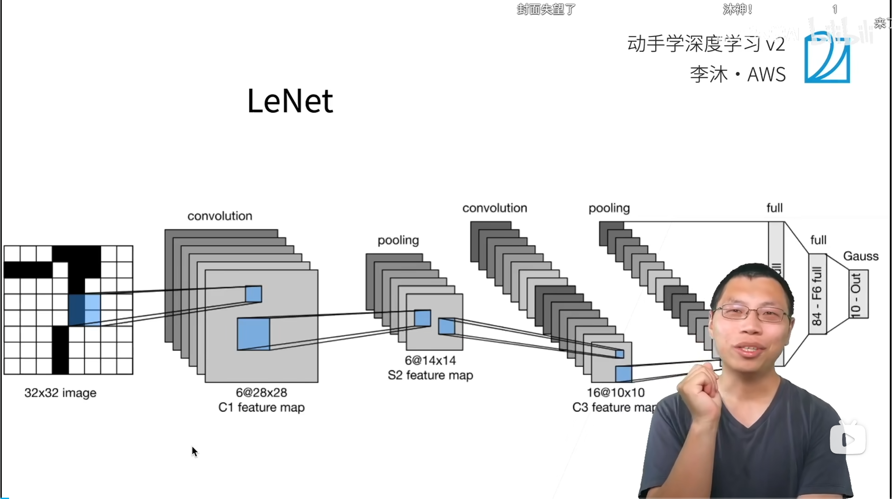
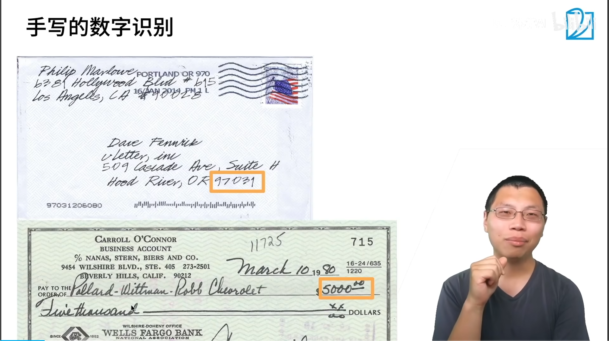
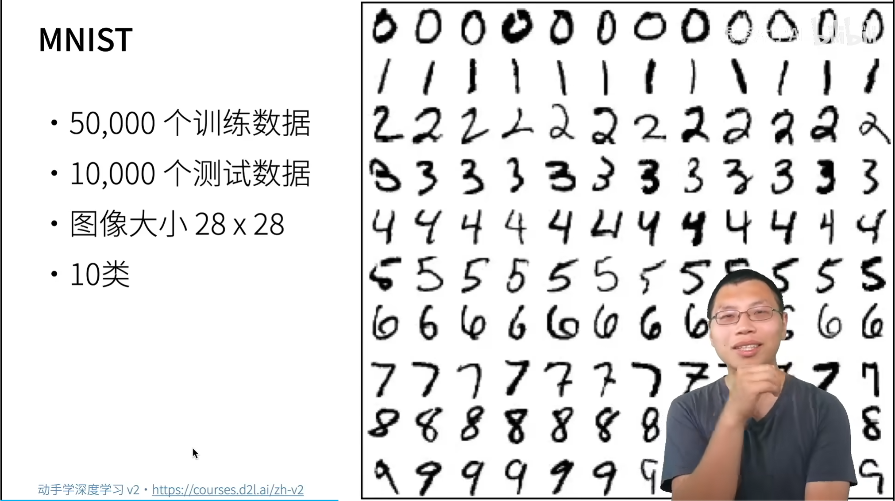
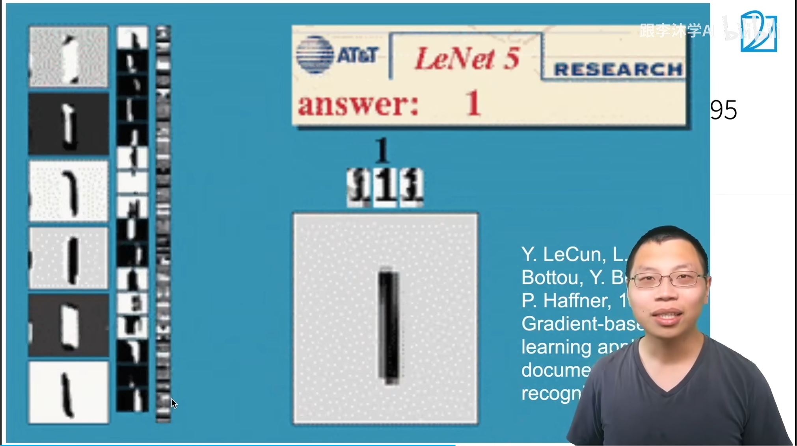
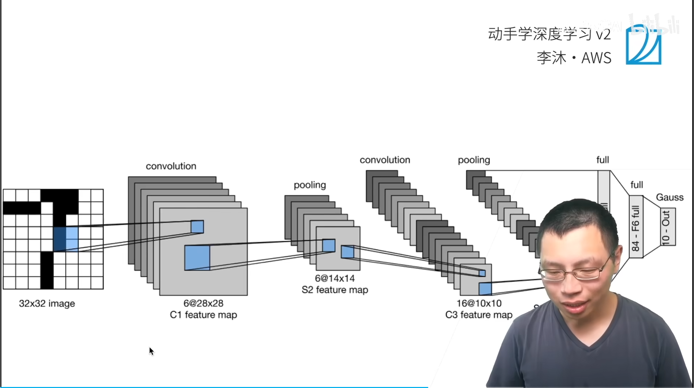
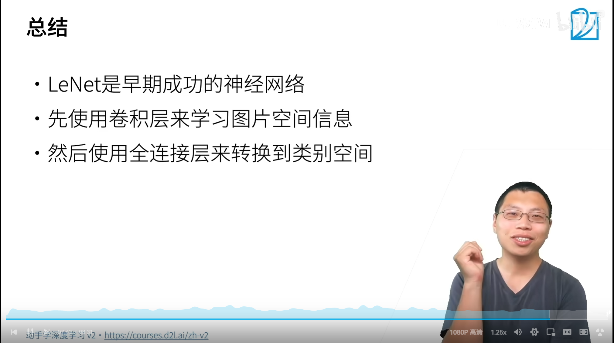
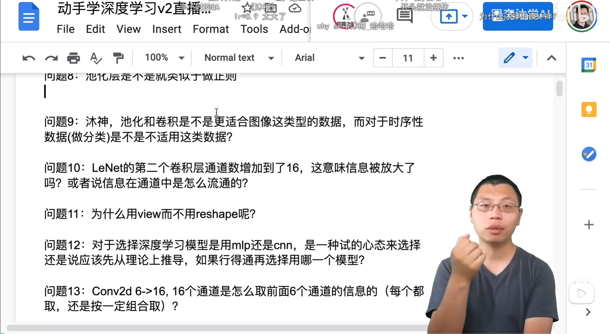

# LeNet网络
















> Loss 下降比较慢：
>
> 修改 lr = 0.01
>
>  nn.Sigmoid(), 修改为 nn.ReLU(),
>
> optim 修改为  SGD -> Adam 




> 时序：可以使用卷积，池化可以用
>
> 问题10:LeNet的第二个卷积层通道数增加到了16，这意味信息被放大了吗?或者说信息在通道中是怎么流通的?
>
> 高宽减半，通道数翻倍。增加通道数，匹配的模式增加了，而是让网络能够学习更多种不同类型的特征表示（Feature Maps）。。信息还是减的
>
> **通道数增加的真正意义不是“信息放大”，而是“特征表示能力增强”**：网络用更多的输出通道，从相同的输入中学习更多种不同的特征表达方式，从而逐步构建越来越丰富、越来越抽象的视觉表示。

```bash
输入图像
      │
      ▼
Conv1（6通道）
      │
      ├─ 学习低级特征：边缘、纹理、角点
      ▼
Conv2（16通道）
      │
      ├─ 将多个低级特征组合，学习更复杂的局部模式
      ▼
后续卷积/全连接
      │
      ├─ 继续组合形成更高级、更抽象的语义表示
      ▼
分类结果
```

> 问题14:输出通道增多，这些增加的信息是些什么?可以理解是随机扩充的图片信息么?
>
> 池化层一般用max还是avg，用max的话会不会损失很多信息?
>
> max保留最显著特征，抗噪声能力强，max可能比avg效果更好。
>
> 常见的非结构化数据
>
> - 图片（Image）
> - 文本（Text）
> - 音频（Audio）
> - 视频（Video）
> - 医学影像（CT、MRI）
> - 点云（Point Cloud）
> - 遥感图像
> - 雷达回波


