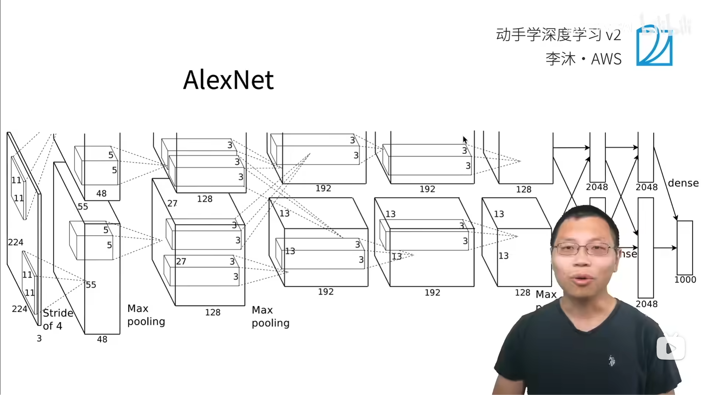

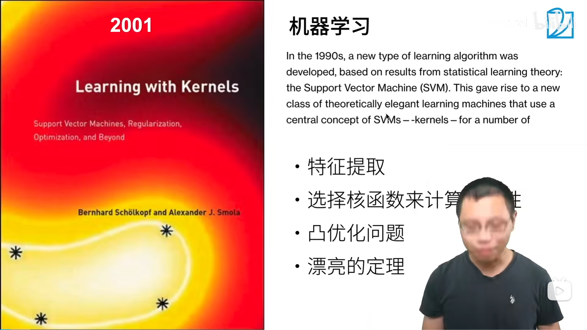

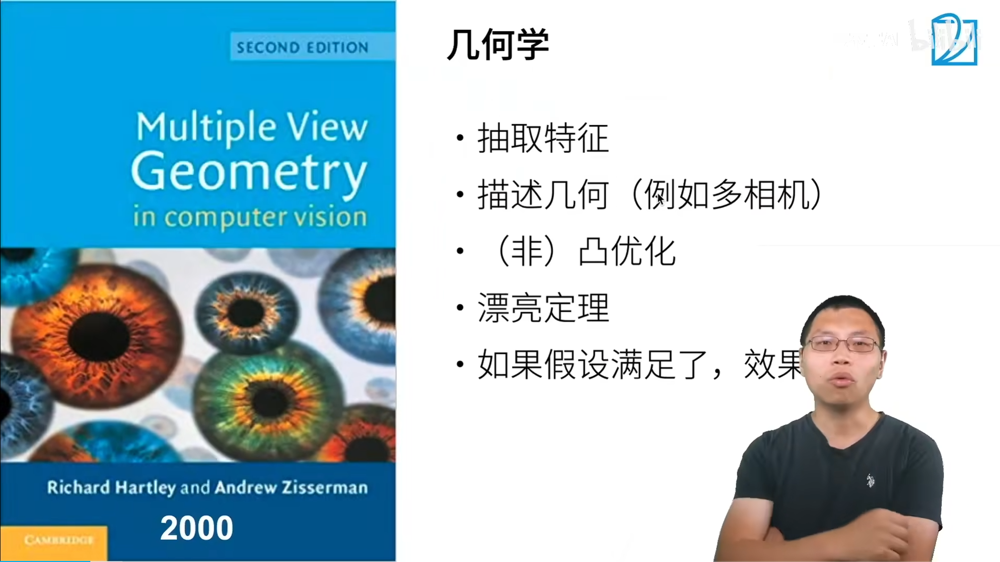

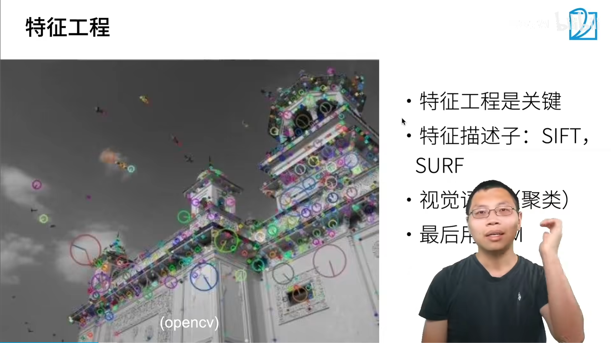

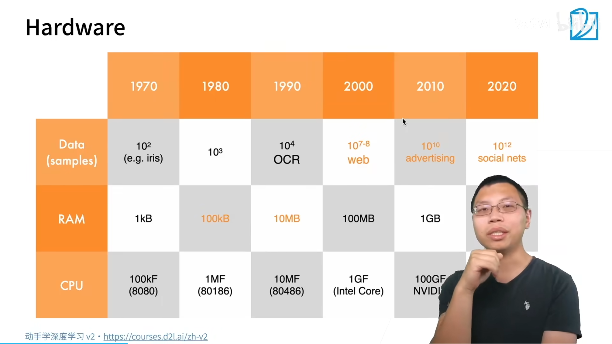

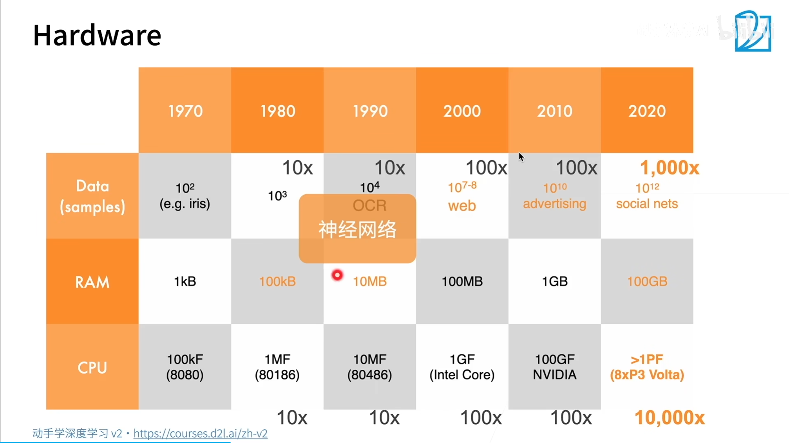

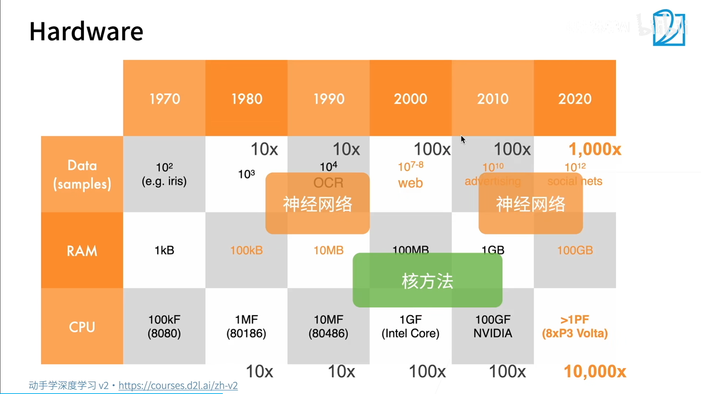

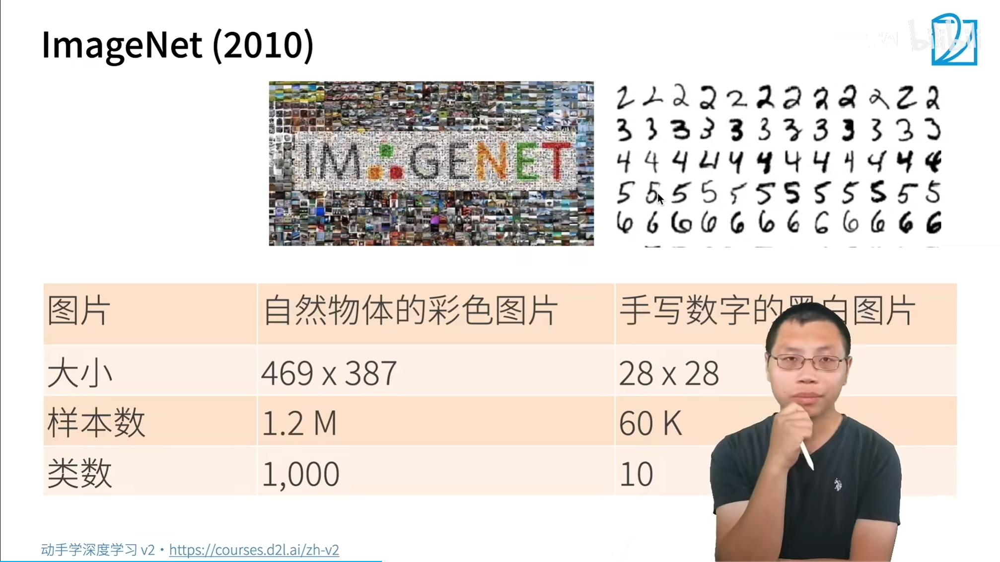

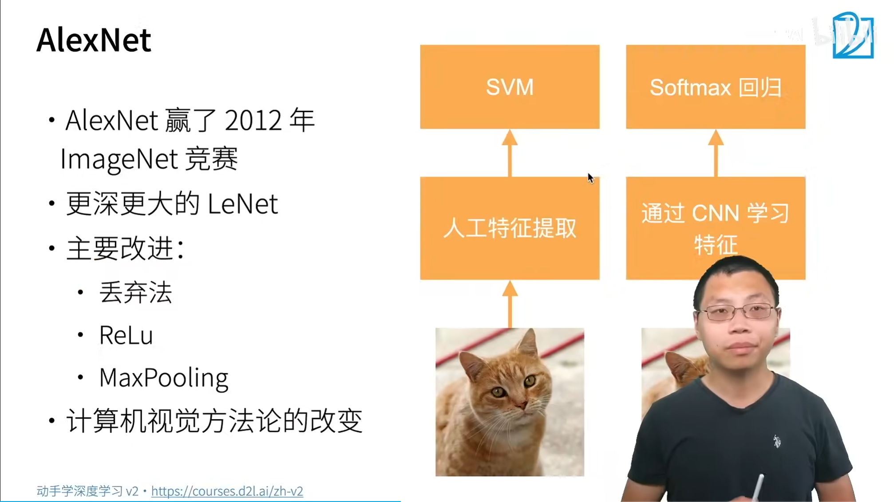

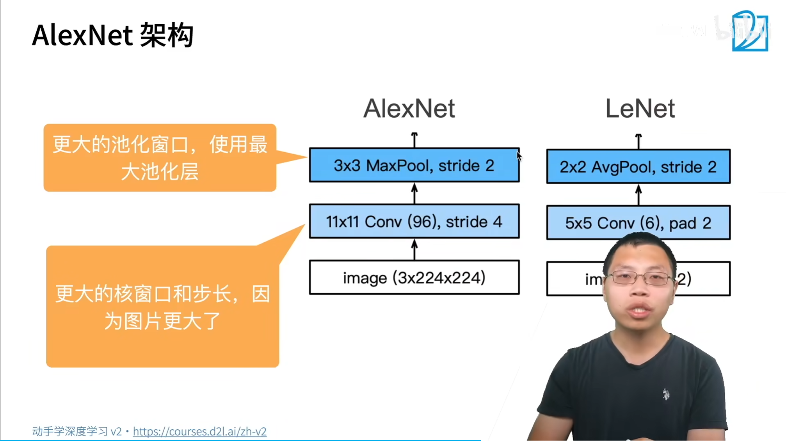

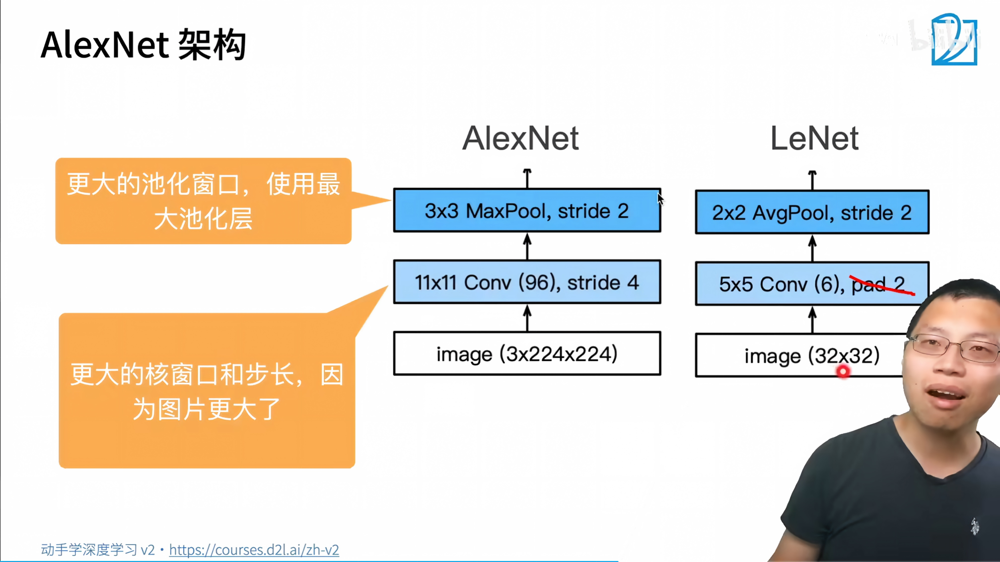

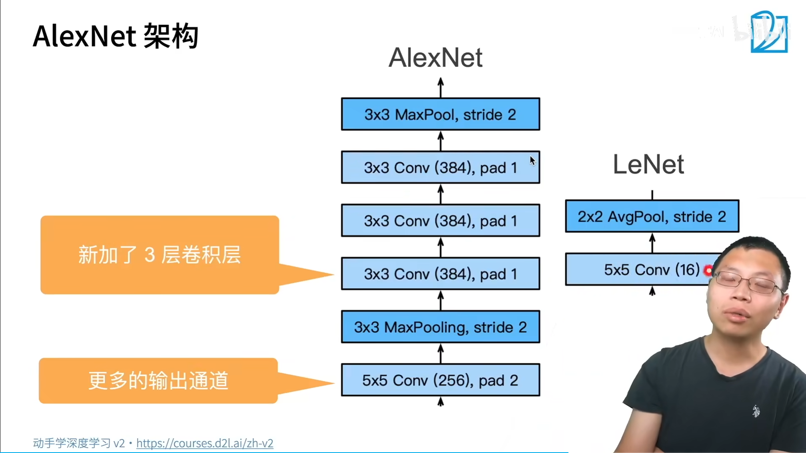

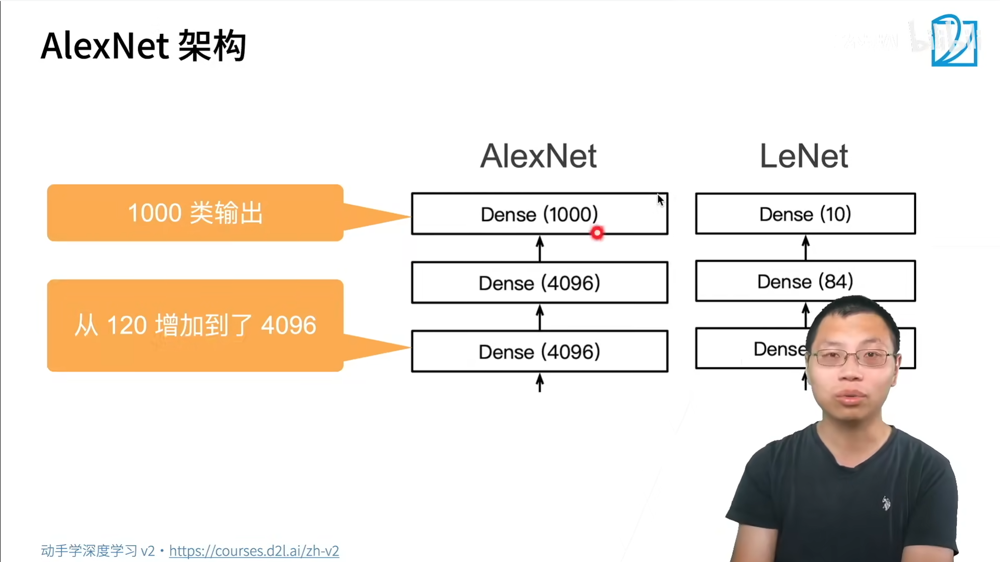


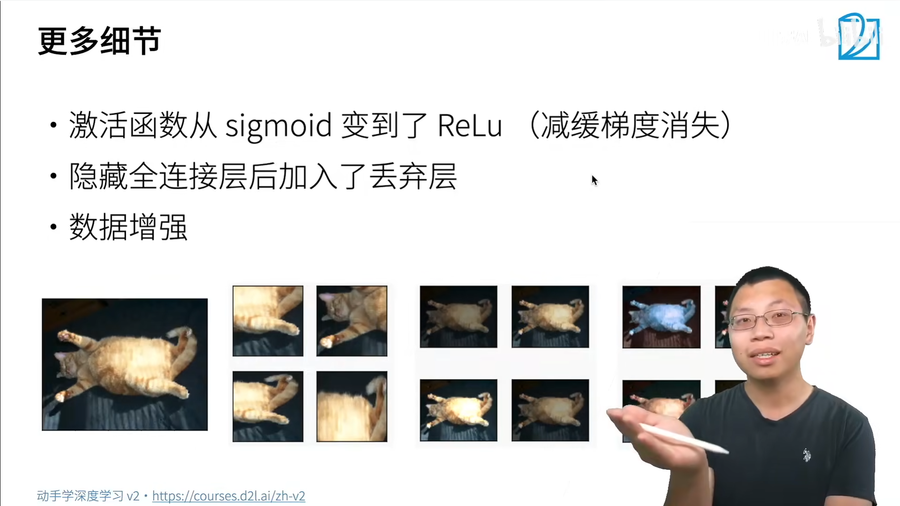

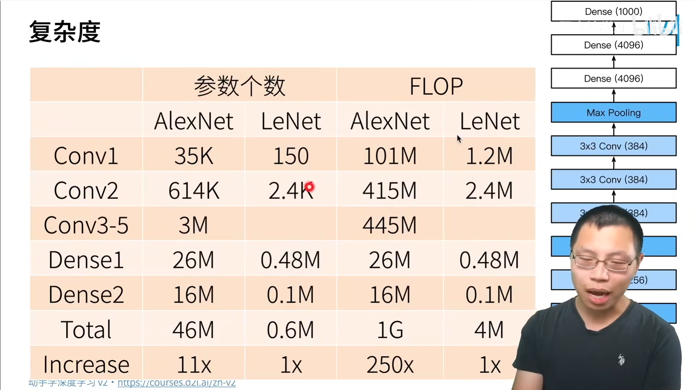


核方法有很好的理论。

网络设计思想：

`Normalization`

 

`LeNet`为什么不是深度卷积神经网络：Deep 是包装出来的

`dropout` 做正则


## 代码

```python
import torch
from torch import nn
from torch.utils.data import DataLoader
from torchvision import datasets, transforms

# ==========================
# 1. 设置设备
# ==========================
device = torch.device("cuda" if torch.cuda.is_available() else "cpu")
print("Using device:", device)

# ==========================
# 2. 数据预处理
# FashionMNIST: 28×28 -> 224×224
# ==========================
transform = transforms.Compose([
    transforms.Resize((224, 224)),
    transforms.ToTensor(),
    transforms.Normalize((0.2860,), (0.3530,))
])

train_dataset = datasets.FashionMNIST(
    root="./data",
    train=True,
    download=True,
    transform=transform
)

test_dataset = datasets.FashionMNIST(
    root="./data",
    train=False,
    download=True,
    transform=transform
)

batch_size = 128

train_loader = DataLoader(
    train_dataset,
    batch_size=batch_size,
    shuffle=True
)

test_loader = DataLoader(
    test_dataset,
    batch_size=batch_size,
    shuffle=False
)

# ==========================
# 3. AlexNet
# ==========================
class AlexNet(nn.Module):

    def __init__(self):
        super(AlexNet, self).__init__()

        self.features = nn.Sequential(

            # 224×224
            nn.Conv2d(1, 96, kernel_size=11, stride=4, padding=1),
            nn.ReLU(inplace=True),

            # 54×54
            nn.MaxPool2d(kernel_size=3, stride=2),

            # 26×26
            nn.Conv2d(96, 256, kernel_size=5, padding=2),
            nn.ReLU(inplace=True),

            # 26×26
            nn.MaxPool2d(kernel_size=3, stride=2),

            # 12×12
            nn.Conv2d(256, 384, kernel_size=3, padding=1),
            nn.ReLU(inplace=True),

            nn.Conv2d(384, 384, kernel_size=3, padding=1),
            nn.ReLU(inplace=True),

            nn.Conv2d(384, 256, kernel_size=3, padding=1),
            nn.ReLU(inplace=True),

            nn.MaxPool2d(kernel_size=3, stride=2)
        )

        self.classifier = nn.Sequential(

            nn.Flatten(),

            nn.Linear(256 * 6 * 6, 4096),
            nn.ReLU(inplace=True),
            nn.Dropout(0.5),

            nn.Linear(4096, 4096),
            nn.ReLU(inplace=True),
            nn.Dropout(0.5),

            nn.Linear(4096, 10)
        )

    def forward(self, x):

        x = self.features(x)

        x = self.classifier(x)

        return x


model = AlexNet().to(device)

print(model)

# ==========================
# 4. 损失函数
# ==========================
criterion = nn.CrossEntropyLoss()

# ==========================
# 5. 优化器
# ==========================
optimizer = torch.optim.Adam(
    model.parameters(),
    lr=1e-4
)

# ==========================
# 6. 训练函数
# ==========================
def train(model, loader):

    model.train()

    total_loss = 0
    correct = 0
    total = 0

    for images, labels in loader:

        images = images.to(device)
        labels = labels.to(device)

        outputs = model(images)

        loss = criterion(outputs, labels)

        optimizer.zero_grad()

        loss.backward()

        optimizer.step()

        total_loss += loss.item()

        _, pred = torch.max(outputs, 1)

        total += labels.size(0)

        correct += (pred == labels).sum().item()

    return total_loss / len(loader), correct / total

# ==========================
# 7. 测试函数
# ==========================
def evaluate(model, loader):

    model.eval()

    correct = 0
    total = 0

    with torch.no_grad():

        for images, labels in loader:

            images = images.to(device)
            labels = labels.to(device)

            outputs = model(images)

            _, pred = torch.max(outputs, 1)

            total += labels.size(0)

            correct += (pred == labels).sum().item()

    return correct / total

# ==========================
# 8. 开始训练
# ==========================
epochs = 10

for epoch in range(epochs):

    train_loss, train_acc = train(model, train_loader)

    test_acc = evaluate(model, test_loader)

    print(
        f"Epoch [{epoch+1:2d}/{epochs}] "
        f"Loss: {train_loss:.4f} "
        f"Train Acc: {train_acc:.4f} "
        f"Test Acc: {test_acc:.4f}"
    )

# ==========================
# 9. 保存模型
# ==========================
torch.save(
    model.state_dict(),
    "alexnet_fashionmnist.pth"
)

print("Model saved!")
```


