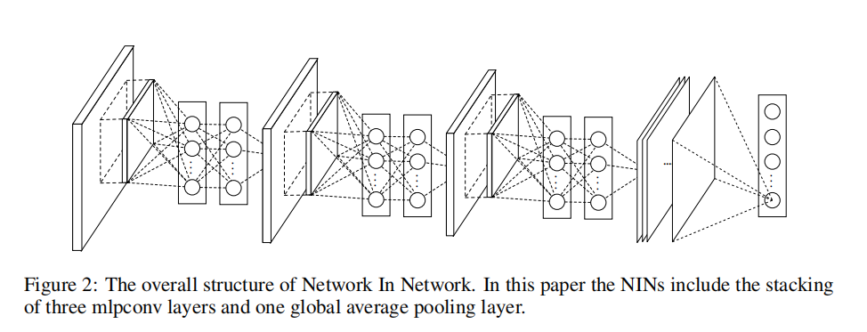
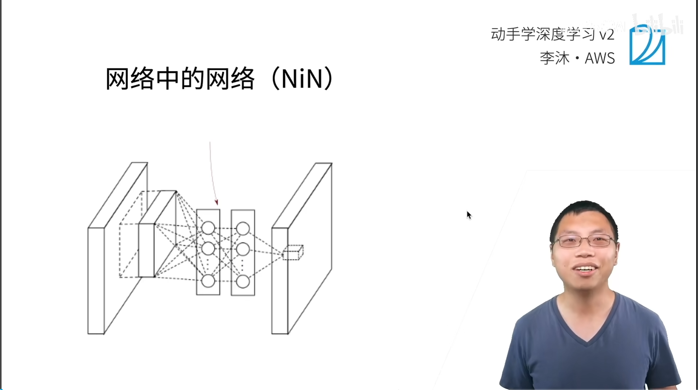
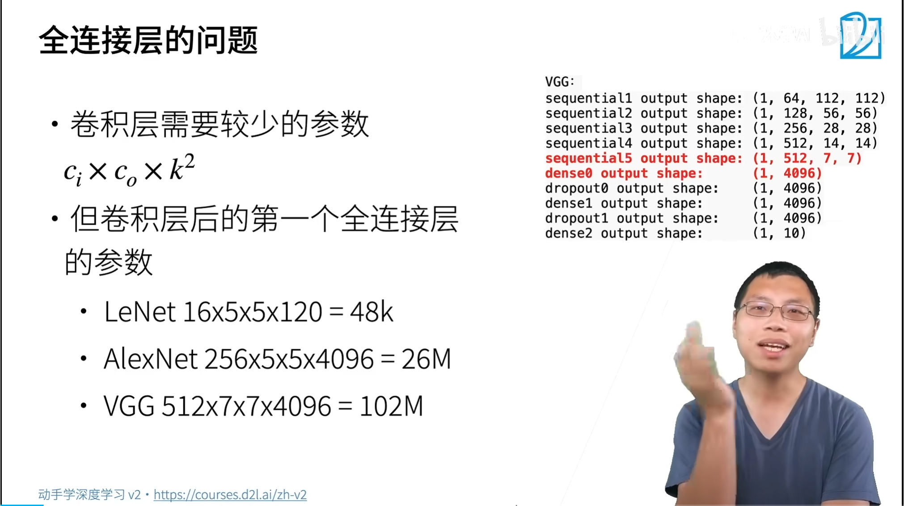
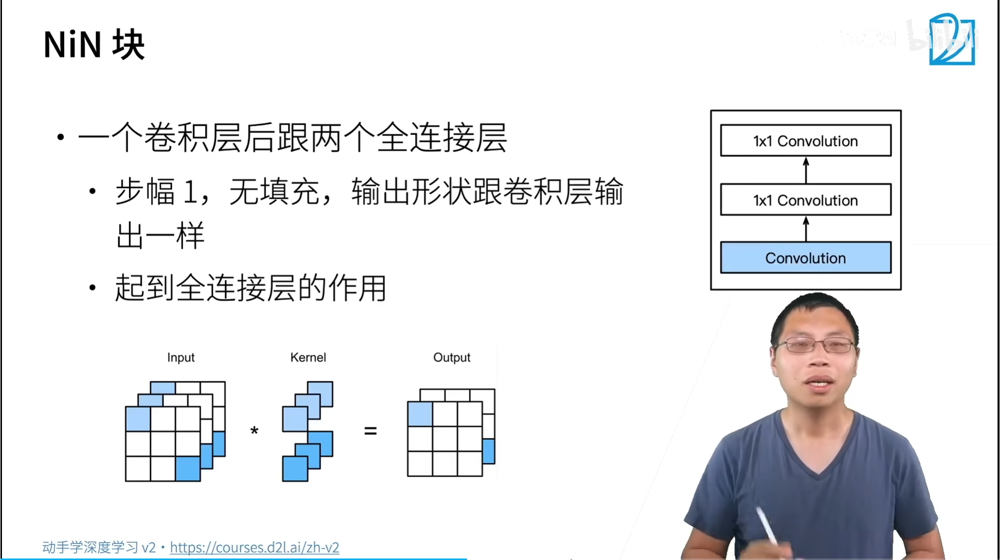
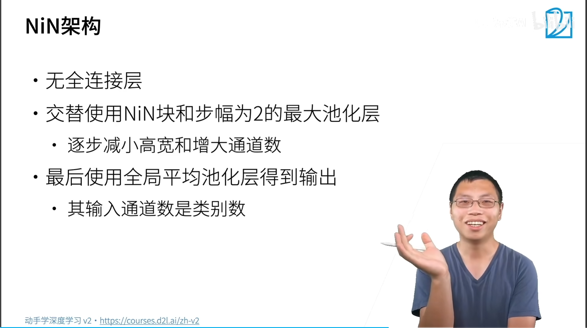
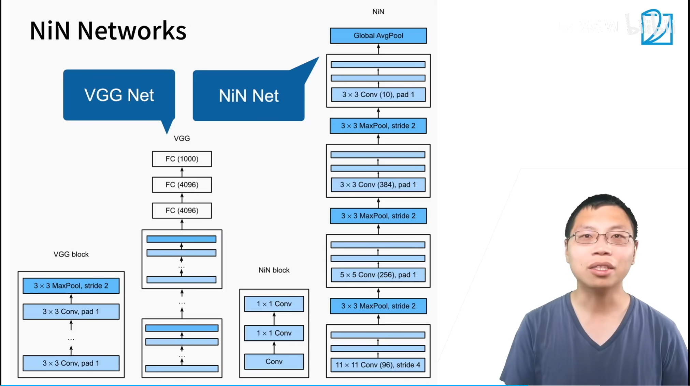
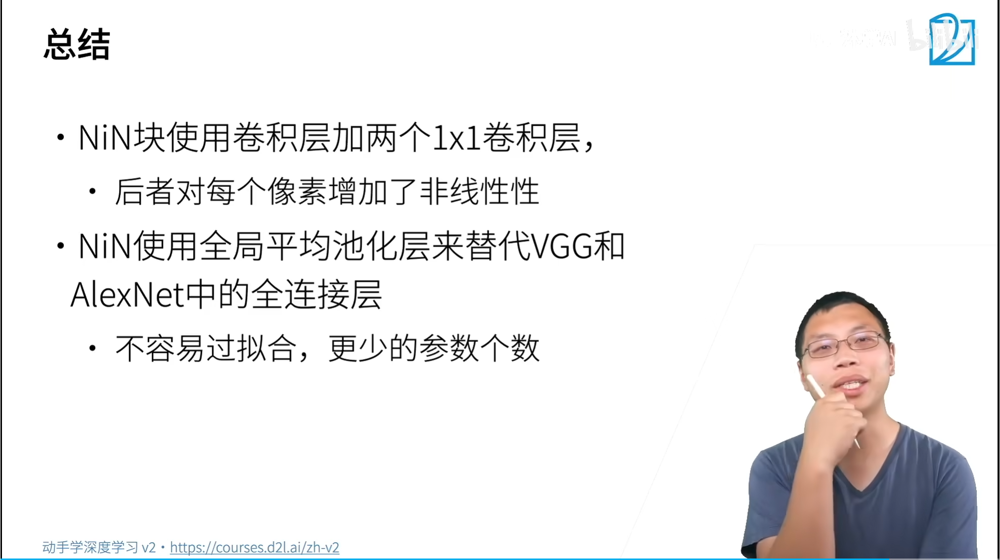

## NiN网络结构

全连接层，会带来过拟合

卷积层参数：$c_i \times c_o \times k^2$

卷积后的第一个全连接层参数：

全局平均池化为什可以作为输出？代替全连接层

1. 参数量

假设在网络的最后，我们有一个特征图，形状为 `[Batch, Channels=512, Height=7, Width=7]`，需要分类为 10 个类别。

- **全连接层（FC）**：
  需要先把特征图拉平（Flatten），变成 `512 * 7 * 7 = 25088` 个节点。
  要映射到 10 个类别，权重矩阵大小为 `[25088, 10]`。
  **参数量 = 25,088 × 10 = 250,880 个**（外加偏置）。
- **全局平均池化（GAP）**：
  直接将 `7x7` 的每个通道压缩成 `1x1`，得到 `[512, 1, 1]`。
  要映射到 10 个类别，只需要一个 `[512, 10]` 的权重矩阵。
  **参数量 = 512 × 10 = 5,120 个**。

**结论**：全局平均池化将全连接层的参数量**缩减了约 98%（从 25万 降到 5千）**。这极大地降低了过拟合的风险，这也是为什么 NiN 用 GAP 来替代 FC 的主要原因。

2. 空间信息处理方式的区别（物理含义）

   两者处理“空间位置”的方式截然不同：

   - **全连接层（FC）**：
     它在将特征图拉平后，会把距离很远的像素（比如左上角和右下角）通过权重连接起来。它**不关心像素的局部位置**，只关心激活值的“绝对数值”。这导致它容易记住训练集中的特定位置，泛化能力较弱。
   - **全局平均池化（GAP）**：
     它是对**每个通道内部的所有像素求平均**。这意味着，它强制要求“特征图”在空间上具有**平移不变性**。也就是说，不管这个特征（比如“猫耳朵”）出现在图片的左上角还是右下角，只要在这个通道的 7x7 区域内存在，求平均后都会得到一个较大的响应值。

   

全局平均池化与普通池化区别？？？

>- **普通平均池化（AvgPool2d）**：基于一个**窗口（kernel_size）**在特征图上滑动，比如 `2×2` 或 `3×3`。它每次只看一个小区域，输出的是一个小方块的平均值。最终，特征图的**高和宽会缩小**，但**通道数保持不变**。
>
>  比如输入是 `256×13×13`，用 `3×3` 池化，步长 2，输出就变成了 `256×6×6`。它缩小了空间尺寸。
>
>- **全局平均池化（Global AvgPool）**：相当于把**窗口设置成与特征图一样大**。也就是说，池化窗口的大小等于输入的高和宽。
>
>  比如输入是 `256×13×13`，全局平均池化会把每个通道上所有 `13×13` 个像素点加起来求平均，最后只得到一个数字。输出结果就是 `256×1×1`。它直接把每个通道压缩成了一个点。
>
>

