# GoogleNet

`Inception`模块的基本组成结构有四个：`1x1`卷积，`3x3`卷积，`5x5`卷积，`3x3`最大池化。

最后再对四个成分运算结果进行通道上组合。

核心：利用不同大小的卷积核实现不同尺度的感知，最后进行融合，可以得到图像更好的表征（即探索特征图上不同邻域内的“相关性”）。

Note：每个分支得到的特征矩阵高和宽必须相同。

> 但Naive Inception有两个缺点：
>
> （1）所有卷积层直接和前一层输入的数据对接，所以卷积层中的计算量会很大（一变四）；
>
> （2）在这个单元中使用的最大池化层保留了输入数据的特征图的深度，所以在最后进行合并后总输出的特征图的深度一定会增加，这样增加了该单元之后的网络结构的计算量。
>
> 所以多加使用了`1x1 `卷积核主要目的是进行压缩降维，减少参数量（即上图b），从而让网络更深、更宽，更好的提取特征，这种思想也称为Pointwise Conv（逐点卷积），简称PW。
>
> 压缩降维：通过卷积层的输出通道数来调整这很好理解；
>
> 减少参数量：假设输入通道数为`Cin`，原本是直接要使用输出通道数为`Cout1`的 N * N 卷积层来进行卷积，那么所需参数量为`Cin * Cout * N * N`；如果加上输出通道数为k的1 * 1卷积核的话，所需参数量为：`Cin * k+N * N * Cout * k`，只要k足够小就能使参数量大幅度下降了。

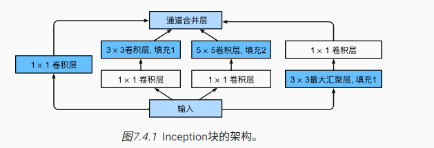

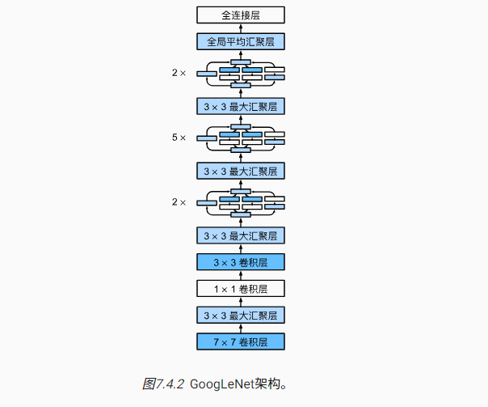

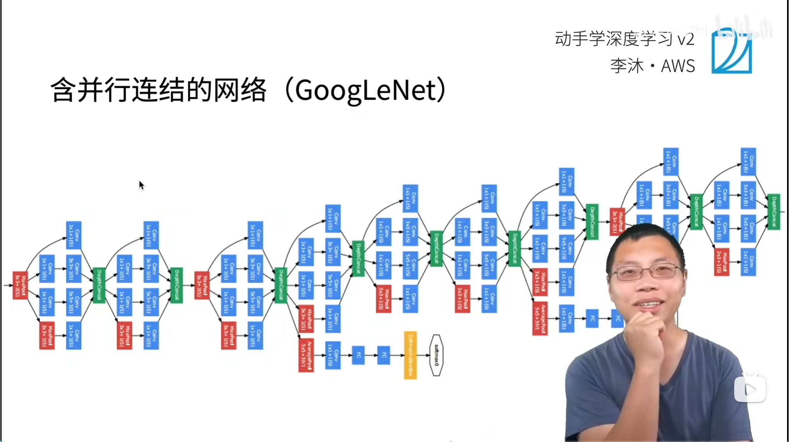

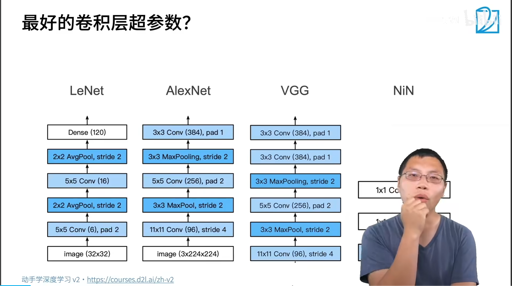

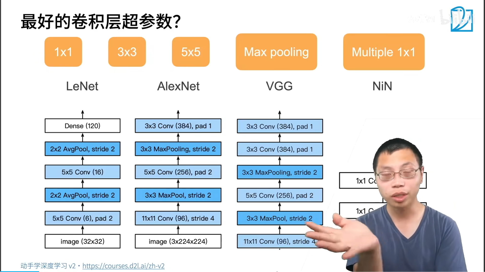

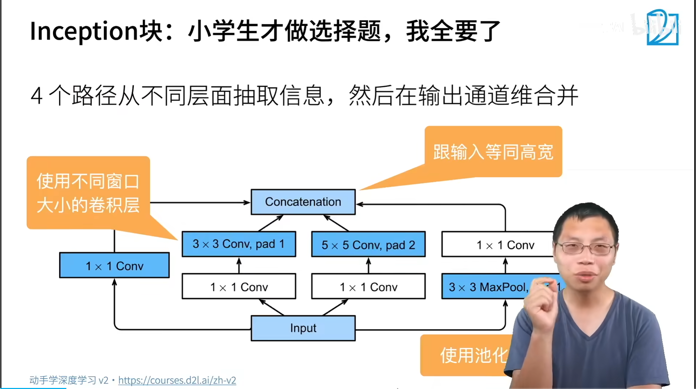

3* 3 pad 1 输入高宽一样

5* 5 pad2 输入高宽一样

$padding = (kernelsize -1)/2$

卷积输出公式：$输出尺寸=（输入尺寸-卷积核+2*填充）/步幅+1$

当步幅$stride$为1时，为了确保 **输出尺寸 = 输入尺寸**，所需的填充（padding）就取决于卷积核大小（kernel_size）。
$$
\begin{aligned}
H_{\text{out}} &= \left\lfloor \frac{H_{\text{in}} + 2P - K_h}{S} \right\rfloor + 1 
\\
W_{\text{out}} &= \left\lfloor \frac{W_{\text{in}} + 2P - K_w}{S} \right\rfloor + 1
\end{aligned}
$$

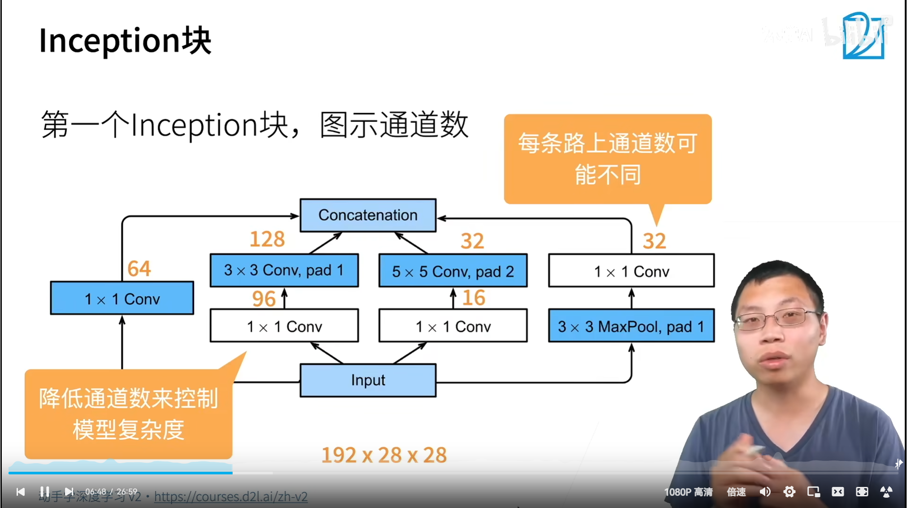

白色框：变化通道数 

蓝色框：抽取信息，不抽取空间信息，只抽取通道信息。

`maxpooling`也是抽取空间信息

抽取通道信息

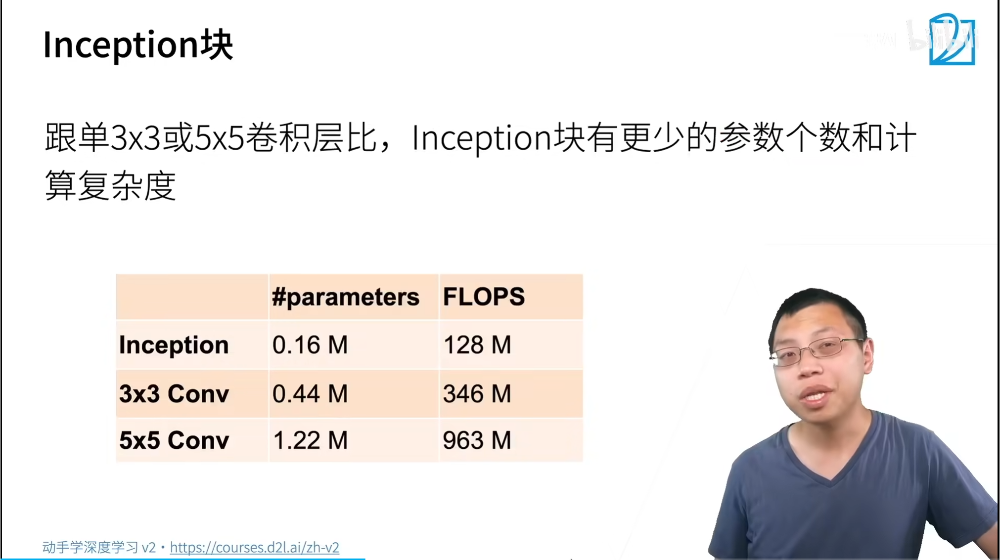

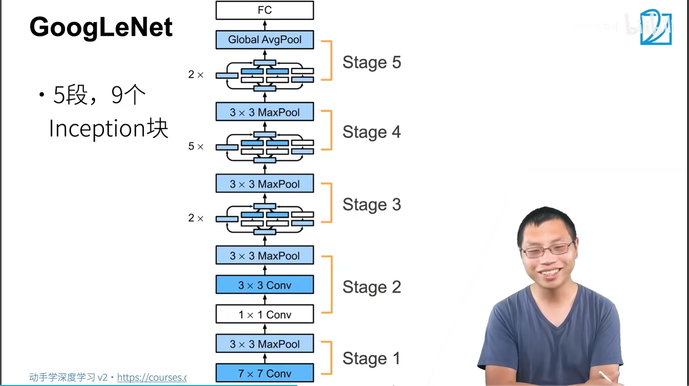

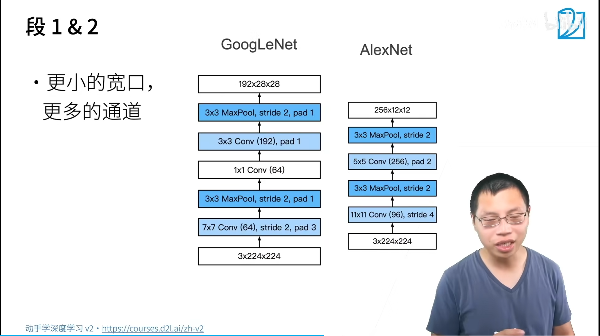

alexnet 降4倍高宽，？？？

googleNet 降2倍高宽？

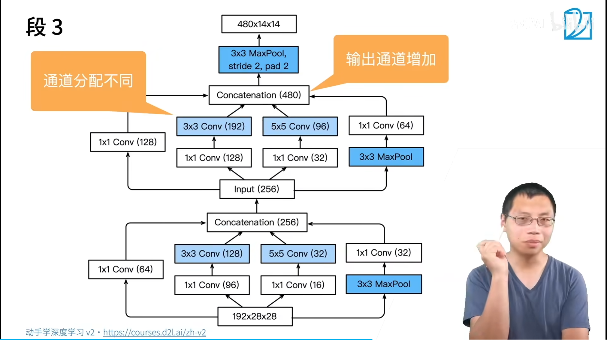

超参数搜索？?

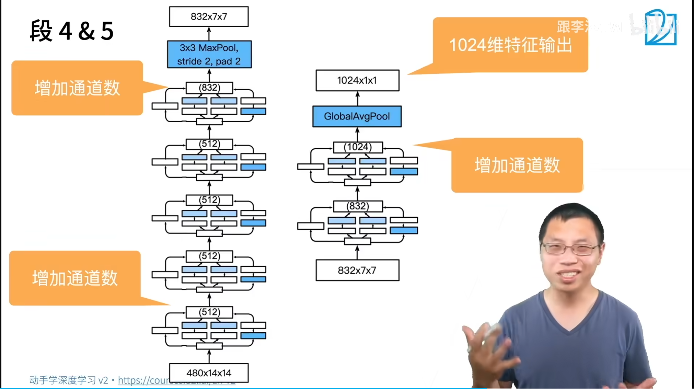

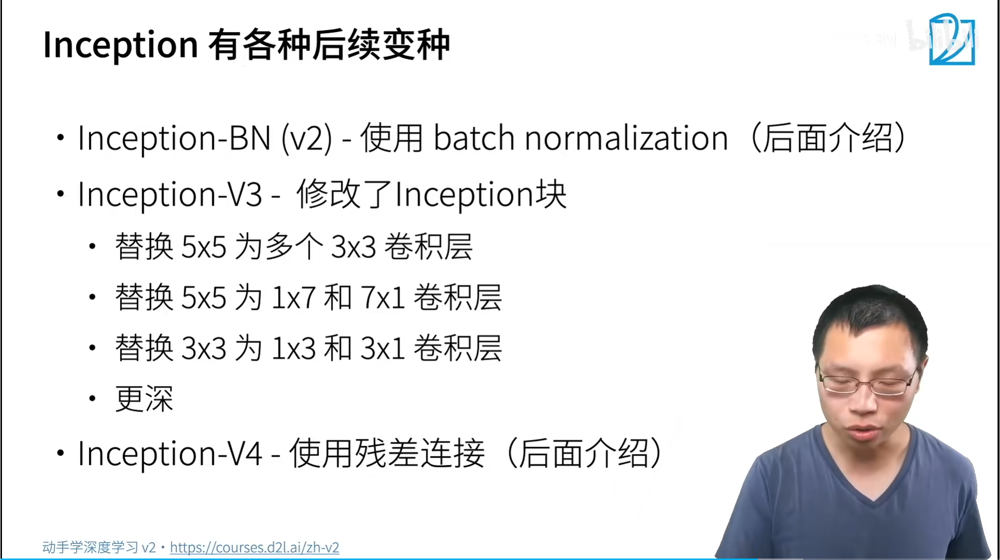

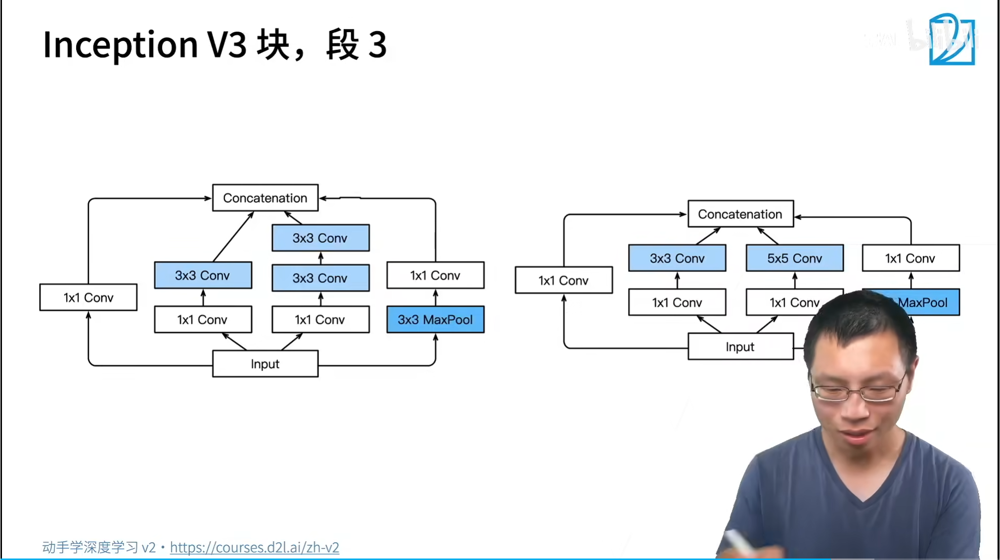

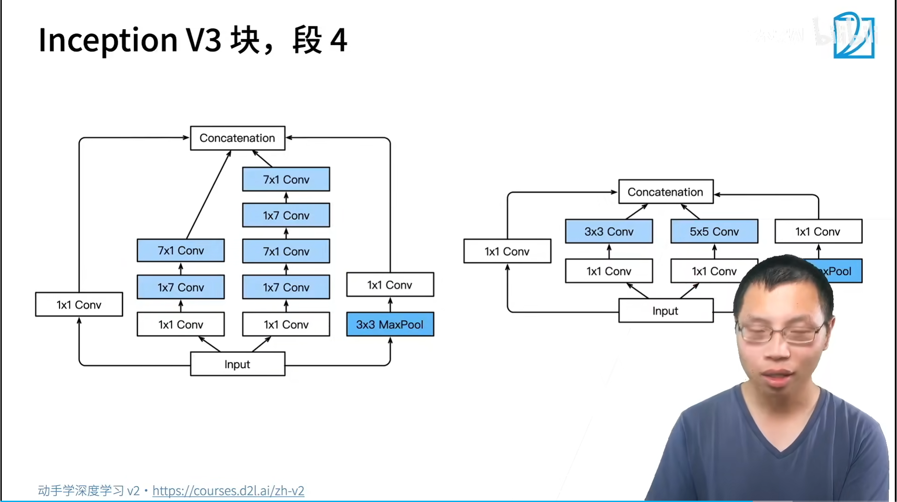

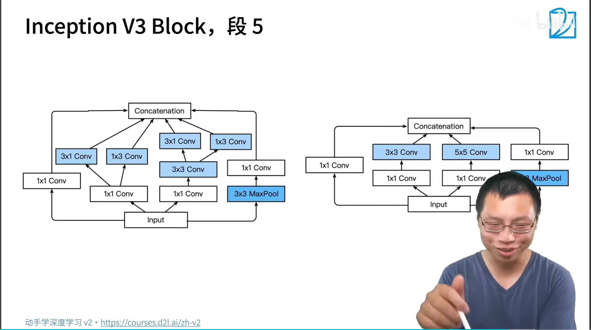

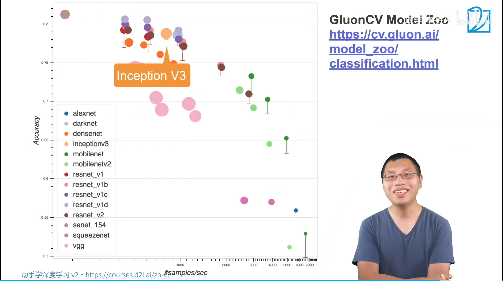

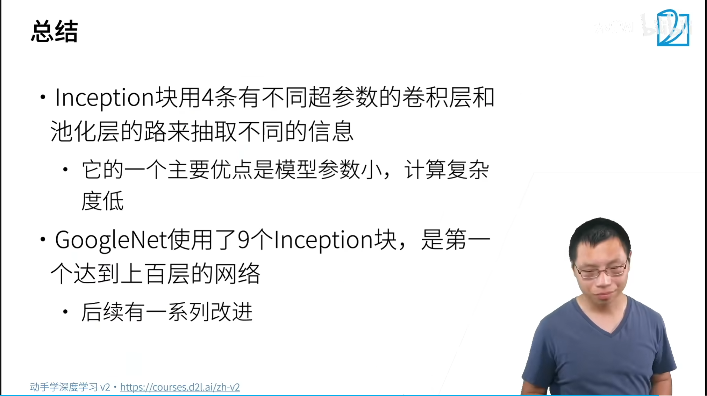

问题1：

通道数不一样是`1 * 1`卷积输出通道造成的

`maxpooling` :对位移更加鲁棒一些；

`1 * 1`卷积，降低通道数，降低复杂度，后面计算量太大了；

2的次幂，幂运算，`GPU`计算会比较块，适合并行运算。

对于经典网络：初期先不要改架构，通道数可以修改，除以2,降低计算；输入输出拉宽拉窄一些都可以。

`3 * 3`修改为`3 * 1`和`1 * 3`降低计算量

调参：`imagenet` 子集上调,1000想法在小数据进行测试，调出10组参数，在完整数据集进行调参。

通道越多，设计精巧、卷积识别的模式越来越多 1024可能就够用了，跟类别相关性不大

trick 技巧，训练技巧

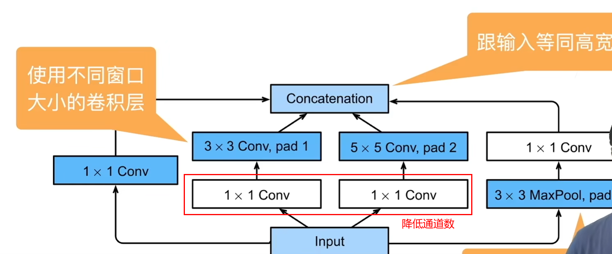

1. [Going deeper with convolutions](https://arxiv.org/pdf/1409.4842)

