# 28.批归一化

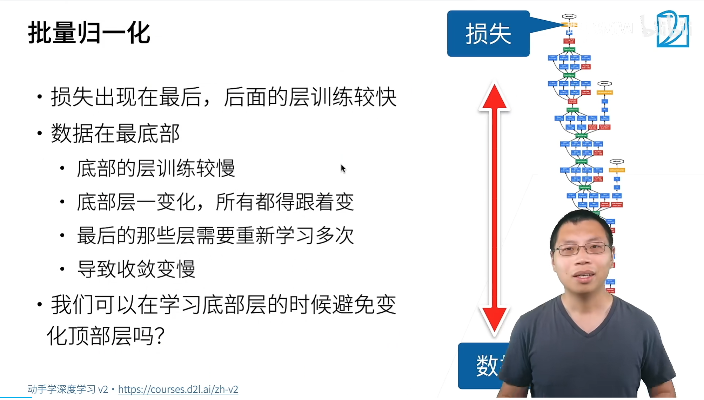

自动梯度求导：

正向从下面数据往上走forward，但是你算backward时，是从上面往下传。

问题：梯度在上面大，下面小（靠近数据位置）

学习率是一个就是一个值，所以但是你下面层因为你梯度比较小，对你的权重的更新就比较少，那么你的问题就是说你的上面的东西会很快的，可能会收敛，下面东西会比较慢，那么导致一个问题是说每一次你更新下面的东西，上面就得重新训练。

底层数据特征一般是局部边缘、纹理等，高层是语义信息特征。下面信息变化，上面就白学了。

**批量归一化引入背景**：

- **梯度问题**：在深度神经网络中，正向传播从数据向上，反向传播从损失函数向下。由于梯度在传递中常是多个小数相乘，越靠近数据的层梯度越小，而学习率通常为固定值，导致上层梯度大更新快易收敛，下层梯度小更新慢，且下层变化会使上层需重新训练，进而导致收敛变慢。
- **分布变化**：不同层之间数据的方差和均值等分布会发生变化，影响学习的稳定性。

**批量归一化原理**：

- **基本思想**：尝试固定一个小批量（mini - batch）在**不同层不同位置数据的均值和方差**，使分布相对稳定，便于学习细微变动。
- **公式计算**：对于小批量样本，先计算均值（对小批量样本求和除以批量大小），方差为样本减去均值的平方和加上一个小数（防止为 0）。批量归一化输出为对输入样本减去均值除以方差，再乘以可学习参数$\gamma$，加上可学习参数$\beta$。

上面很快收敛，下面靠近数据的不容易收敛
$$
\mu_B = \frac{1}{|B|}\sum_{i\in B} x_i \quad \text{and} \quad \sigma_B^2 = \frac{1}{|B|}\sum_{i\in B} \left(x_i - \mu_B\right)^2 + \epsilon
$$

$$
x_{i+1} = \gamma \frac{x_i - \mu_B}{\sigma_B} + \beta
$$
`Batch`均值：
$$
\mu_B = \frac{1}{m}\sum_{i=1}^{m} x_i
$$
`Batch`方差：
$$
\sigma_B^2 = \frac{1}{m}\sum_{i=1}^{m} (x_i - \mu)^2
$$
归一化：
$$
\hat{x} = \frac{x - \mu}{\sqrt{\sigma^2 + \varepsilon}}
$$

$$
y = \gamma \hat{x}+\beta
$$

- $\gamma $：缩放（Scale）

- $\beta$：平移（Shift）

参数$\gamma$，$\beta$是可训练参数，也叫学习参数。

`BN` 的作用不仅仅是限制输入的范围，更关键的是它**限制了梯度的变化范围**，使得损失函数的表面变得**更加平滑**。在这种平滑的地形上，梯度下降的方向更加稳定和可靠，不会因为某一步梯度特别大而“踩空”或“爆炸”，因此我们可以使用**更大的学习率（Learning Rate）**。大学习率意味着每一步迈得更大，收敛速度自然就快得多。

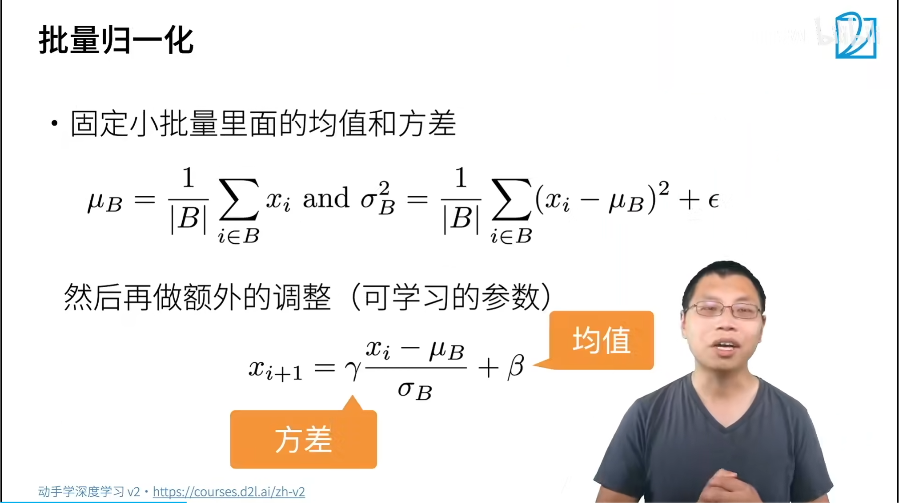

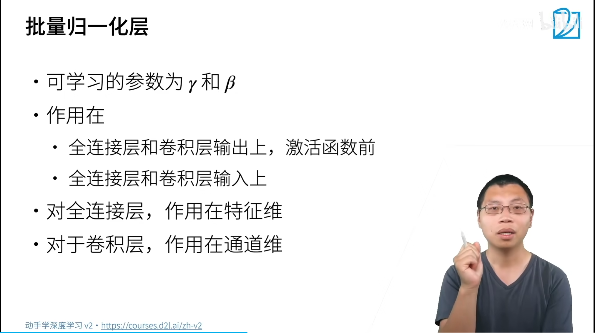

批量归一化，线性变化

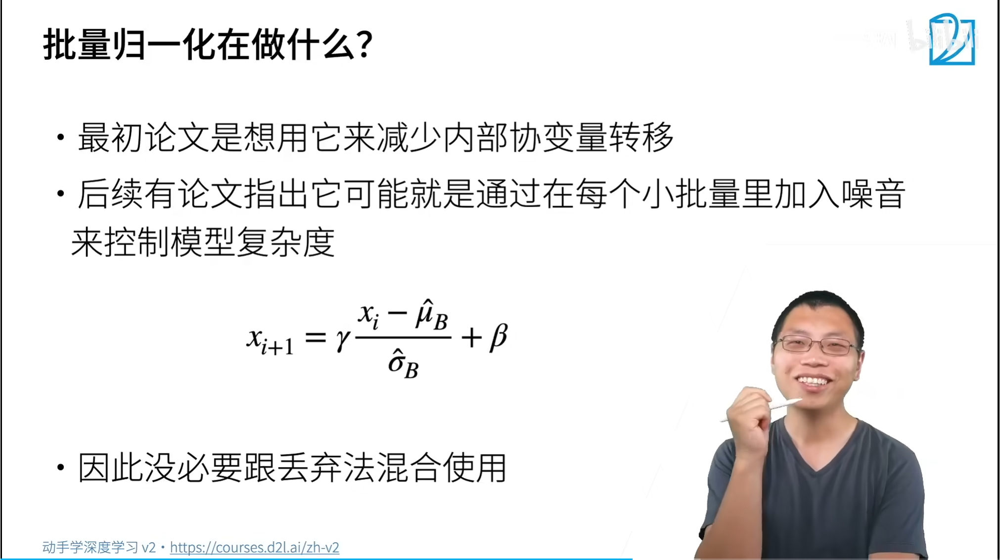

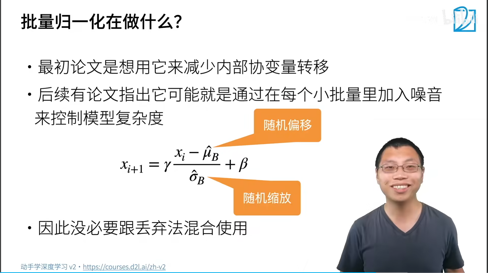

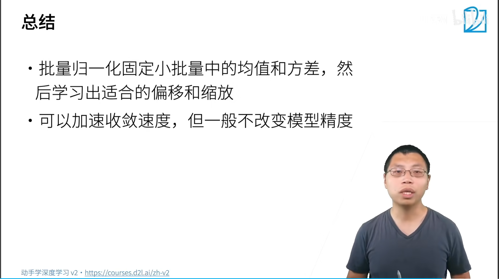

模型稳定，收敛就不会慢，选择 较好的初始化

### 主流归一化方法对比

我把最常用的几种方法整理成了一张表，方便你直观地看到它们的区别。核心是看它们对形状为 `[N, C, H, W]` 的特征图（N为批次，C为通道，H和W为空间维度）的哪个维度进行归一化。

| 方法                            | 归一化维度                   | 是否依赖批次 | 常见应用场景                           |
| :------------------------------ | :--------------------------- | :----------- | :------------------------------------- |
| **Batch Normalization (BN)**    | 跨样本、按通道 (`N, H, W`)   | 是           | CNN图像分类、目标检测等大多数视觉任务  |
| **Layer Normalization (LN)**    | 单样本、全通道 (`C, H, W`)   | 否           | Transformer、RNN等NLP模型              |
| **Instance Normalization (IN)** | 单样本、单通道 (`H, W`)      | 否           | 图像风格迁移、生成对抗网络(GAN)        |
| **Group Normalization (GN)**    | 单样本、分组通道 (将`C`分组) | 否           | 小批次训练场景（如目标检测、语义分割） |

### 1. 正态分布

① 正态分布，又叫做高斯分布。

② 若随机变量$X$，服从一个位置参数为$\mu$、尺度参数为$\sigma$的概率分布，且其概率密度函数为：

$f(x)=\frac{1}{\sigma\sqrt{2 \pi} } e^{- \frac{{(x-\mu)^2}}{2\sigma^2}} \tag{1}$

③ 则这个随机变量就称为正态随机变量，正态随机变量服从的分布就称为正态分布，记作：

$X \sim N(\mu,\sigma^2) \tag{2}$

④ 当μ=0,σ=1时，称为标准正态分布：

$X \sim N(0,1) \tag{3}$

⑤ 此时公式简化为：

$f(x)=\frac{1}{\sqrt{2 \pi}} e^{- \frac{x^2}{2}} \tag{4}$

⑥ 下图是三种$（\mu,\sigma）$组合的函数图像。

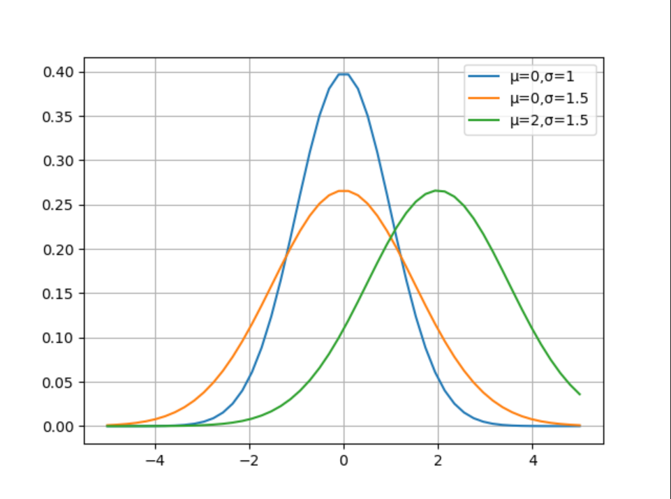

### 2. 每层数据分布

① 机器学习领域有个很重要的假设：I.I.D.（独立同分布）假设，就是假设训练数据和测试数据是满足相同分布的，这样就能做到通过训练数据获得的模型能够在测试集获得好的效果。

② 在深度神经网络中，我们可以将每一层视为对输入的信号做了一次变换：

$Z = W \cdot X + B \tag{5}$

③ 输入层的数据如果不做归一化，很多时候甚至网络不会收敛，可见归一化的重要性。

④ 随后的网络的每一层的输入数据在经过公式5的运算后，其分布一直在发生变化，前面层训练参数的更新将导致后面层输入数据分布的变化，必然会引起后面每一层输入数据分布的改变，不再是输入的原始数据所适应的分布了。

⑤ 而且，网络前面几层微小的改变，后面几层就会逐步把这种改变累积放大。训练过程中网络中间层数据分布的改变称之为内部协变量偏移（Internal Covariate Shift）。BN的提出，就是要解决在训练过程中，中间层数据分布发生改变的情况。

① 比如，在上图中，假设X是服从蓝色或红色曲线的分布，经过公式5后，有可能变成了绿色曲线的分布。

② 标准正态分布的数值密度占比如下图所示。

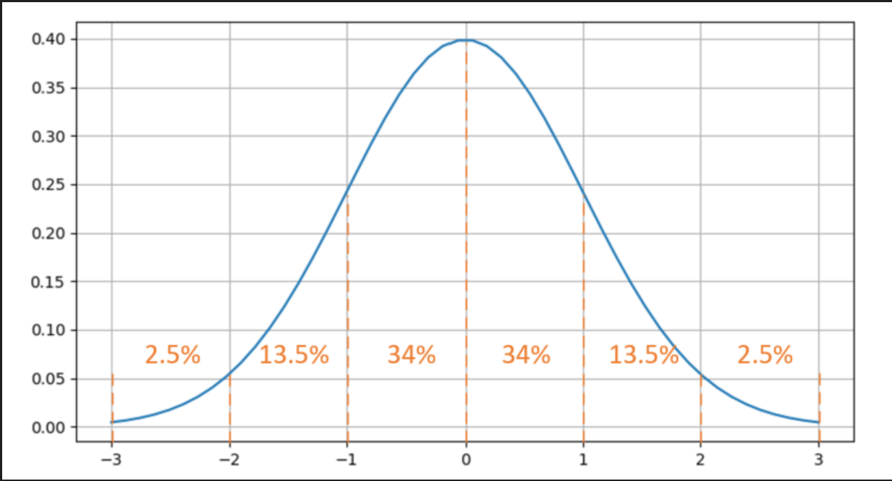③ 有68%的值落在[-1,1]之间，有95%的值落在[-2,2]之间。

① 比较一下偏移后的数据分布区域和Sigmoid激活函数的图像，如下图所示。

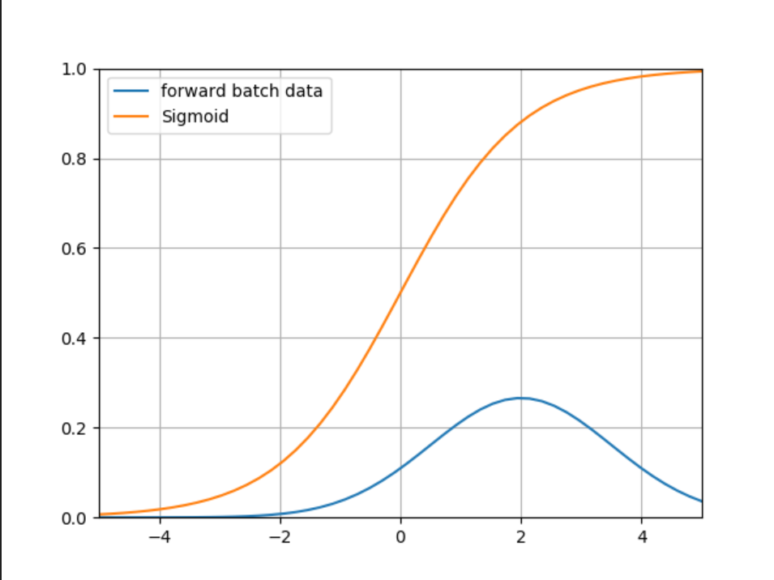

② 可以看到带来的问题是：

\1. 在大于2的区域，激活后的值基本接近1了，饱和输出。如果蓝色曲线表示的数据更偏向右侧的话，激活函数就会失去了作用，因为所有的输出值都是0.94、0.95、0.98这样子的数值，区别不大；

\2. 导数数值小，只有不到0.1甚至更小，反向传播的力度很小，网络很难收敛。

① 我们在深度学习中不是都用ReLU激活函数吗？那么BN对于ReLU有用吗？下面我们看看ReLU函数的图像，如下图所示。

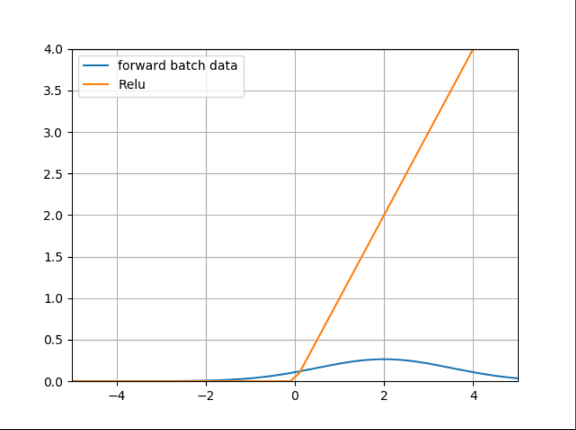

② 上图中蓝色为数据分布，已经从0点向右偏移了，黄色为ReLU的激活值，可以看到95%以上的数据都在大于0的区域，从而被Relu激活函数原封不动第传到了下一层网络中，而没有被小于0的部分剪裁，那么这个网络和线性网络也差不多了，失去了深层网络的能力。

### 3.批量归一化

① 既然可以把原始训练样本做归一化，那么如果在深度神经网络的每一层，都可以有类似的手段，也就是说把层之间传递的数据移到0点附近，那么训练效果就应该会很理想。这就是批归一化BN的想法的来源。

② 深度神经网络随着网络深度加深，训练起来越困难，收敛越来越慢，这是个在DL领域很接近本质的问题。很多论文都是解决这个问题的，比如ReLU激活函数，再比如Residual Network。BN本质上也是解释并从某个不同的角度来解决这个问题的。

③ BN就是在深度神经网络训练过程中使得每一层神经网络的输入保持相同的分布，致力于将每一层的输入数据正则化成的分布。因次，每次训练的数据必须是mini-batch形式，一般取32，64等数值。

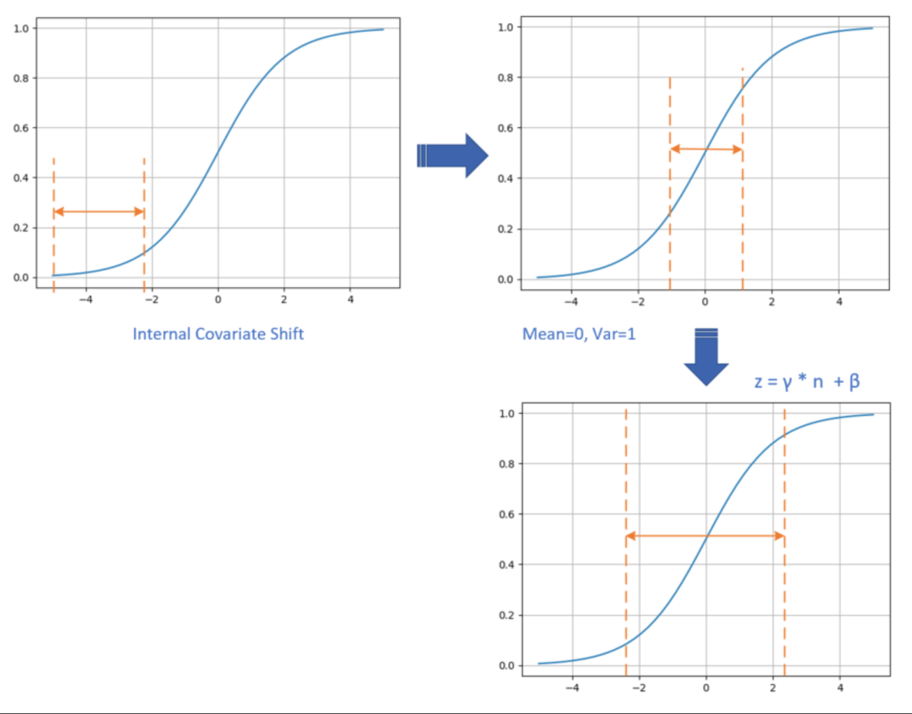

① 数据在训练过程中，在网络的某一层会发生Internal Covariate Shift，导致将数据处于激活函数的饱和区；

② 经过均值为0、方差为1的变换后，位移到了0点附近。但是只做到这一步的话，会带来两个问题：

\1. 在[-1,1]这个区域，Sigmoid激活函数是近似线性的，造成激活函数失去非线性的作用；

\2. 在二分类问题中我们学习过，神经网络把正类样本点推向了右侧，把负类样本点推向了左侧，如果再把它们强行向中间集中的话，那么前面学习到的成果就会被破坏；

③ 经过$\gamma,\beta$的线性变换后，把数据区域拉宽，则激活函数的输出既有线性的部分，也有非线性的部分，这就解决了问题a；而且由于$\gamma,\beta$也是通过网络进行学习的，所以以前学到的成果也会保持，这就解决了问题b。

④ 在实际的工程中，我们把BN当作一个层来看待，一般架设在全连接层（或卷积层）与激活函数层之间。

### 参考

1. [Batch Normalization: Accelerating Deep Network Training b y Reducing Internal Covariate Shift](https://arxiv.org/pdf/1502.03167)