# `ResNet` 网络


> 参考：
>
> 1. [动手学深度学习（二十四）——公式详解ResNet](https://blog.csdn.net/jerry_liufeng/article/details/119710269)
>
> 

ResNetV2的网络深度有18，34，50，101，152。50层以下的网络基础块是BasicBlock，50层及以上的网络基础块是BottleNeck。

# BasicBlock

图示如下

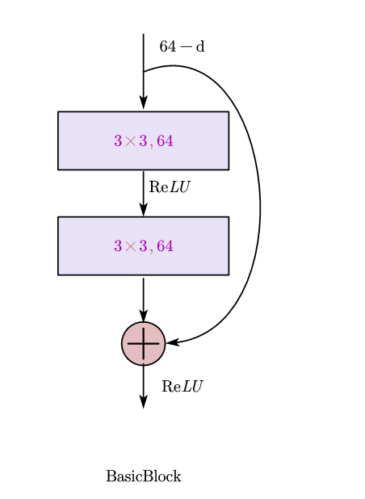

代码实现

```
class BasicBlock(nn.Module):
    expansion = 1
    def __init__(self, in_channel, out_channel, stride=1, downsample=None):
        super(BasicBlock, self).__init__()
        self.conv1 = conv3x3(in_channel, out_channel, stride)
        self.bn1 = nn.BatchNorm2d(out_channel)
        self.relu = nn.ReLU(inplace=True)
        self.conv2 = conv3x3(out_channel, out_channel)
        self.bn2 = nn.BatchNorm2d(out_channel)
        self.downsample = downsample
        self.stride =stride

    def forward(self, x):
        residual = x
        out = self.conv1(x)
        out = self.bn1(out)
        out = self.relu(out)
        out = self.conv2(out)
        out = self.bn2(out)
        if self.downsample is not None:
            residual = self.downsample(x)

        out = out + residual
        out = self.relu(out)

        return out
```

# BottleNeck

图示如下

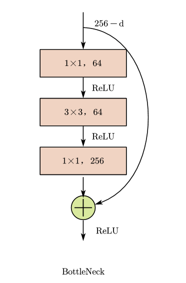

代码实现：

```
class Bottleneck(nn.Module):

    expansion = 4

    def __init__(self, in_channel, out_channel, stride=1, downsample=None):
        super(Bottleneck, self).__init__()

        self.conv1 = nn.Conv2d(in_channel, out_channel, kernel_size=1, stride=stride, bias=False)
        self.bn1 = nn.BatchNorm2d(out_channel)

        self.conv2 = nn.Conv2d(out_channel, out_channel, kernel_size=3, stride=1, padding=1, bias=False)  # stride = 3
        self.bn2 = nn.BatchNorm2d(out_channel)

        self.conv3 = nn.Conv2d(out_channel, out_channel * 4, kernel_size=1, bias=False)
        self.bn3 = nn.BatchNorm2d(out_channel * 4)

        self.relu = nn.ReLU(inplace=True)
        self.stride = stride
        self.downsample =downsample


    def forward(self, x):
        residual = x

        out = self.conv1(x)
        out = self.bn1(out)
        out = self.relu(out)

        out = self.conv2(out)
        out = self.bn2(out)
        out = self.relu(out)

        out = self.conv3(out)
        out = self.bn3(out)

        if self.downsample is not None:
            residual = self.downsample(x)

        out = out + residual
        out = self.relu(out)

        return out
```

### ResNet


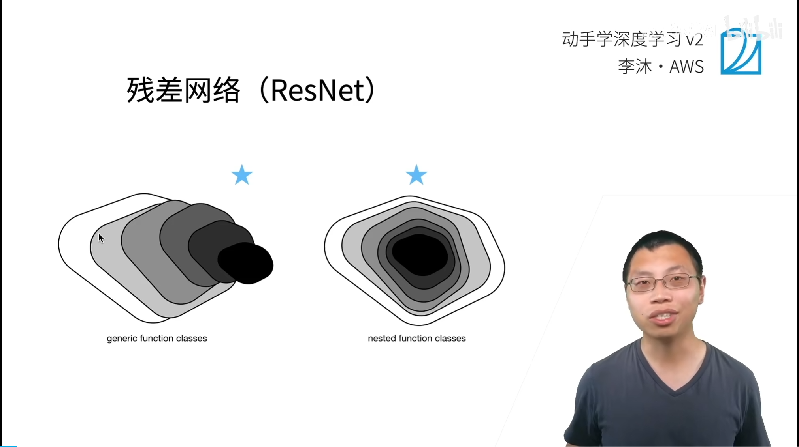


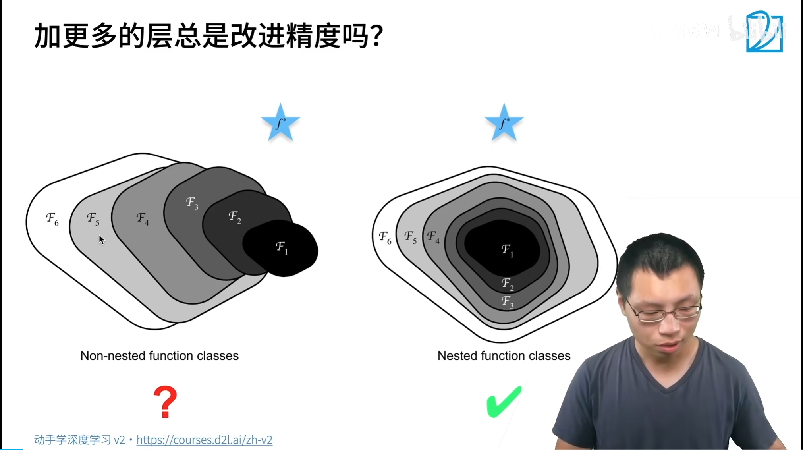

更复杂的模型一定带来好处吗？加深一定带来好处吗

函数的大小代表复杂程度，F6更大更复杂，但是可能学偏了,F3模型应该是最优的，欧氏距离最短

更复杂模型，包含简单模型，不会变差。所以我就是我能学到的那个模型就会严格的比前面更大，所以永远是至少不会变差。


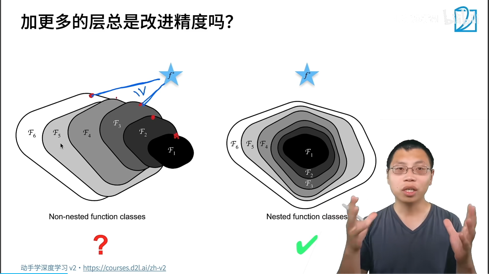

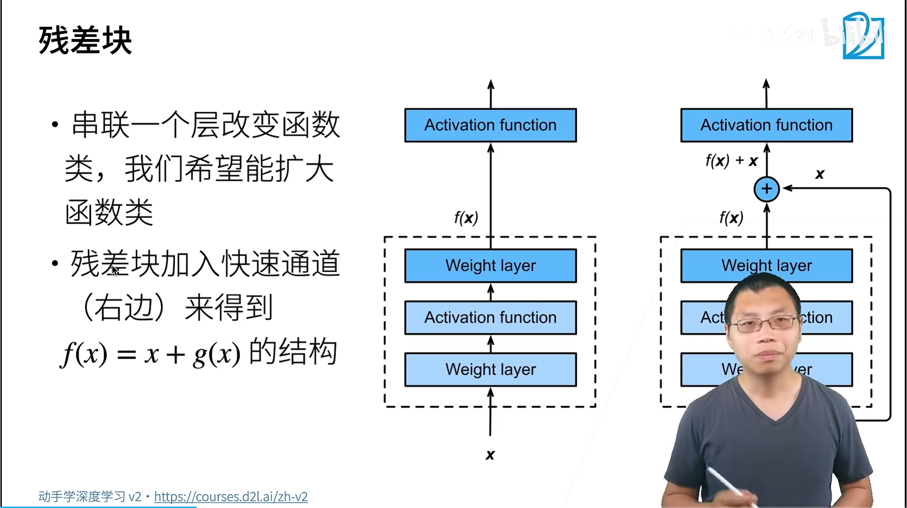

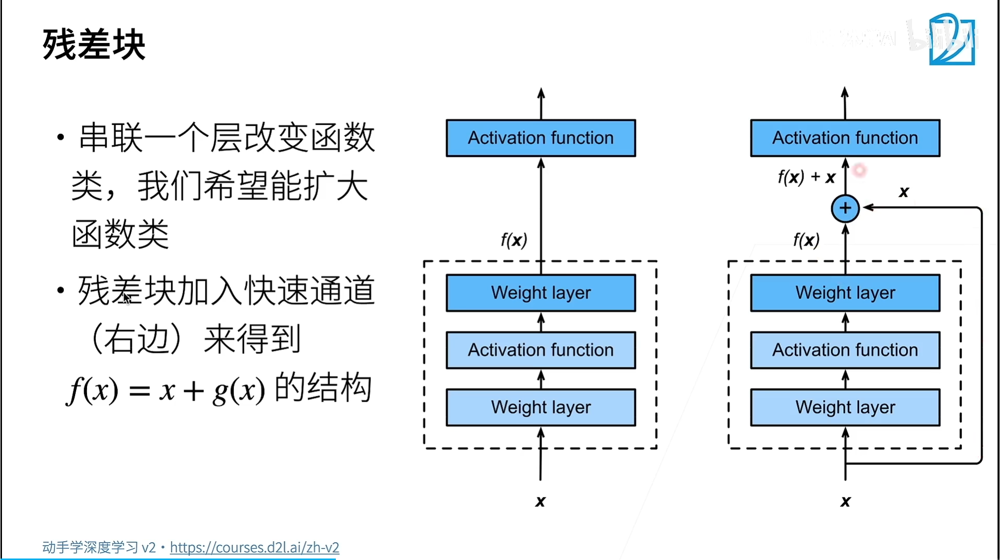
$$
f(x)=x+g(x)
$$
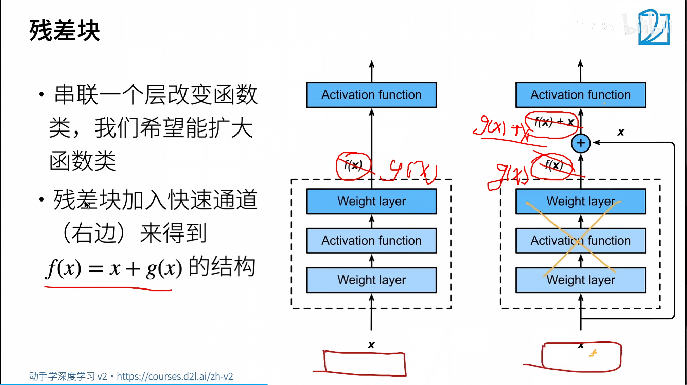

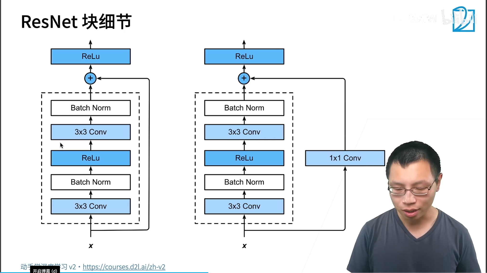


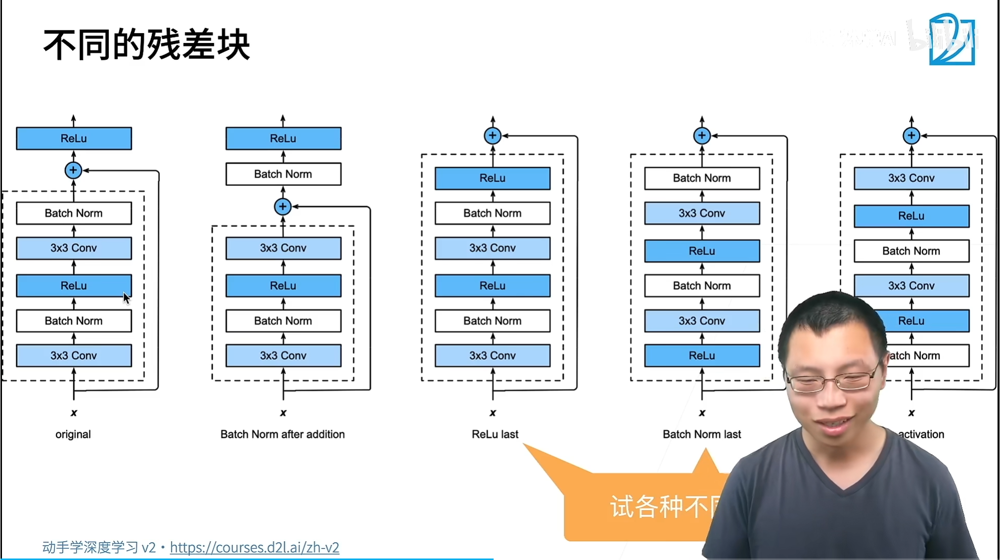

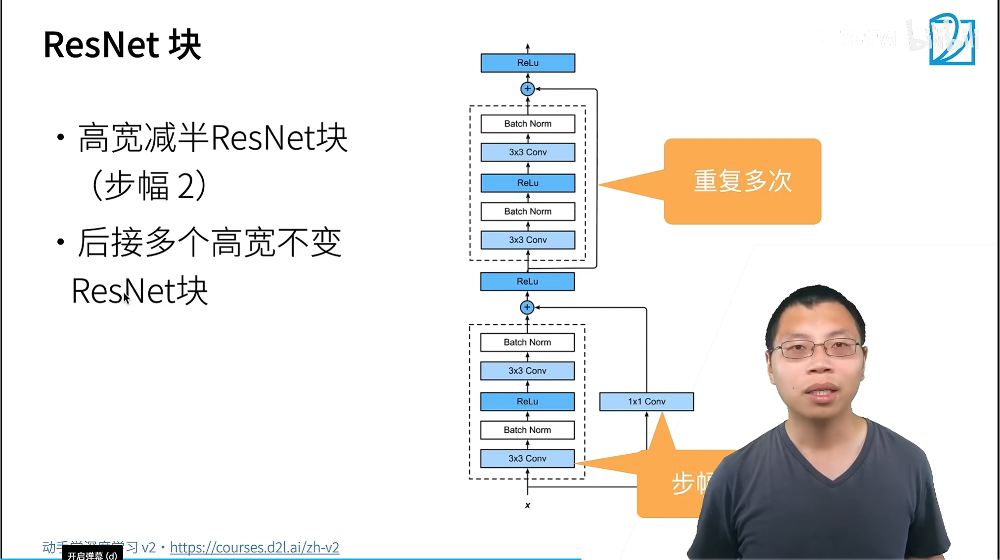


```python
# 1* 1卷积块：高宽减半，通道增加一倍
nn.Conv2d(
    in_channels=64,
    out_channels=128,
    kernel_size=1,
    stride=1,
    padding=0
)
```

$$
H_{out} = \frac{H_{in}+2 \times Padding -Kernel}{Stride}+1
\\
H = \frac{64-2 \times 0 - 1}{1}+1
$$


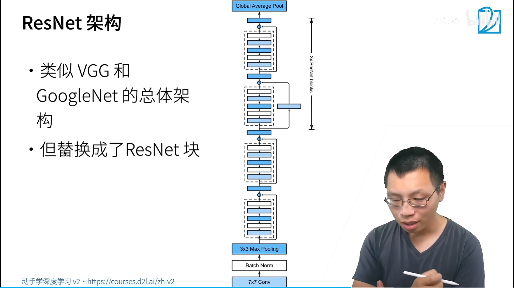

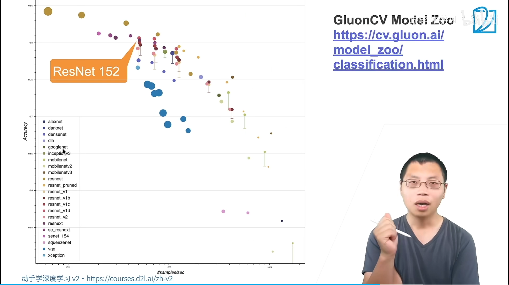

扩散学习率

层数越少，速度越快。34：34个卷积层

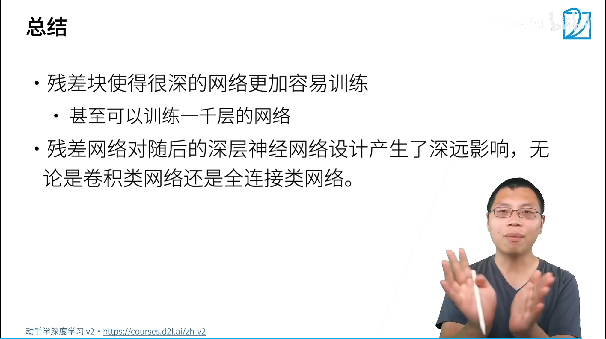


cos和step学习率？

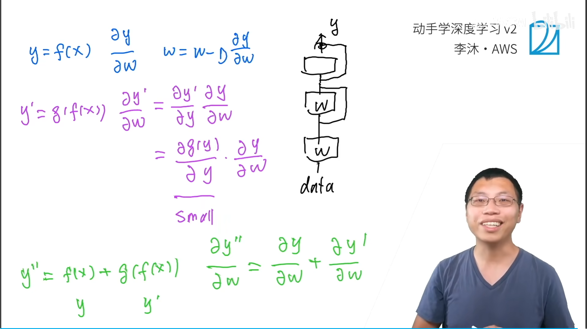

1. [Deep Residual Learning for Image Recognition](https://arxiv.org/pdf/1512.03385)


