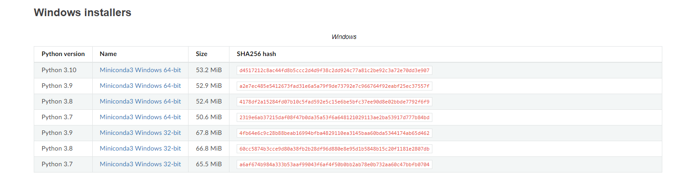
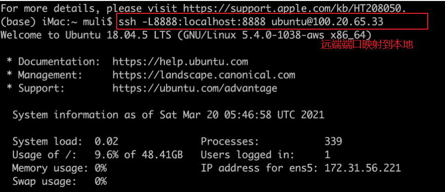
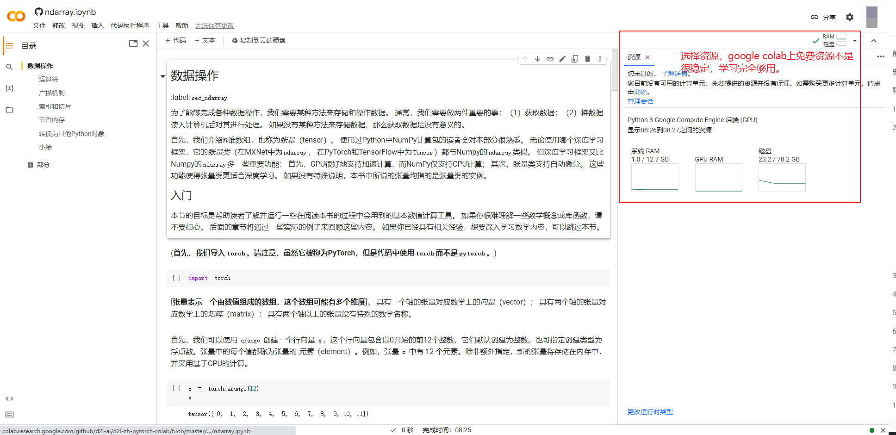

# 3. 【动手学深度学习v2】安装环境

> 李沐
>
> B站：https://space.bilibili.com/1567748478/channel/seriesdetail?sid=358497
>
> 课程主页：https://courses.d2l.ai/zh-v2/
>
> 教材：https://zh-v2.d2l.ai/
>
> 课件：https://courses.d2l.ai/zh-v2/assets/pdfs/part-0_3.pdf

## 1. 安装Python\Anaconda

+ 安装[mini Anaconda]( https://docs.conda.io/en/latest/miniconda.html):

  下载地址： https://docs.conda.io/en/latest/miniconda.html



+ 安装[Python](https://www.python.org/downloads/)

`python` 下载 ：https://www.python.org/downloads/


## 2. 安装虚拟环境

```bash
# 创建虚拟环境
conda create -n torch python=3.8
# 激活
conda activate torch
```


## 3. 安装库

```bash
# 安装pytorch d2l
pip install jupyter d2l torch torchvision

# 清华源下载
pip install jupyter d2l torch torchvision -i https://pypi.tuna.tsinghua.edu.cn/simple
```

## 4. 远端服务器映射

用`ssh`终端软件，比如`securecrt`，`putty`



## 5. google colab

