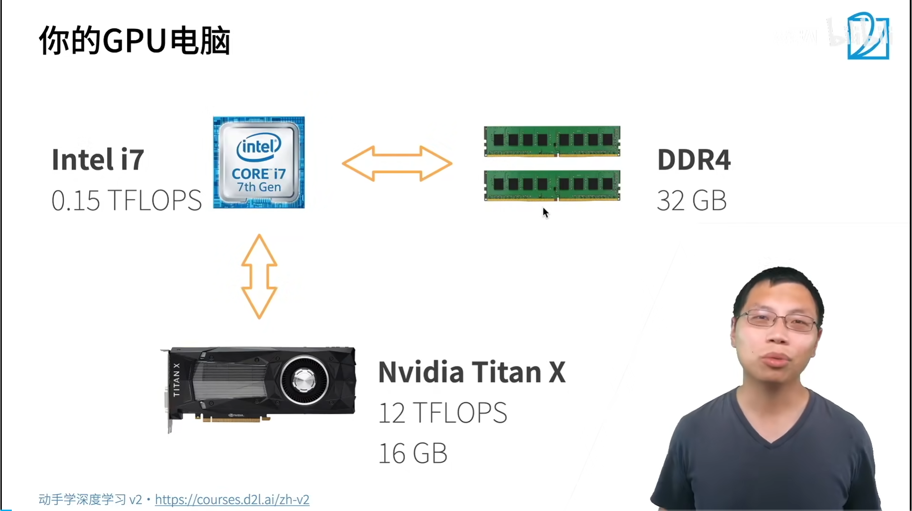

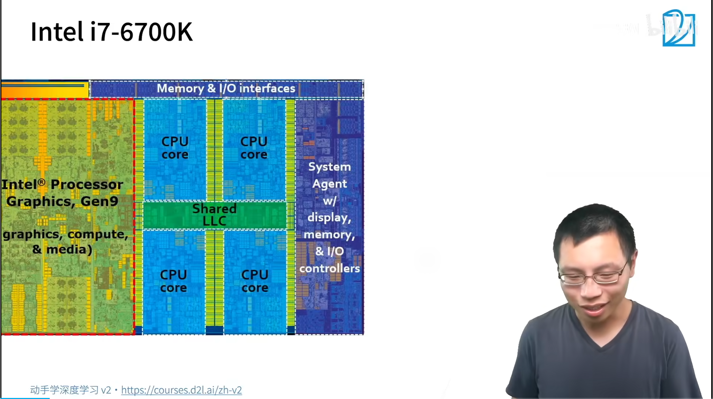

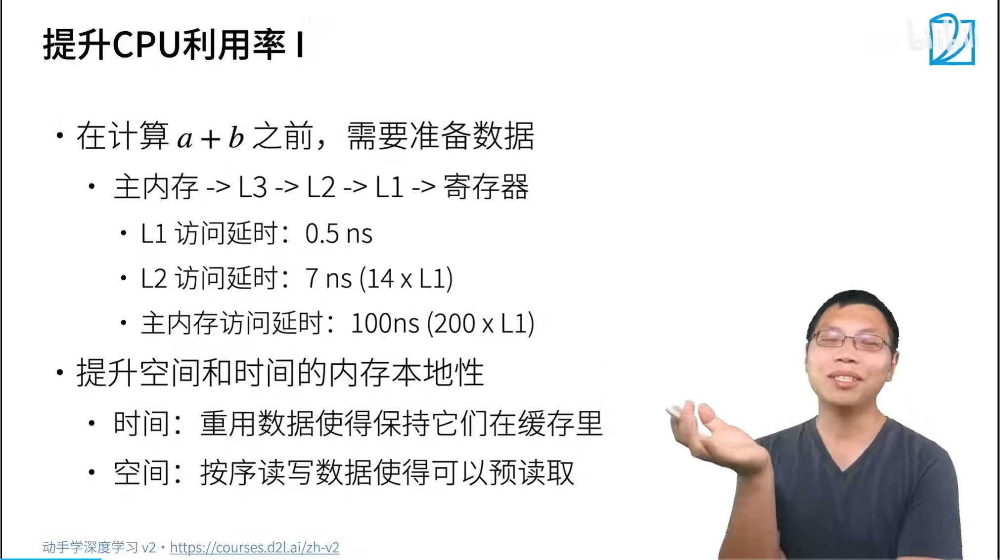

数据进入寄存器才能开始计算

提升空间和时间上的本地性

访问一行，比访问一列要快，CPU一次性读取64字节，读到缓存中

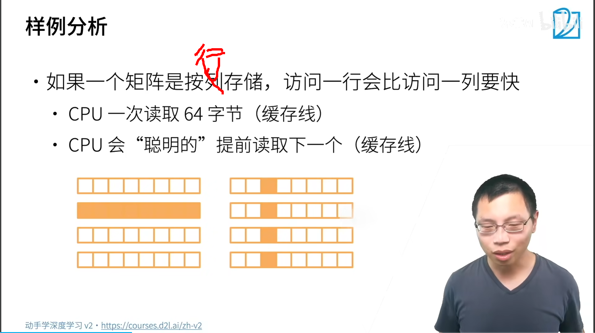

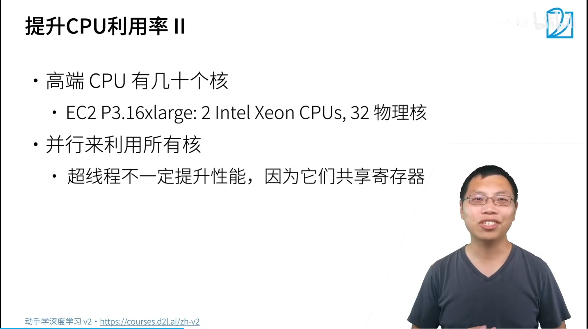

摩尔定律

高端CPU，多个核，超线程没有改变寄存器数量

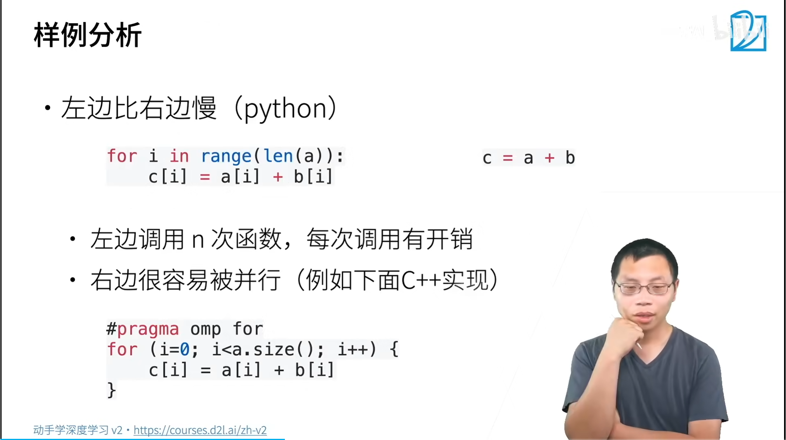

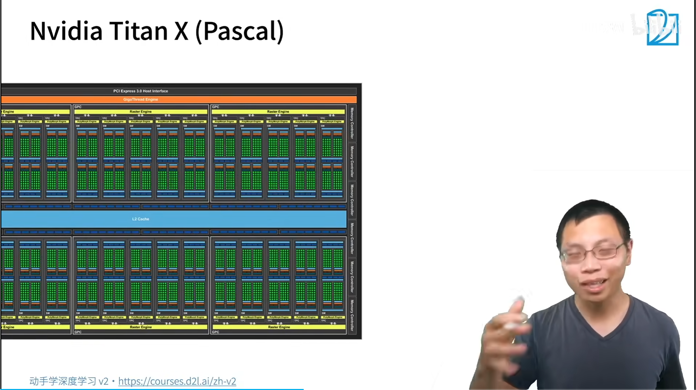

GPU 开上千个显存，绿点

GPU核远远高于CPU

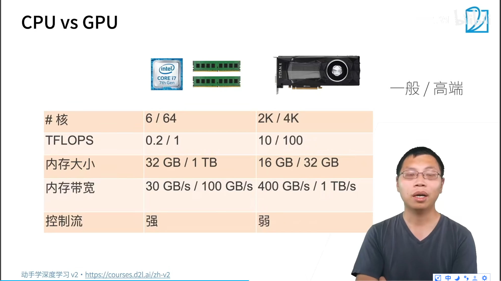

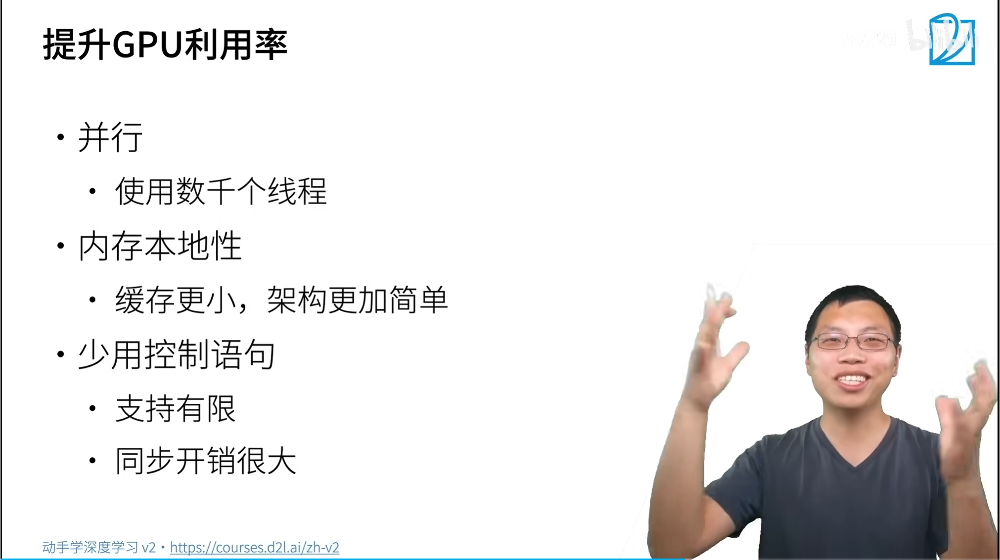

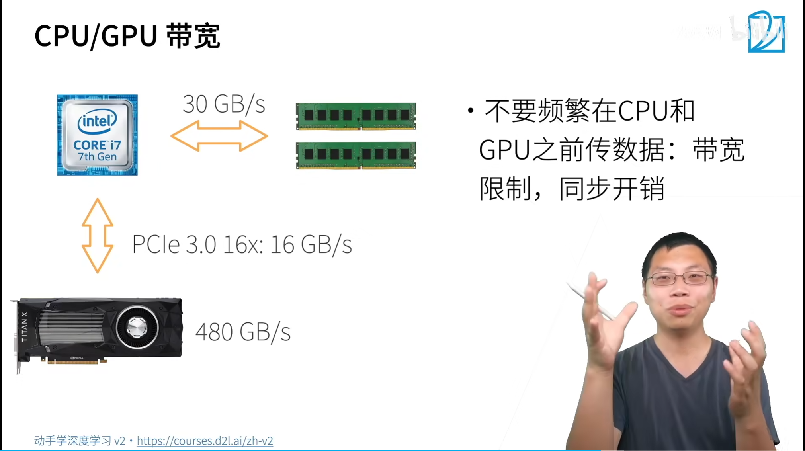

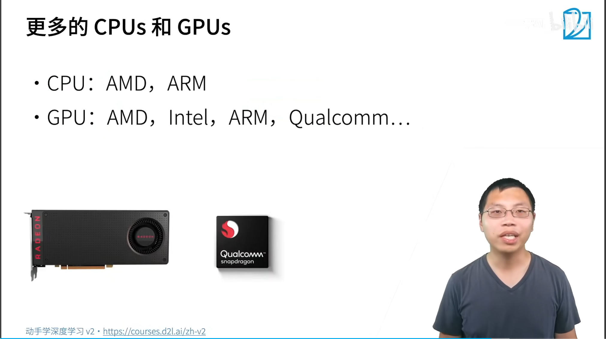

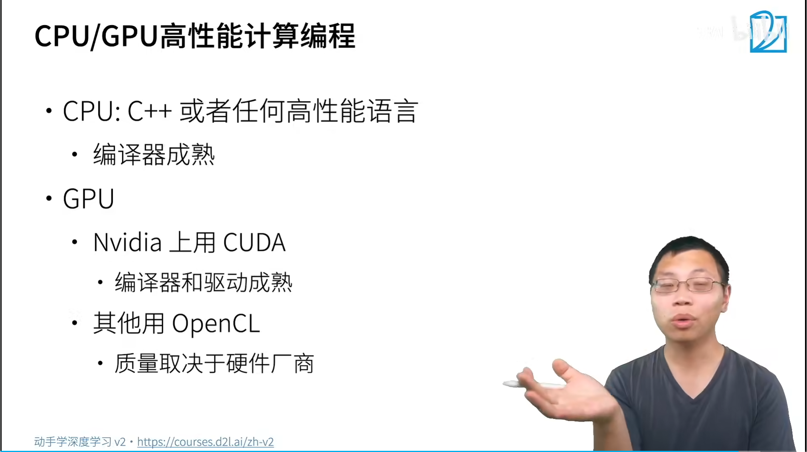

llc 缓存

for loops 尽量用向量化，tensor来做

python有并行锁

深度学习的可解释性？？