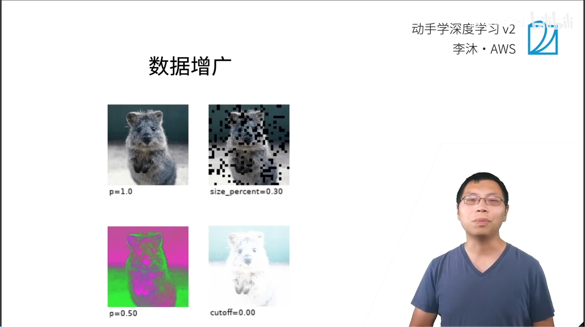
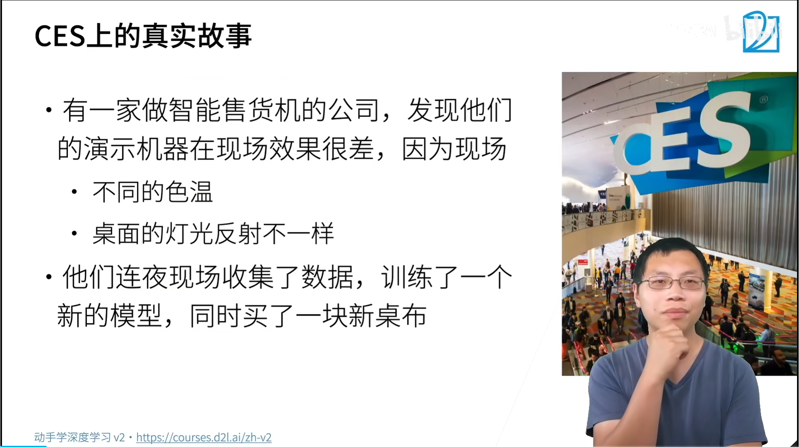
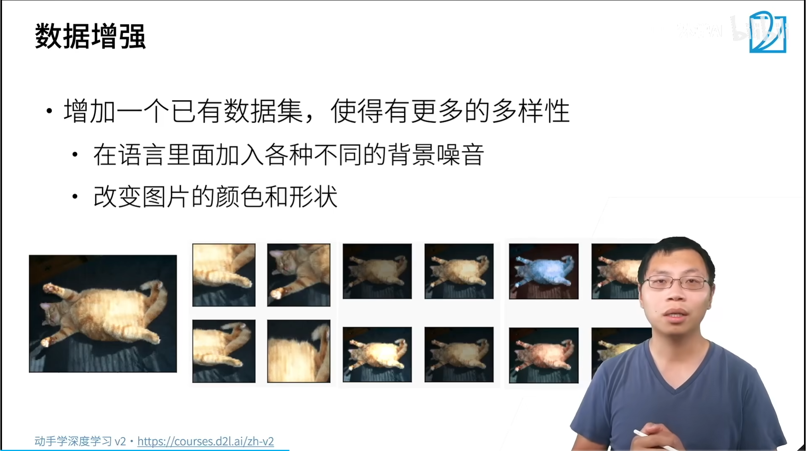
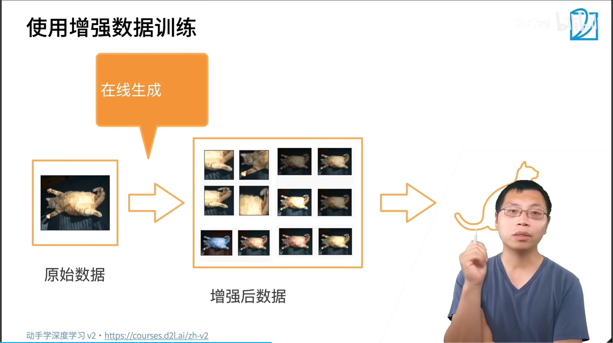
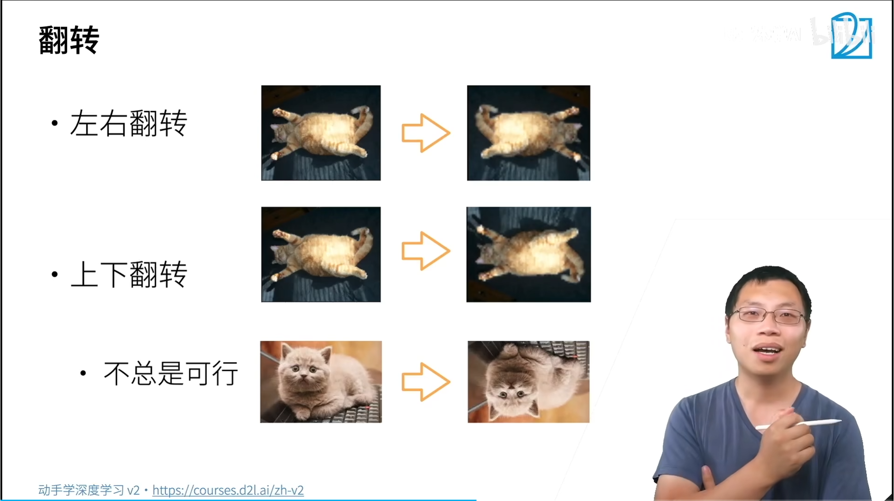
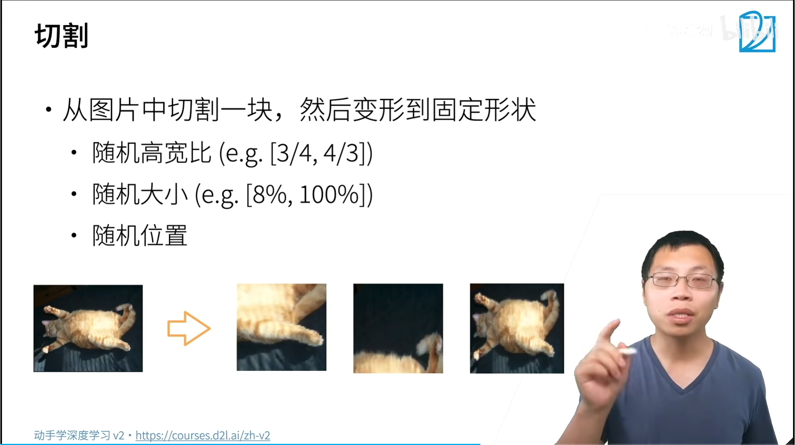
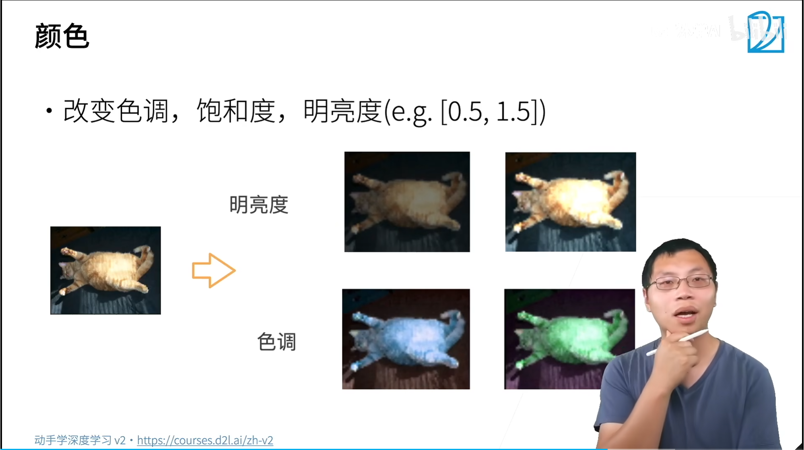
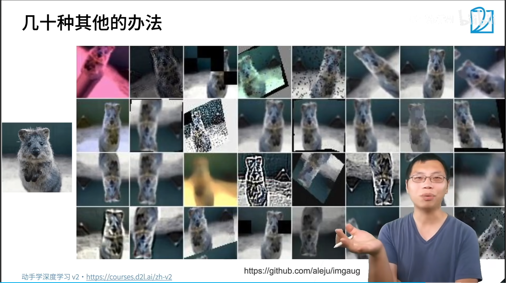
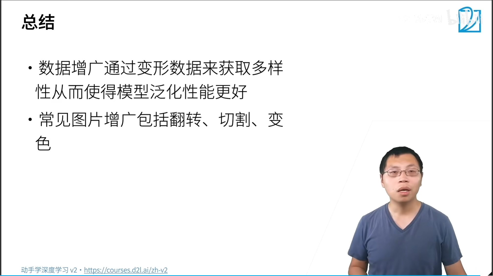

# 36  数据增广

泛化性

数据增强，已有的数据基础上，使得数据有更多的多样性

在线进行增强，随机增强，增强的方法随机对数据进行增强

测试时，不对数据集进行增强

左右翻转

上下翻转

数据集上下翻转不一定总可行，例如建筑，上下翻转就很奇怪，猫上下翻转，头朝下也很奇怪。

但是，手机识别时，有可能会遇到手机翻转导致照片上下翻转情况。

随机性

色调、饱和度、明亮度

在当前值

从部署环境、采集到的数据、反推训练时需要采取的数据增强方法。

1. [imgaug](https://github.com/aleju/imgaug)

