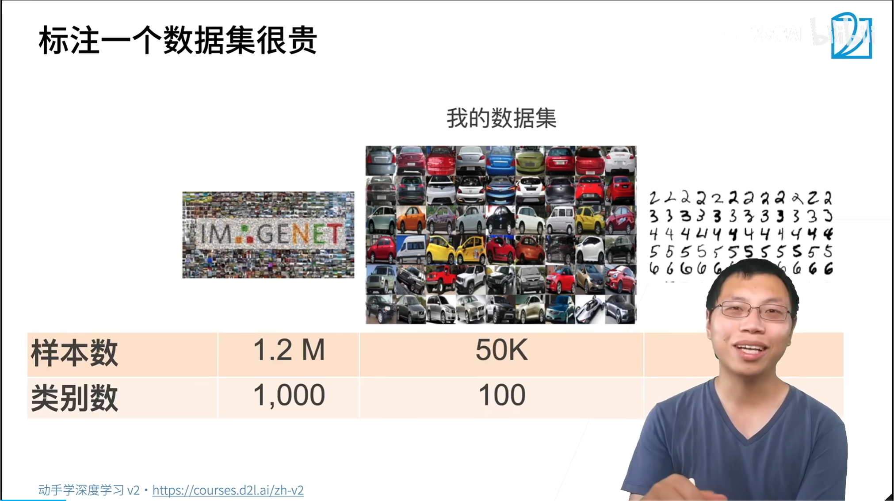
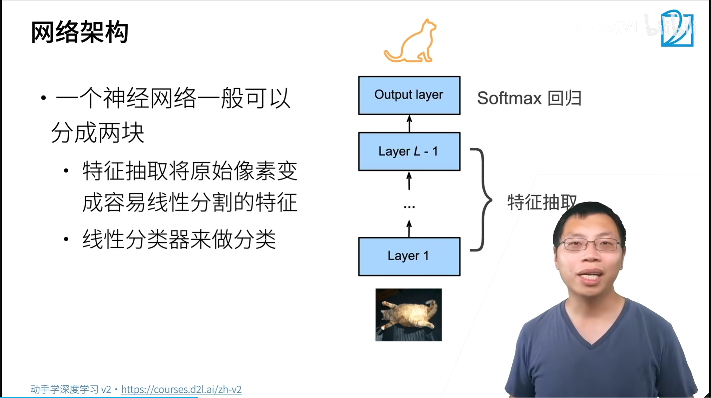
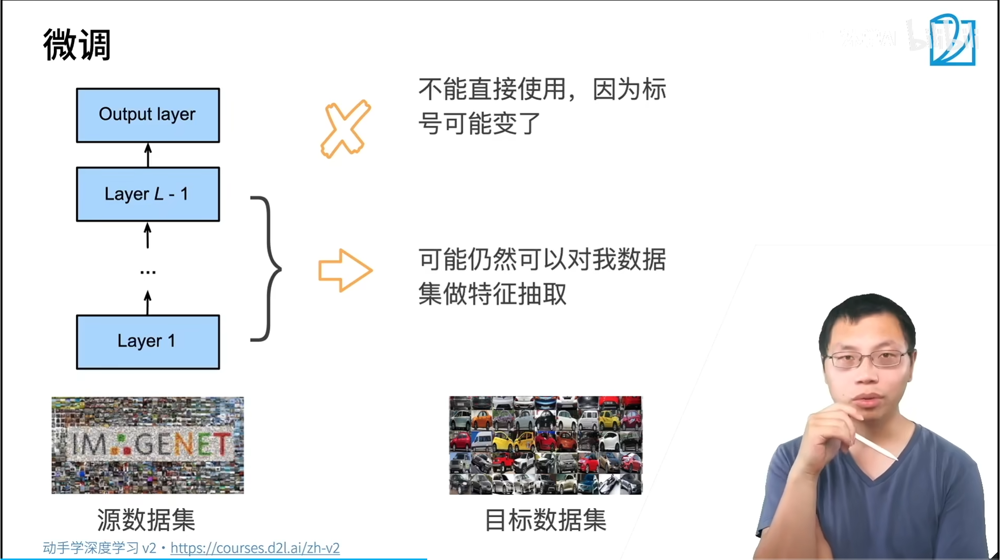
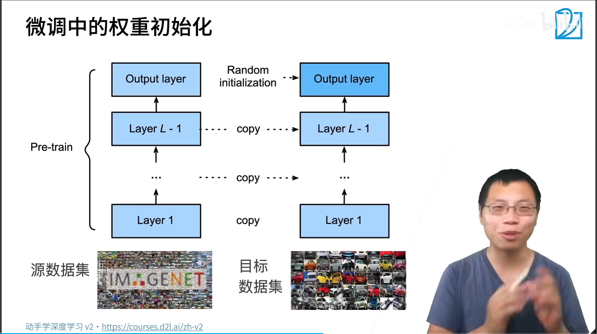
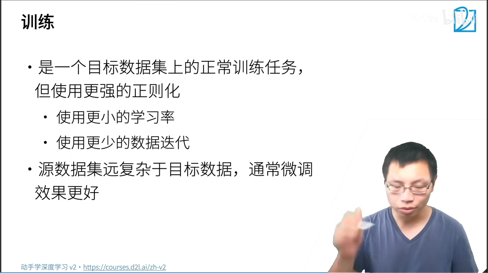
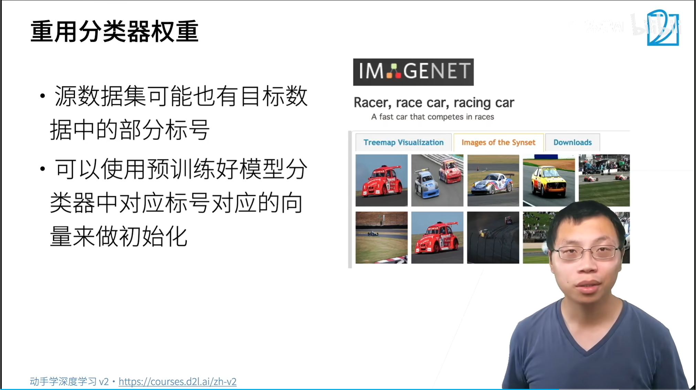
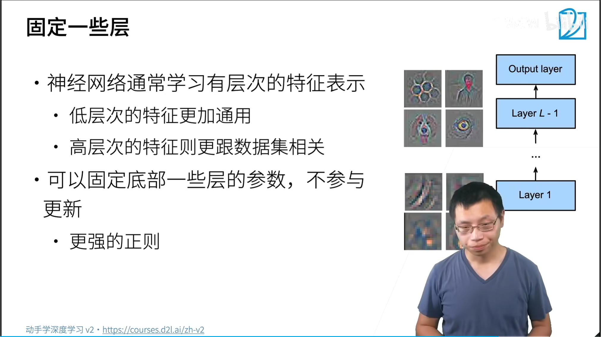
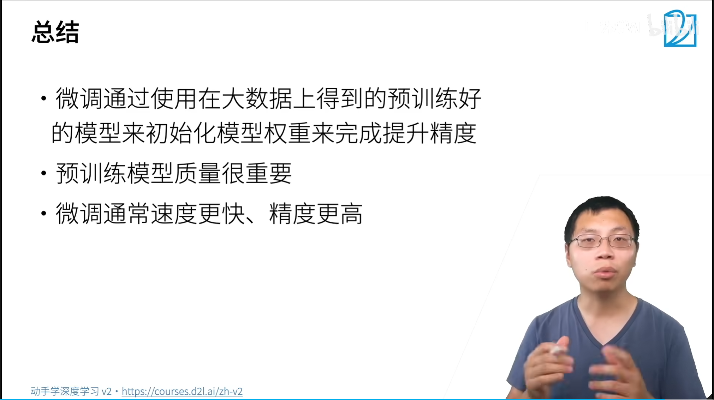

# 37  微调

迁移学习

特征提取更容易学习，像素->特征->softmax回归

学习手段，转换为语义空间中

使用一样架构的模型，模型初始化，从预训练模型中提取出来，输出层进行随机初始化

底层特征更加通用

高层特征与数据更加相关

固定底层的一些层的参数，不参与更新

预训练速度更快，微调更好

数据不平衡需要怎么做？？

| 比例   | 情况       |
| ------ | ---------- |
| <3     | 基本平衡   |
| 3~10   | 轻度不平衡 |
| 10~100 | 严重不平衡 |
| >100   | 极端不平衡 |

数据层：增强，欠采样

损失层：加权loss

采样层：过采样、欠采样

重用标号

微调是迁移学习的一种

微调不要条学习率，对学习率不敏感

