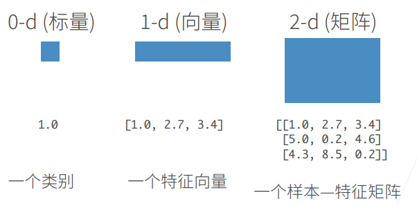
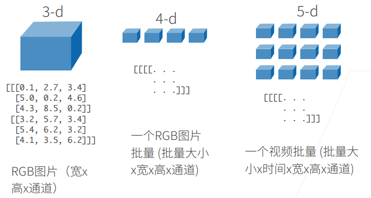
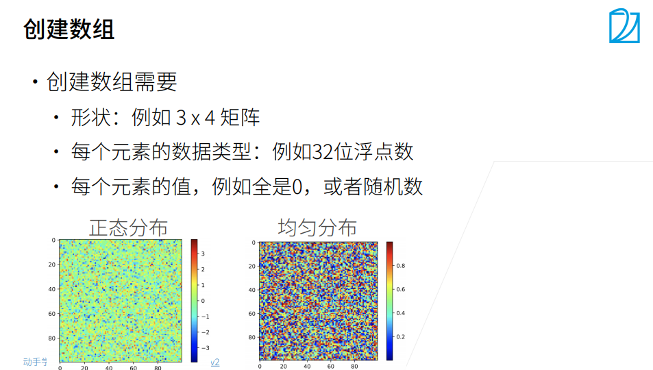
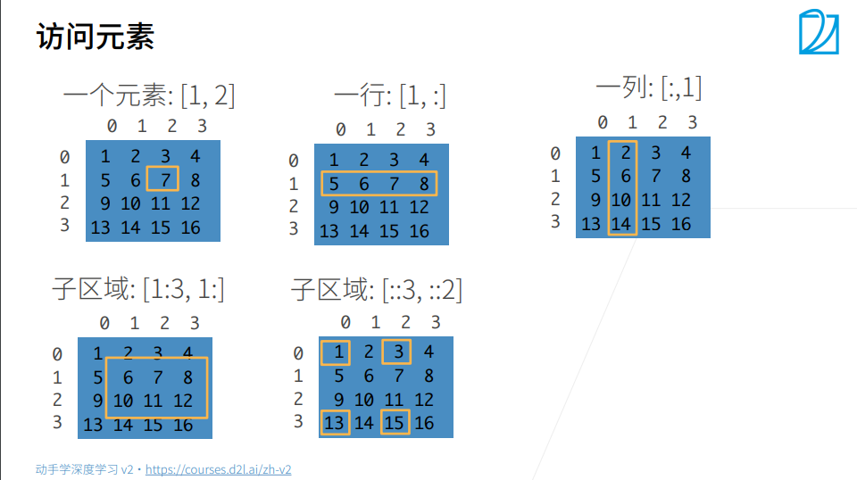

# 4. 数据操作 + 数据预处理【动手学深度学习v2】

> 李沐
>
> B站：https://space.bilibili.com/1567748478/channel/seriesdetail?sid=358497
>
> 课程主页：https://courses.d2l.ai/zh-v2/
>
> 教材：https://zh-v2.d2l.ai/
>
> 课件：https://courses.d2l.ai/zh-v2/assets/pdfs/part-0_4.pdf

## 1. N维数组

N维数组是机器学习和神经网络的主要数据结构。

## 2. 创建数组

## 3. 访问数组

+  可以根据切片，或者间隔步长访问元素。
+ [::3,::2]是每隔3行、2列访问。

## 4. 代码

GitCode ：[数据操作 + 数据预处理](https://gitcode.net/ch_ccc/dive_into_deep_learning/-/blob/master/4.%E6%95%B0%E6%8D%AE%E6%93%8D%E4%BD%9C%E3%80%81%E6%95%B0%E6%8D%AE%E9%A2%84%E5%A4%84%E7%90%86.ipynb)

## 5. 问题

