# 5. 线性代数【动手学深度学习v2】

> 李沐
>
> B站：https://space.bilibili.com/1567748478/channel/seriesdetail?sid=358497
>
> 课程主页：https://courses.d2l.ai/zh-v2/
>
> 教材：https://zh-v2.d2l.ai/
>
> 课件：https://courses.d2l.ai/zh-v2/assets/pdfs/part-0_5.pdf

## 标量、向量、矩阵

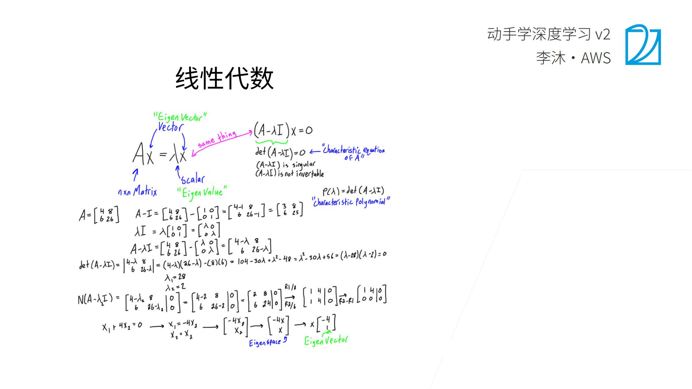

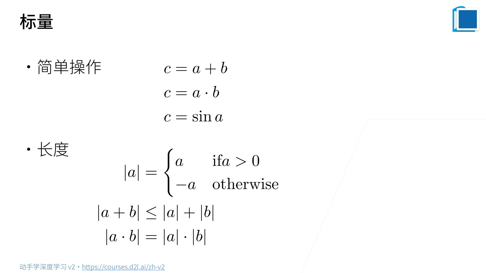

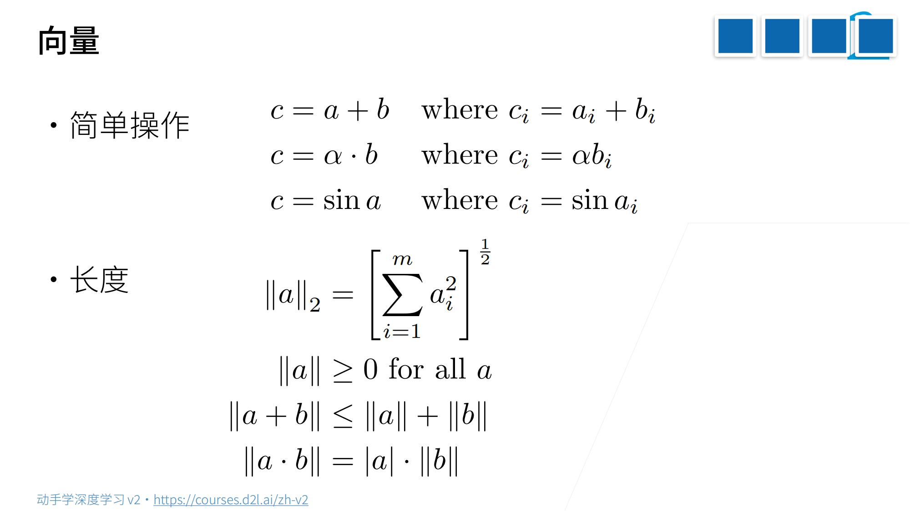

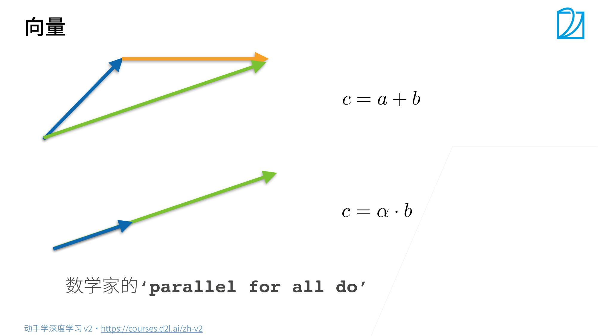

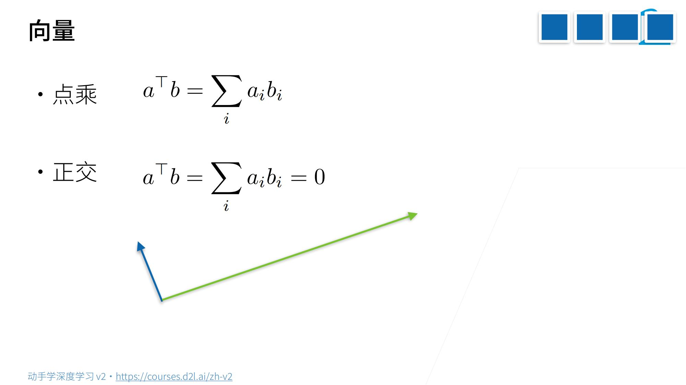

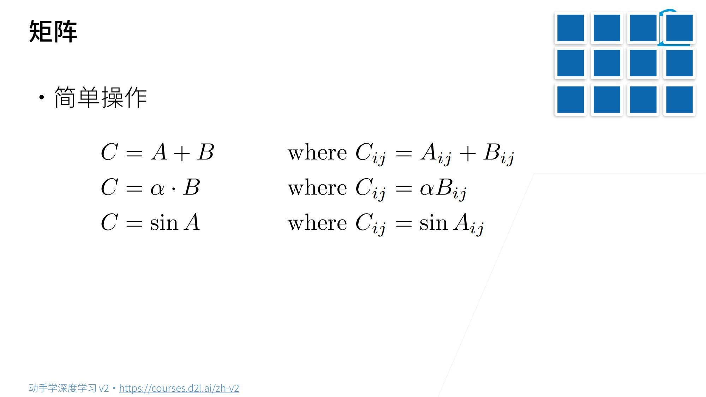

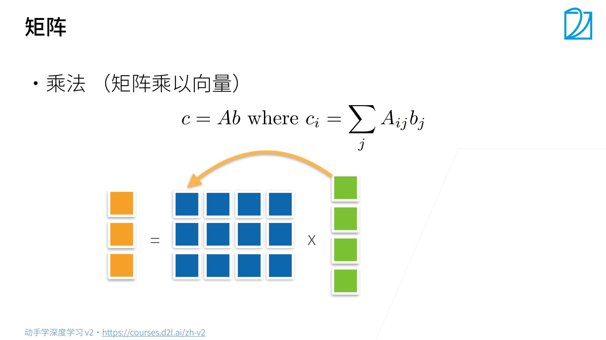

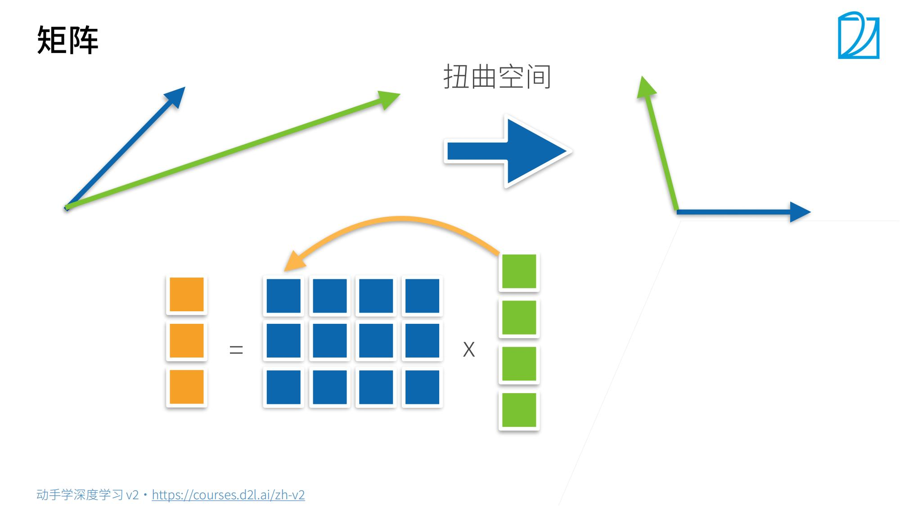

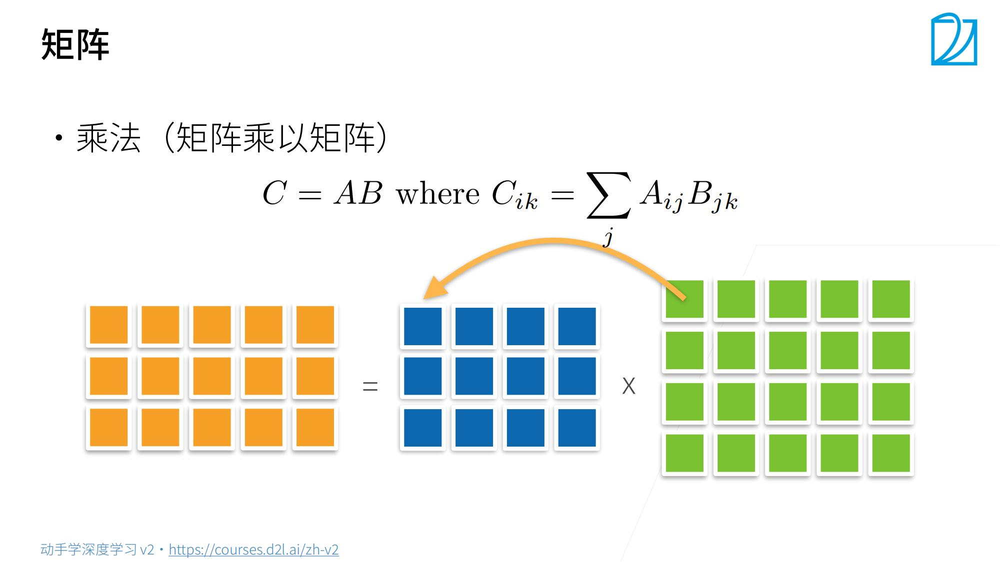

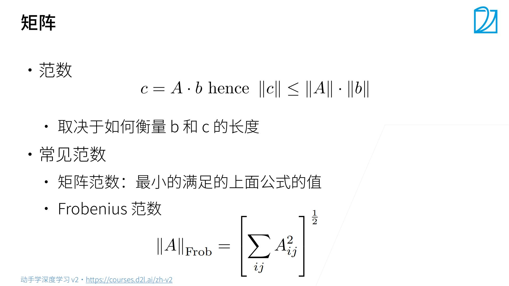

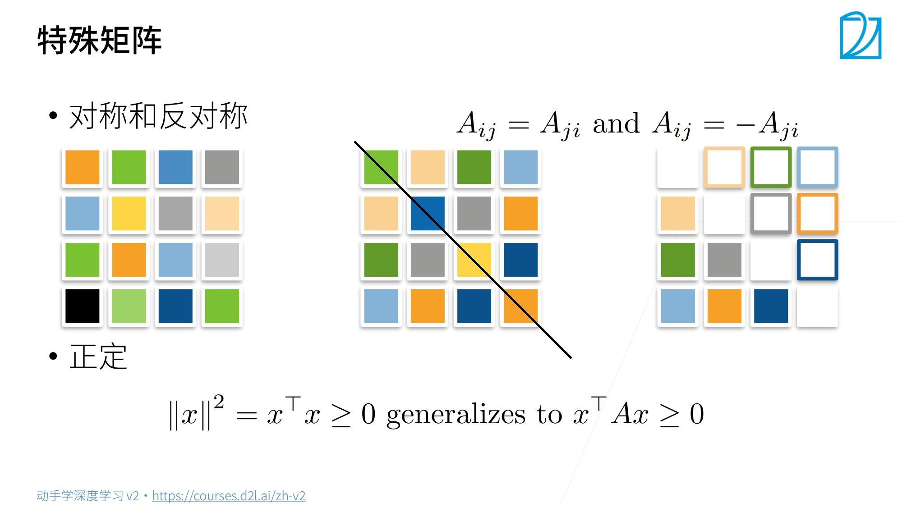

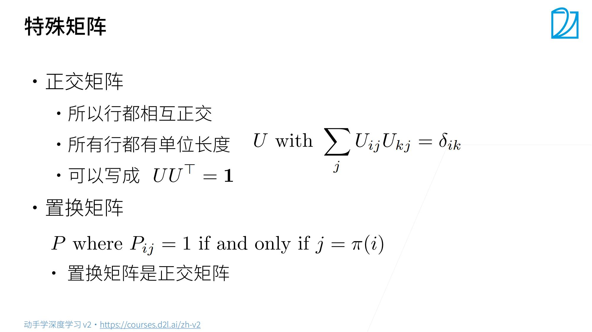

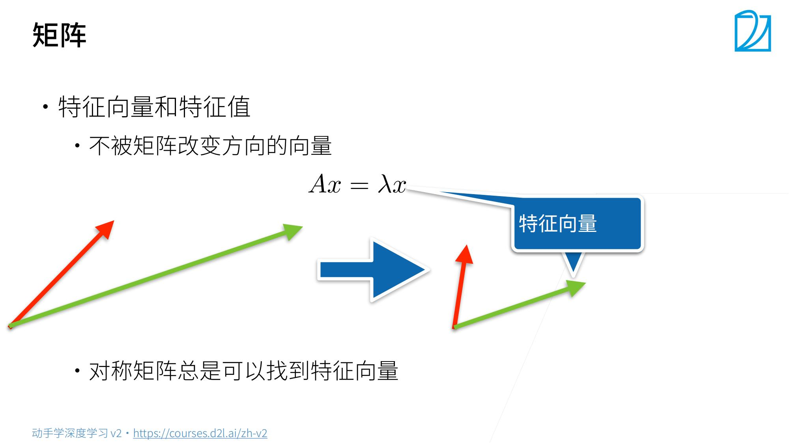

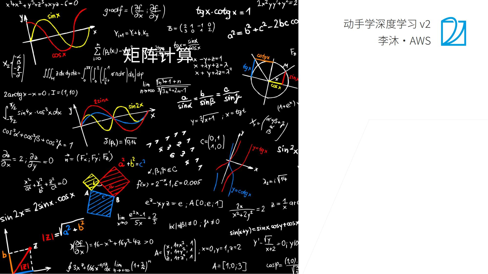

## 问题

3-21
问题1: 这么转换有什么负面影响嘛? 比如数值变得稀疏

问题2:为什么深度学习要用张量来表示?

统计、数学专业。

问题3:求copy与clone的区别 (是关于内存吗?

copy 不拷贝内存，clone 复制内存。

问题4:对哪一维求和就是消除哪一维可以这么理解吗?

问题5: torch不区分行向量和列向量吗?

问题6:sum(axis=[0,1])怎么求?

问题7:L1 L2 正则化怎么加入？