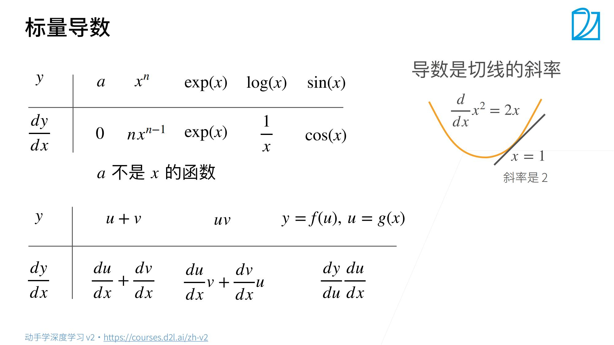
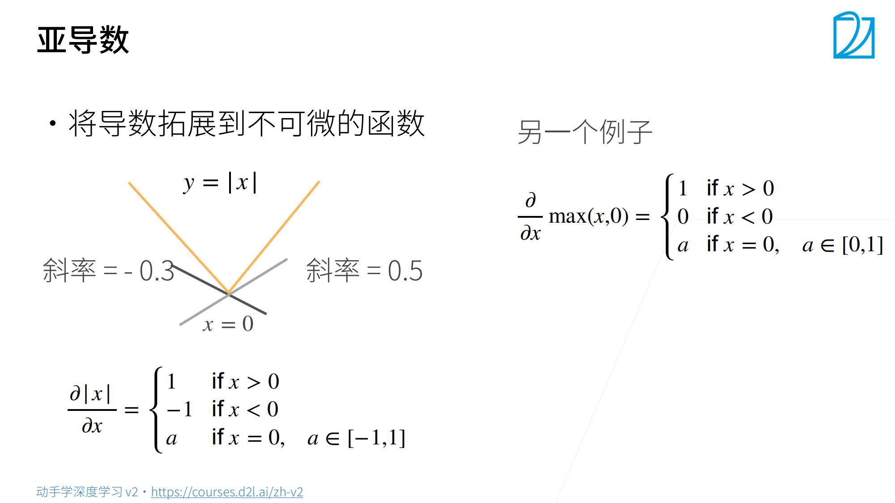
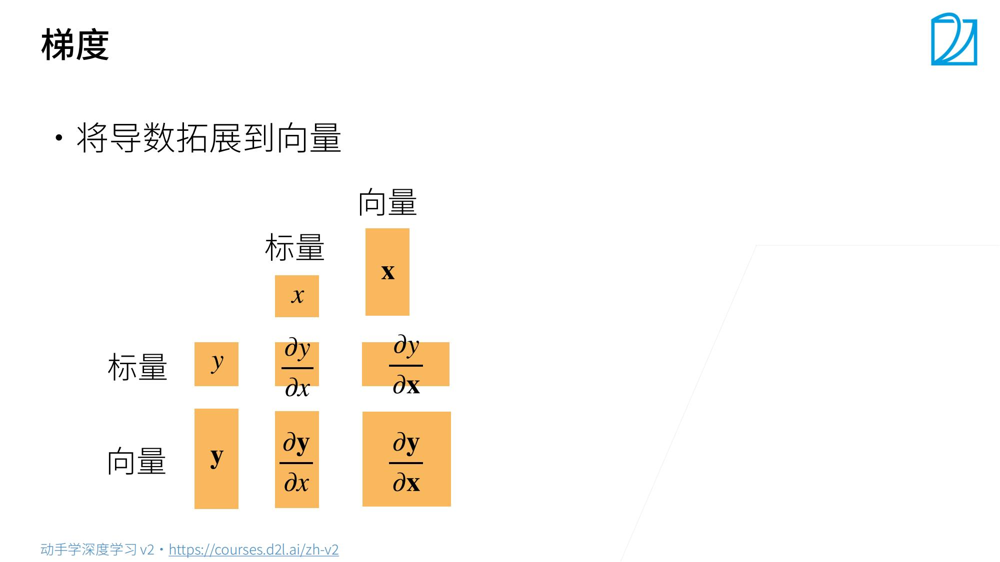
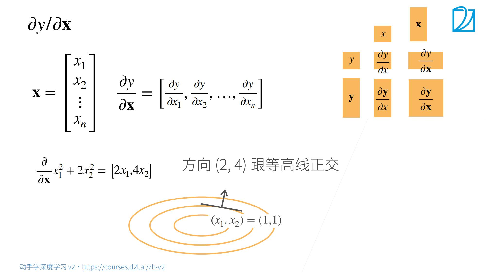
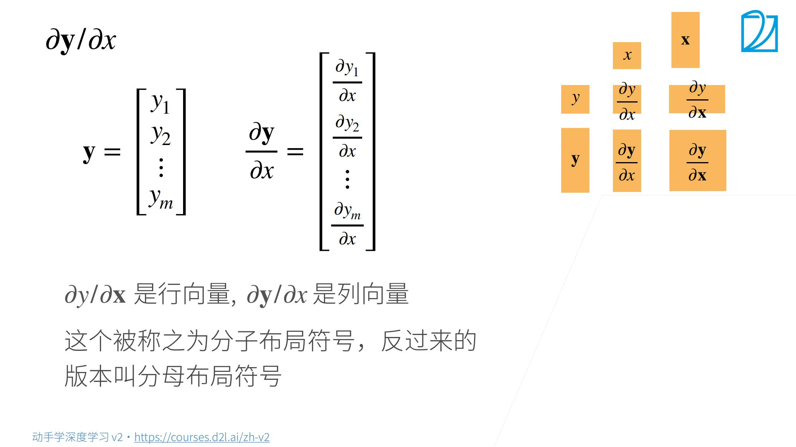
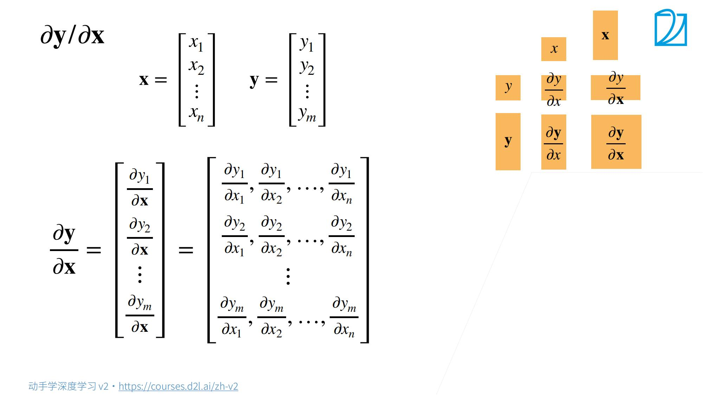
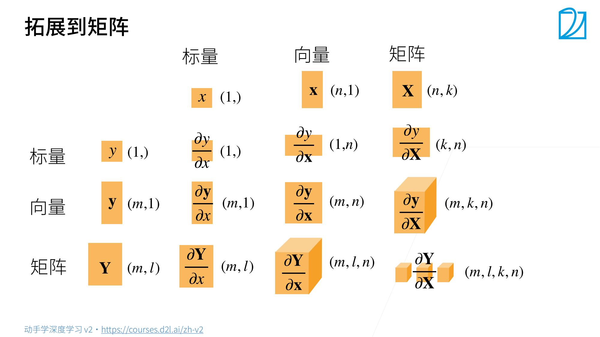
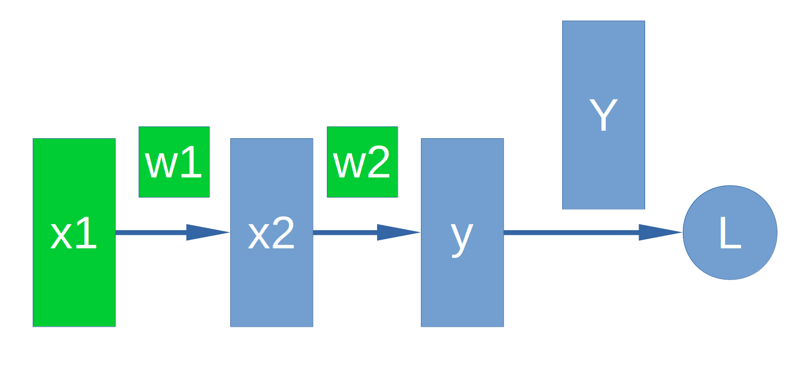

# 6. 矩阵计算【动手学深度学习v2】

> 李沐
>
> B站：https://space.bilibili.com/1567748478/channel/seriesdetail?sid=358497
>
> 课程主页：https://courses.d2l.ai/zh-v2/
>
> 教材：https://zh-v2.d2l.ai/
>
> 课件：https://courses.d2l.ai/zh-v2/assets/pdfs/part-0_6.pdf
>
> 参考：https://zh-v2.d2l.ai/chapter_preliminaries/calculus.html#subsec-calculus-grad

## 1. 标量





## 2.标量对向量求导

$X$是一个<font color =red>列向量，偏导数之后得到行向量</font>。

标量/向量，<font color =red>要从列向量变为行向量</font> 。(torch中更没有行列向量区别)

、

## 3. 向量对标量求导

<font color=red>列向量还是行向量——>不变</font>



## 4. 向量对向量求导

综合2、3步骤；





## 5. 梯度和导数


## 6. 正向和反向计算

计算中忽略了参数$b$。


$$
x_2 = w_1*x_1+b \\
y = w_2*x_2+b \\
L = Y-y
$$

$$
\frac{\partial L}{\partial x_1} = \frac{\partial L}{\partial y} \frac{\partial y}{\partial x_2} \frac{\partial x_2}{\partial x_1}  \\
\frac{\partial L}{\partial w_1} = \frac{\partial L}{\partial y} \frac{\partial y}{\partial x_2} \frac{\partial x_2}{\partial w_1} \\
\frac{\partial L}{\partial w_2} = \frac{\partial L}{\partial y} \frac{\partial y}{\partial w_2}
$$



```python
# 实例2 
# 正向计算
x1 = torch.from_numpy( 2*np.ones((2, 2), dtype=np.float32) )
x1.requires_grad_(True)   #设置该tensor可被记录操作用于梯度计算
w1 = torch.from_numpy( 5*np.ones((2, 2), dtype=np.float32) )
w1.requires_grad_(True)
print("x1 =", x1,",x1 shape:",x1.shape)
print("w1 =", w1)
 
x2 = x1 * w1
w2 = torch.from_numpy( 6*np.ones((2,2), dtype=np.float32) )
w2.requires_grad_(True)
print("x2 =", x2)
print("w2 =", w2)
 
y = x2 * w2
Y = torch.from_numpy( 10*np.ones((2,2), dtype=np.float32) )
print("y =", y)
print("Y =", Y)
 
L = Y - y

# 反向计算
L.backward(torch.ones(2,2,dtype=torch.float32))
print("x1 grad:",x1.grad)
print("w1 grad:",w1.grad)
print("w2 grad:",w2.grad)

# x1 = tensor([[2., 2.],
#         [2., 2.]], requires_grad=True) ,x1 shape: torch.Size([2, 2])
# w1 = tensor([[5., 5.],
#         [5., 5.]], requires_grad=True)
# x2 = tensor([[10., 10.],
#         [10., 10.]], grad_fn=<MulBackward0>)
# w2 = tensor([[6., 6.],
#         [6., 6.]], requires_grad=True)
# y = tensor([[60., 60.],
#         [60., 60.]], grad_fn=<MulBackward0>)
# Y = tensor([[10., 10.],
#         [10., 10.]])
# x1 grad: tensor([[-30., -30.],
#         [-30., -30.]])
# w1 grad: tensor([[-12., -12.],
#         [-12., -12.]])
# w2 grad: tensor([[-10., -10.],
#         [-10., -10.]])
```

