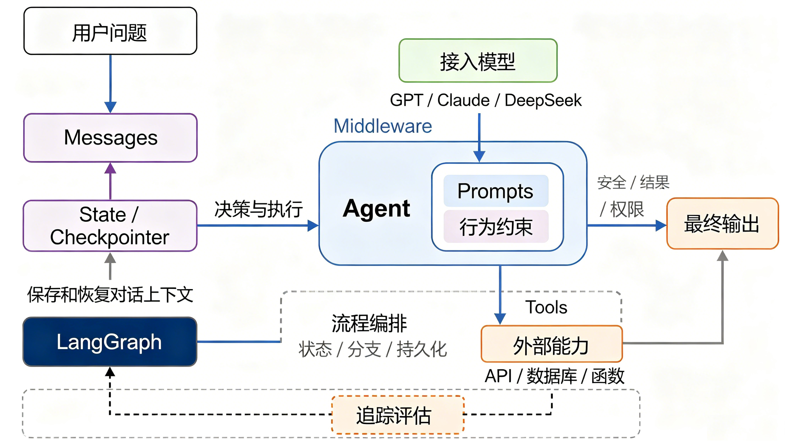

# 3天从入门到精通LangChain 1\.0\+笔记

# Part0 前言

## 0\.1 LangChain初识


- 时代换挡：从 Web App 到 AI Agent

- 为什么只调大模型 API 还不够

- LangChain 1\.0\+ 的核心定位

- LangChain 的三个核心价值

    - 组件化（积木化）

    - Agent 化

    - 生产化

本节总结：

同时按 LangChain 1\.0 口径弱化了旧版 Chain，强化了 create\_agent\(\)、Middleware、LangGraph、LangSmith。

## 0\.2 课程定位

课程不按旧版 `Chain` 体系做百科式罗列，而是按照新版 LangChain 应用开发主线组织：

```GraphQL
LangChain 认知
-> 核心组件
-> Agent
-> Middleware
-> LangGraph
-> RAG
-> 完整项目
```

课程目标不是“背 API”，而是让学习者理解 LangChain 1\.0\+ 如何把模型、消息、提示词、工具、状态、检索和流程控制组织成一个可运行的 AI 应用。

## 0\.3 适合人群与前置基础

适合人群：

- 会基础 Python，想进入 AI 应用开发。

- 学过大模型 API，但不知道如何组织成完整项目。

- 看过旧版 LangChain 教程，但对 1\.0\+ 的 Agent、Middleware、LangGraph 不清楚。

- 想做企业知识库、智能助手、智能客服、自动化工具类项目。

建议具备：

- [Python 基础语法](https://www.bilibili.com/video/BV1Xs42137TK/?vd_source=b2ba04a07a9c9655a83ed1dec82a019e)

- [面向对象基础](https://www.bilibili.com/video/BV1FXDVYkEQh/?vd_source=b2ba04a07a9c9655a83ed1dec82a019e)

- [基本的 API 调用经验](https://www.bilibili.com/video/BV1yEdnY2ERU/?vd_source=b2ba04a07a9c9655a83ed1dec82a019e)

不要求提前掌握：

- Web 开发。

- 数据库。

- LangChain 旧版 Chain 体系。

- LangGraph。

- 向量数据库。

- 企业级 Agent 架构。

环境：

- Python3\.11及以上

- Pycharm或者VSCode等IDE

## 0\.4 学完能做什么

学习者最终能得到：

- 一套围绕 LangChain 1\.0\+ 新架构建立的知识体系，理解 `Model`、`Messages`、`Tools`、`create_agent()`、`Middleware`、`LangGraph`、`state/checkpointer` 之间的关系。

- 一个基础版 Agent 项目：单 Agent、多工具调用、结构化输出和多轮上下文管理。

- 一个进阶版 Agent 项目：状态驱动、多角色 handoff、middleware 控制和可扩展的业务流程。

最终项目是一个电商智能客服 Agent，覆盖：

```GraphQL
-> 订单查询
-> 物流查询
-> 登录与订单历史
-> 退货资格判断
-> 退货工单生成
-> 多角色客服切换
-> RAG 知识库增强
```

先看最终效果

```GraphQL
用户：查一下 CN10001 到哪了。
Agent：订单 CN10001 当前已发货，最新物流节点是苏州分拨中心。

用户：我想登录看订单历史。
Agent：请提供手机号后四位进行验证。

用户：我要退 CN10002 这个智能手环 Pro。
Agent：该订单仍在 7 天无理由退货期内，可以发起退货申请。

用户：帮我看看 CN10002 能不能退货。
```

## 0\.5 学习方法

- 敲代码

- 记笔记

---

# Part 1 LangChain 简介

## 1\.1 LangChain1\.0 基本介绍

从 Web时代的Spring Boot、Django切换到AI Agent时代的LangChain

LangChain 是一个用于开发由大语言模型（LLM）驱动的应用程序的==开源框架==，LangChain 真正的定位，是帮助我们把大模型、工具、数据源、消息结构、Agent 架构这些能力组织起来，构建真正可用的 AI 应用。

LangChain 这一开源框架诞生于 2022 年 10 月，由哈佛大学的 Harrison Chase（哈里森・蔡斯）创建，其名称来源于 "Language"（语言模型）和 "Chain"（链式连接）的组合，体现了其核心设计理念 —— 将大语言模型与其他计算资源和数据源以链式方式连接，构建出功能更加强大的 AI 应用。

LangChain 的诞生源于一个关键洞察：单一的大语言模型虽然能力强大，但在实际应用场景中存在明显局限。具体如下：

- <font color=red>LLM 的知识受限于其训练数据，无法获取训练时点之后的信息；</font>

- <font color=red>模型无法直接与外部系统（如数据库、API）交互；</font>

- <font color=red>模型本身不具备状态保持能力，难以进行连贯的多轮对话。</font>

所以要构建真正实用的 AI 应用，必须将大语言模型与外部工具、数据源和记忆机制有机结合，从而催生了 LangChain 框架的设计理念。

- 官方文档：https://docs.langchain.com/oss/python/langchain/overview

https://docs.langchain.com/oss/python/langchain/overview

- Github： https://github.com/langchain-ai/langchain

最后简单总结一下：

<font color=red>LangChain 是 LLM 应用和 AI Agent 应用的组件化开发框架，它让我们可以像搭积木一样，把模型、工具、数据、记忆、状态和业务流程组合起来，最终构建出能解决实际问题的 AI 应用。</font>

LangChain 就是组件化开发框架

## 1\.2 Langchain核心组件

核心能力：标准化组件 \+ Agent 架构



LangChain 1\.0\+ 提供了一系列可复用的标准化组件，让开发者可以像搭积木一样构建 AI 应用：

- Models：统一对接不同大模型，让开发者可以在 GPT、Claude、DeepSeek、通义千问等模型之间切换，而不用重复写适配代码。

- Messages：用标准消息结构组织多轮对话，让模型调用不再是简单字符串拼接。

- Prompts：管理和组织提示词，支持模板化、动态填充和角色约束，让模型行为更加可控。

- Tools：把外部函数、API、数据库查询、业务动作封装成工具，让模型能够调用外部能力。

- Agents：让大模型具备“自主判断下一步 \+ 调用工具 \+ 完成任务”的能力，从单次问答升级为任务执行。

- Middleware：在 Agent 执行过程中增加控制逻辑，例如权限校验、日志记录、安全拦截、动态提示词、模型切换等。

- State / Memory：管理多轮上下文和业务状态，让应用能够记住对话过程和任务进度。

- LangGraph：为复杂 Agent 流程提供状态编排、持久化执行、人类介入和多步骤控制能力。

- LangSmith：提供调试、追踪、评估和可观测性能力，帮助 AI 应用从 Demo 走向生产环境。

```apl
Models 负责接模型。
Messages 负责组织对话。
Prompts 负责控制模型行为。
Tools 负责连接外部能力。
Agents 负责自主决策和任务执行。
Middleware 负责过程控制。
State / checkpointer 负责保存上下文和任务进度。
LangGraph 负责复杂流程编排。
LangSmith 负责调试、追踪和评估。
```

一句话总结：

LangChain 1\.0\+ 提供的是一套标准化组件和 Agent 架构，帮助我们把大模型能力组织成真正可运行、可维护、可上线的 AI 应用。

## 1\.3 LangChain 1\.0\+ 与旧版本的区别

2024 年是 LangChain 架构重大变革的一年。随着开发者从构建原型转向生产环境部署，对更精细工作流控制的需求日益增长，LangChain 团队推出了 LangGraph 作为底层智能体编排框架，并将原有的链和智能体逐步迁移到新的 Agent 抽象上。2025 年 10 月 22 日 LangChain 团队正式发布 LangChain v1\.0\.0 与 LangGraph v1\.0\.0，标志着框架进入稳定阶段，为企业级 AI 应用提供了更清晰的开发路径。

### 对比表

|变化点|0\.3 及旧教程|1\.0\+|
|---|---|---|
|学习主线|`LLMChain`、`SequentialChain`、`AgentExecutor`、`Memory`|`Model`、`Messages`、`Tools`、`create_agent()`、`Middleware`、`LangGraph`|
|Agent 创建|`AgentExecutor`、`create_react_agent`、`create_json_agent`、`create_tool_calling_agent` 分散使用|统一为 ==`create_agent()`==|
|控制机制|常写在 prompt、hook、callback、业务代码里|==`Middleware`==|
|底层执行|直接调用或分散编排|`create_agent()` 底层基于 ==LangGraph==|
|记忆机制|`ConversationBufferMemory`、`ConversationSummaryMemory` 等|`messages`、`state`、`checkpointer`、`thread_id`|
|包结构|主包里能力更散|**包结构更清晰**，旧能力更多迁到 `langchain-classic`|

LangChain 1\.0 的最大变化，不是某一个函数，而是学习主线变了。旧版很多教程围绕 `LLMChain`、`SequentialChain`、`AgentExecutor`、`Memory` 展开，更像是在拼装 Chain；新版更推荐围绕 `Model`、`Messages`、`Tools`、`create_agent()`、`Middleware`、`LangGraph` 来理解，更像是在搭建一个 Agent 应用。`create_agent()` 负责把模型、消息和工具等能力统一组装起来，`Middleware` 负责集中控制执行过程，`messages`、`state`、`checkpointer`、`thread_id` 则把会话记忆从“保存聊天记录”升级成“管理会话状态”。简单说，LangChain 1\.0 是从旧版“Chain 拼装框架”，升级成以 Agent 为中心、以 LangGraph 为底座、通过 Middleware 做过程控制的新架构。

### 包结构

|包名|作用|课程中的用途|
|---|---|---|
|`langchain`|主包，高阶入口|`create_agent`|
|`langchain-core`|核心抽象层|`HumanMessage`、`AIMessage`、`ToolMessage`|
|`langchain-openai` / `langchain-anthropic`|官方模型集成|对接各厂商模型|
|`langchain-community`|社区工具和集成|部分文档加载器、向量库、工具|
|`langchain-classic`|旧版兼容包|迁移旧代码时参考|
|`langgraph`|状态和流程编排|`checkpointer`、状态、流程控制|

### 课程里常见的导入

```Python
from langchain.agents import create_agent
from langchain_core.messages import HumanMessage, AIMessage, ToolMessage
from langchain.tools import tool
from langchain_deepseek import ChatDeepSeek
from langgraph.checkpoint.memory import InMemorySaver
```

### 重点

- `langchain` 负责高阶能力。

- `langchain-core` 负责消息、工具、模型等基础抽象。

- `langgraph` 负责记忆、状态和流程。

- 后面看到不同包名的导入，不是混乱，而是分层设计。

---

# Part 2 核心组件

Part 2 的重点是学习 LangChain 应用中的基础组件，包括<font color=red> Model、Message、Prompt、Parser、Runnable 和 Tool</font>。

这些组件最终都会服务于 Agent，但 Part 2 不正式展开 Agent 的完整执行机制。遇到 Agent 相关内容时，只做必要铺垫，重点说明“这个组件以后会在 Agent 中承担什么作用”。

Agent 的创建方式、输入输出结构、工具调用循环、状态和记忆，会在 Part 3 系统讲解。

```GraphQL
Part 2：先理解组件。
Part 3：再理解 Agent 如何把组件组织成完整任务。
```

## 2\.1 Model：大模型调用

### 本章定位

<font color=red>Model 是所有 LangChain 应用的起点。(大脑)</font>本章不追求覆盖所有模型参数，而是先解决三件事：

1. 大模型调用的本质是什么。

2. LangChain 为什么要再包一层模型接口。

3. Model 和 Agent 在职责上有什么区别。

### 2\.1\.1 环境安装与 API Key 配置

#### 目标

搭好课程运行环境。

#### （1）安装langchain1\.0

```GraphQL
pip install -U langchain langchain-openai langchain-deepseek langgraph python-dotenv pydantic
```

> LangChain 1\.0 官方要求 **Python 3\.10\+**
> 
> \-U 是 \-\-upgrade的缩写，意思是**升级到最新版**。
> 
> pip install \-U langchain包括：langchain和langchain\-core
> 
> 

#### （2）API KEY配置

安装完 LangChain 相关包之后，还需要配置模型厂商的 API Key。

LangChain 本身不是大模型服务商，它只是一个应用开发框架。  

真正调用 GPT、Claude、DeepSeek、通义千问等模型时，仍然需要对应厂商的 API Key。

\.env示例：

```GraphQL
OPENAI_API_KEY=你的 OpenAI API Key
DEEPSEEK_API_KEY=你的 DeepSeek API Key
ANTHROPIC_API_KEY=你的 Anthropic API Key
DASHSCOPE_API_KEY=你的通义千问 API Key
```

课程里用哪个模型，就配置哪个 Key，不需要全部都配。

比如课程使用 DeepSeek，可以只写：

```GraphQL
DEEPSEEK_API_KEY=sk-xxxxxxxxxxxxxxxx
```

如果使用 OpenAI\-compatible 方式调用 DeepSeek，也可以配置：

```GraphQL
OPENAI_API_KEY=你的 DeepSeek API Key
OPENAI_BASE_URL=https://api.deepseek.com
```

获取apikey，不同的厂商方式不同，

比如deepseek：https://platform\.deepseek\.com/api\_keys

比如阿里的通义千问，进入百炼平台：https://bailian.console.aliyun.com/cn-beijing?spm=5176.29619931.0.0.74cd10d7Cw9fCn&tab=home#/home，用支付宝登录即可，

#### （3）安装 python\-dotenv

为了让 Python 程序读取 \.env 文件，需要安装：

```GraphQL
pip install -U python-dotenv
```

在代码中加载环境变量：

```Python
from dotenv import load_dotenv

# load_dotenv() 会自动读取项目根目录下的 .env 文件，并把里面的配置加载到环境变量中。
load_dotenv()
```

使用环境变量：

```Python
import os

api_key = os.getenv("DEEPSEEK_API_KEY")
print(api_key)
```

正式项目中一般不建议直接打印 API Key，这里只是为了测试是否读取成功。

> - \.env 文件不要提交到 GitHub。
> 
> - API Key 不要写死在代码里。
> 
> - 不同模型厂商使用不同环境变量名。
> 
> - 如果使用 OpenAI\-compatible 接口，需要额外配置 base\_url。
> 
> - 课程项目建议统一使用 \.env 管理密钥。
> 
> 

### 2\.1\.2 原生 SDK 调用模型

#### 目标

先理解模型调用的本质，再理解 LangChain 为什么要再封装一层。

这一节先不使用 LangChain，而是直接使用模型厂商或兼容协议提供的 SDK 调用大模型。

#### 什么是 SDK

SDK 是 Software Development Kit 的缩写，中文通常叫“软件开发工具包”。

在大模型开发中，SDK 可以理解成模型厂商提供给开发者的官方调用工具包。开发者可以通过 SDK 在代码中调用模型，而不需要从零处理所有接口细节。

如果不使用 SDK，开发者通常需要自己处理：

- 请求地址；

- 请求头；

- API Key；

- 请求参数；

- 返回结果解析；

- 错误处理。

SDK 会把这些底层细节封装起来，让模型调用更简单。

例如，OpenAI 提供了 openai Python 包。DeepSeek、通义千问等模型厂商，也会提供自己的 API 或兼容 OpenAI 格式的调用方式。

一句话总结：

```GraphQL
SDK 是厂商提供给程序员的官方调用工具包，用来简化接口调用。
```

原生 SDK 调用模型，指的是直接使用模型厂商提供的工具包调用模型。

LangChain 调用模型，则是在不同厂商 SDK 或 API 之上再封装一层统一接口。

#### 核心知识点

一次对话模型调用，通常可以拆成五个部分：

```GraphQL
对话模型调用 = client + model 名称 + messages + 生成参数 + response
```

这句话可以这样理解：

- client：连接模型服务的客户端，负责带着 API Key 请求模型服务。

- model 名称：指定本次调用哪个模型，例如 deepseek\-v4\-pro。

- messages：发给对话模型的消息列表，每条消息都有角色，例如 system、user。

- 生成参数：控制模型如何生成回答，例如 temperature、stream、max\_tokens。

- response：模型返回的结果对象，真正的回答文本需要从里面取出来。

换成大白话：

```GraphQL
一次对话模型调用，就是先用 client 连接模型服务， 指定要调用哪个 model， 把 messages 发过去， 再用生成参数控制回答方式， 最后从 response 里取出模型返回结果。
```

原生 SDK 的优点是直接、透明；缺点是每个厂商的客户端、参数和返回结构都可能不同。

先看原生写法，有助于理解 LangChain 并不是“魔法”，它底层仍然是在调用模型 API。

#### 示例代码

下面使用 openai Python 包调用 DeepSeek 模型。

注意，这里虽然导入的是 OpenAI，但实际请求会发往 DeepSeek 的接口地址。

```Python
# 从 openai 包中导入 OpenAI 客户端类
# 注意：这里虽然导入的是 OpenAI，但因为 DeepSeek 兼容 OpenAI 接口格式，
# 所以也可以用 OpenAI SDK 调用 DeepSeek
from openai import OpenAI

# 导入 load_dotenv，用来读取 .env 文件中的环境变量
from dotenv import load_dotenv

# 导入 os，用来读取系统环境变量
import os

# 加载当前项目目录下的 .env 文件
# 例如 .env 中可以写：DEEPSEEK_API_KEY=你的 API Key
load_dotenv()

# 创建模型服务客户端
client = OpenAI(
    # 从环境变量中读取 DeepSeek 的 API Key
    api_key=os.getenv("DEEPSEEK_API_KEY"),

    # 指定 DeepSeek 的 API 地址
    # 这样请求会发往 DeepSeek，而不是 OpenAI 官方服务
    base_url="https://api.deepseek.com",
)

# 调用对话模型接口，发送一次聊天请求
response = client.chat.completions.create(
    # 指定要调用的 DeepSeek 模型
    model="deepseek-v4-pro",

    # messages 是对话模型的输入，格式是一个消息列表
    messages=[
        # system 消息：用于设定模型的角色、风格或规则
        {"role": "system", "content": "你是一名 AI 助教。"},

        # user 消息：表示用户真正提出的问题
        {"role": "user", "content": "你好，你是谁？来自哪一个厂商？"},
    ],

    # stream=False 表示不使用流式输出
    # 模型生成完整回答后，一次性返回结果
    stream=False,

    # temperature 控制回答的随机性
    # 值越高，回答越发散；值越低，回答越稳定
    temperature=0.9,
)

# 从响应对象中取出模型生成的文本内容
# choices[0] 表示取第一个候选回答
# message.content 表示取这个回答的正文
print(response.choices[0].message.content)
```

#### 代码拆解

这段代码里最重要的是四个部分：

```GraphQL
client = OpenAI(...)
```

表示创建一个模型服务客户端。

```GraphQL
base_url="https://api.deepseek.com"
```

表示请求实际发往 DeepSeek，而不是 OpenAI 官方服务。

```GraphQL
model="deepseek-v4-pro"
```

表示本次调用的是 DeepSeek 的模型。

```GraphQL
response.choices[0].message.content
```

表示从原生 SDK 返回对象中取出模型生成的文本。

#### 什么是 OpenAI\-compatible？

OpenAI\-compatible，中文可以理解为“兼容 OpenAI 接口格式”。

它的意思不是“这个模型来自 OpenAI”，而是说这个模型服务在接口格式上兼容 OpenAI 的调用方式。

例如 DeepSeek 提供了 OpenAI\-compatible API，所以我们可以使用 OpenAI 官方 SDK：

```GraphQL
from openai import OpenAI
```

然后通过修改三个地方来调用 DeepSeek：

```GraphQL
api_key：换成 DeepSeek 的 API Key 
base_url：换成 DeepSeek 的接口地址 
model：换成 DeepSeek 的模型名称
```

这里需要注意，OpenAI\-compatible 只表示接口协议兼容，不表示模型厂商是 OpenAI。

### 2\.1\.3 用 LangChain 统一调用模型

#### 目标

掌握 LangChain 调用对话模型的标准思路：

- 理解为什么要把模型封装成 LangChain Model。 

- 掌握创建模型对象和调用模型对象的区别。 

- 理解官方 provider、OpenAI\-compatible、手动实例化三种写法的区别。 

#### 为什么要用 LangChain 调用模型

上一节我们直接使用原生 SDK 调用了模型。 原生 SDK 可以解决“能不能调用模型”的问题，而且单次调用本身并不复杂。 但是在真实项目中，模型通常不是孤立使用的。它后面还要接入 Prompt、Parser、Runnable、Tool、Agent，以及流式输出、批量调用、结构化输出等能力。 LangChain 的价值，不是单纯让一次模型调用更短，而是把模型封装成一个标准组件。 这个标准组件可以进入 LangChain 的统一执行体系：

```GraphQL
text Prompt -> Model -> Parser Tool -> Agent -> Model Model -> Stream Model -> Structured Output
```

也就是说，模型被封装成 LangChain Model 后，后续才能更自然地和 Prompt、Parser、Tool、Agent 等组件组合。

能够统一调用接口的标准组件

先记住两层概念：

```GraphQL
创建模型对象：init_chat_model(...) 
调用模型对象：
model.invoke(...)
model.stream(...) 
model.batch(...)
```

其中：

```GraphQL
init_chat_model 负责创建模型对象； 
model.invoke(...) 才是统一调用接口。
```

创建好模型后，无论底层是 DeepSeek、OpenAI、通义千问还是其他模型，调用方式都尽量统一：

```Python
response = model.invoke("你好，简单介绍下自己。") 
print(response.content)
```

一句话总结：

```GraphQL
原生 SDK 解决“能不能调用模型”； LangChain 解决“如何把模型接入 Prompt、Tool、Agent 等组件体系”。
```

#### 什么是 `init_chat_model`

`init_chat_model` 是 LangChain 提供的对话模型统一初始化入口。

它的作用是根据模型名称和模型提供方，创建一个 LangChain 标准的 Chat Model 对象。

例如：

```Python
model = init_chat_model(
    model="deepseek-v4-pro",
    model_provider="deepseek",
)
'''
我要使用 DeepSeek 的 deepseek-v4-pro 模型，
请 LangChain 帮我创建一个可以统一调用的模型对象。
创建完成后，不管底层使用的是 DeepSeek、OpenAI、Anthropic，还是其他模型，后续都可以尽量用统一方式调用：'''

response = model.invoke("你好")
print(response.content)
```

> - init\_chat\_model 负责创建模型对象，不负责真正发起调用。
> 
> - 真正调用模型的是 model\.invoke\(\.\.\.\)、model\.stream\(\.\.\.\)、model\.batch\(\.\.\.\)。
> 
> - 不同 model\_provider 通常需要安装不同的集成包。
> 
> - model\_provider 可以自动推断，但课程中建议显式填写，方便理解和排错。
> 
> 

#### 方式一：init\_chat\_model \+ 官方 provider（推荐）

如果 LangChain 已经支持某个厂商的 provider，推荐直接写厂商 provider。

以 DeepSeek 为例：

```Python
from langchain.chat_models import init_chat_model
from dotenv import load_dotenv
import os

load_dotenv()

model = init_chat_model(
    model="deepseek-v4-pro",
    model_provider="deepseek",
    api_key=os.getenv("DEEPSEEK_API_KEY"),
    temperature=0.7,
)

response = model.invoke("你好，简单介绍下自己。")
print(response.content)
```

重点：

- model="deepseek\-v4\-pro"：实际调用的模型。

- model\_provider="deepseek"：告诉 LangChain 使用 DeepSeek 对应的模型集成。

- model\.invoke\(\.\.\.\)：统一调用模型。

这类写法适合作为课程主线，因为它统一、清晰，不需要一开始记住每个厂商的具体模型类名。

#### 方式二：init\_chat\_model \+ OpenAI\-compatible

很多厂商虽然不是 OpenAI，但提供兼容 OpenAI 格式的接口。

这类接口叫 OpenAI\-compatible API，也就是“OpenAI 兼容接口”。

例如阿里云百炼提供 OpenAI\-compatible 接口，可以这样调用通义千问：

```Python
from langchain.chat_models import init_chat_model
from dotenv import load_dotenv
import os

load_dotenv()

model = init_chat_model(
    model="qwen-plus",
    model_provider="openai",
    api_key=os.getenv("DASHSCOPE_API_KEY"),
    base_url="https://dashscope.aliyuncs.com/compatible-mode/v1",
    temperature=0.7,
)

response = model.invoke("你好，简单介绍下自己。")
print(response.content)
```

这里要讲清楚：

- model="qwen\-plus"：实际调用通义千问模型。

- model\_provider="openai"：表示按 OpenAI 兼容协议发送请求，不表示模型来自 OpenAI。

- base\_url：真实请求地址是阿里云百炼。

- api\_key：使用的是阿里云百炼的 API Key。

可以这样理解：

```GraphQL
model_provider="openai" 决定请求协议； 
base_url 决定请求地址； 
model 决定实际模型； 
api_key 决定访问凭证。
```

所以 OpenAI\-compatible 不是另一套 LangChain 调用方式，而是 init\_chat\_model 的一种配置场景。

#### 方式三：手动实例化模型类

除了 init\_chat\_model，也可以直接使用具体模型类。

比如 DeepSeek：

```Python
from langchain_deepseek import ChatDeepSeek
from dotenv import load_dotenv
import os

load_dotenv()

model = ChatDeepSeek(
    model="deepseek-v4-pro",
    api_key=os.getenv("DEEPSEEK_API_KEY"),
    temperature=0.7,
)

response = model.invoke("你好，简单介绍下自己。")
print(response.content)
```

“手动实例化”的意思是：

不通过 init\_chat\_model，而是自己直接导入并创建具体模型类，比如 ChatDeepSeek、ChatOpenAI。

这种写法更直接，但初学阶段不建议作为主线，因为每个厂商的类名和参数可能不同，会增加记忆成本。

#### 三种写法对比

|写法|示例|本质|适用场景|课程推荐|
|---|---|---|---|---|
|init\_chat\_model \+ 官方 provider|model\_provider="deepseek"|统一初始化，使用厂商专用集成|DeepSeek、OpenAI、Anthropic 等官方支持的 provider|==主线==|
|init\_chat\_model \+ OpenAI\-compatible|model\_provider="openai" \+ base\_url|统一初始化，底层走 OpenAI 兼容协议|通义千问百炼、其他兼容 OpenAI 协议的模型服务|主线中的兼容场景|
|手动实例化模型类|ChatDeepSeek\(\.\.\.\)|直接创建具体模型对象|旧项目迁移、精细配置、排查问题|补充|

#### 本节结论

```GraphQL
LangChain 调用模型分两步：

第一步，创建模型对象。
课程主线推荐使用 init_chat_model。
如果厂商有官方 provider，就写厂商 provider；
如果走 OpenAI-compatible 接口，就写 model_provider="openai" + base_url。

第二步，调用模型对象。
无论前面怎么创建，后面都统一使用：
model.invoke(...)
model.stream(...)
model.batch(...)

手动实例化模型类也是可行的，
但它不是课程主线，更适合旧项目迁移、精细配置和排查问题。
```

### 2\.1\.4 访问 Model：invoke、stream 和 batch

#### 目标

LangChain 的 Model 对象，可以使用统一接口来访问它

掌握模型最常用的三种访问方式：

- invoke：单次调用，等待模型生成完整结果后一次性返回。

- stream：流式调用，模型边生成边返回，适合聊天界面和打字机效果。

- batch：批量调用，一次处理多个输入，适合批量测试、批量生成和离线任务。

#### invoke 示例

invoke 是最基础、最常用的调用方式。invoke 通常是：发起 HTTP 请求，等待模型生成完，一次性返回完整结果。

```GraphQL
response = model.invoke("你好，简单介绍下自己。") 
print(response.content)
```

可以理解为：

```GraphQL
输入一个问题，等待模型生成完整结果，再一次性返回。
```

#### stream 示例

stream 用于流式输出。发起 HTTP 请求后，连接保持打开，服务端生成一点，就通过流式响应返回一点。常见实现方式可能是 HTTP streaming、SSE 或 chunked transfer。

```GraphQL
# 用户输入 -> Model -> chunk1 -> chunk2 -> chunk3 -> ...
stream = model.stream("你好，简单介绍下自己。") 
for chunk in stream:    
     print(chunk.content, end="", flush=True)
```

- 模型生成一点，程序就接收一点。

- 这里的 stream 返回的是一个可迭代对象。每次循环拿到的 chunk，通常是一小段增量内容

- 适合聊天窗口、打字机效果、长文本生成、需要降低用户等待感的等场景。

#### batch 示例

batch 用于一次处理多个输入。

```Python
responses = model.batch([
    "你好，简单介绍下自己。",
    "用一句话介绍 LangChain。",
    "什么是 OpenAI-compatible？",
])

for response in responses:
    print(response.content)
```

可以理解为：

```GraphQL
问题列表 -> Model -> 回答列表
输入是一个列表：
[
    "你好，简单介绍下自己。",
    "用一句话介绍 LangChain。",
    "什么是 OpenAI-compatible？",
]
输出也是一个列表：
[
    response1,
    response2,
    response3,
]
```

batch 常用于批量测试提示词、批量生成内容、批量处理问答数据。

#### 三种方式对比

|特性|invoke|stream|batch|
|---|---|---|---|
|输入|单个输入|单个输入|多个输入|
|输出|一个完整结果|多个增量片段|多个完整结果|
|返回时机|等待全部内容生成完毕|生成一点返回一点|等待一批任务完成|
|代码体验|最简单，易调试|需要循环处理 chunk|适合批量处理|
|用户体验|可能有等待感|更接近实时对话|通常用于后台，不直接面向用户|
|适用场景|脚本、测试、普通问答|聊天 UI、长文本生成、打字机效果|批量测试、批量生成、离线任务|

#### 重点

- invoke 是最基础的模型调用方式。

- stream 返回的是一个可迭代对象。

- 每个 chunk 通常只包含一==小段增量==内容。

- 命令行里使用 stream 时建议加 flush=True，否则可能看不到实时输出效果。

- batch 接收一个输入列表，返回一个结果列表。

- 不管使用哪种方式，返回结果通常都是消息对象，可以通过 \.content 取出文本内容。

#### 本节结论

```GraphQL
invoke：一次输入，一次完整输出。 
stream：一次输入，多次增量输出。 
batch：多次输入，多个完整输出。
# 实际开发中可以这样选择：
普通问答、脚本测试、后台任务：invoke 
聊天 UI、打字机效果、长文本生成：stream 
批量测试、批量生成、离线处理：batch
```

## 2\.2 Message：消息结构

### 本章定位

Message 是对话模型的输入和输出结构。

```GraphQL
model.invoke("你好")
```

在 LangChain 中，模型不是只接收一个普通字符串，而是==接收一组 messages。==

在 LangChain 中，发送给模型的消息、模型返回的消息、工具调用请求、工具返回结果，都会以 Message 的形式进入 `messages` 列表。

每条 message 都会说明两个信息：

1. 谁说的。

2. 说了什么。

```Python
# messages 列表:字典写法
[
      {
          "role": "system",
          "content": "你是一个乐于助人的 AI 助手。",
      },
      {
          "role": "user",
          "content": "你好，我是教 AI 的 Yuan 老师。",
      },
      {
          "role": "assistant",
          "content": "你好，Yuan 老师，很高兴认识你。",
      },
      {
          "role": "user",
          "content": "请查询 SpaceX 最近 7 天的最新消息。",
      },
 ]
# messages 列表: 
from langchain_core.messages import SystemMessage, HumanMessage, AIMessage

 [
      SystemMessage(content="你是一个乐于助人的 AI 助手。"),
      HumanMessage(content="你好，我是教 AI 的 Yuan 老师。"),
      AIMessage(content="你好，Yuan 老师，很高兴认识你。"),
      HumanMessage(content="请查询 SpaceX 最近 7 天的最新消息。"),
  ]
```

Message 的核心价值是：它用结构化方式保存上下文，让模型能够区分系统规则、用户问题、模型回复和工具结果。

本章只需要掌握六件事：

1. 为什么对话模型围绕 messages 展开。

2. SystemMessage、HumanMessage、AIMessage、ToolMessage 分别表示什么。

3. 如何用 messages 调用模型。

4. 为什么多轮对话需要应用自己维护历史消息。

5. 为什么 Agent 的执行过程也会保存在 messages 中。

6. 多模态消息为什么仍然属于 Message 体系。

### 2\.2\.1 Message在Agent下整体Demo

先用一张图建立整体框架：

```Plain Text
%%{init: {'theme': 'base', 'themeVariables': { 'primaryColor': '#eef2ff', 'primaryTextColor': '#111827', 'primaryBorderColor': '#a78bfa', 'lineColor': '#93c5fd', 'secondaryColor': '#fef3c7', 'tertiaryColor': '#dcfce7', 'fontSize': '16px' }}}%%
flowchart LR
    S[SystemMessage<br/>系统规则] --> MSG[Messages]
    H[HumanMessage<br/>用户输入] --> MSG

    MSG --> M[Model]
    M --> AI[AIMessage<br/>回复 / tool_calls]
    AI --> J{需要工具？}

    J -- 否 --> O[最终输出]
    J -- 是 --> T[Tool]
    T --> TM[ToolMessage<br/>工具结果]
    TM --> MSG

    A[Agent<br/>流程控制器] -.-> M
    A -.-> T
    A -.-> MSG
```

实线表示消息和数据的流转，虚线表示 Agent 的控制关系。

```GraphQL
# 但在 Agent 中，messages 不只是聊天记录，还会保存任务执行过程。

因为 Agent 不是简单回答一句话，而是可能经历多个步骤：
用户提出任务 -> 模型判断是否需要工具 -> 模型发出工具调用请求 -> 工具执行 -> 工具结果返回 -> 模型基于工具结果继续回答
```

这张图先不用完全展开 Agent 的细节，只需要先看懂不同 Message 的位置：

- SystemMessage：系统规则、角色设定。

- HumanMessage：用户输入的问题或任务。

- AIMessage：模型回复，也可能包含工具调用请求。

- ToolMessage：工具执行后的结果。

- Messages：保存这些消息的列表，也是模型和 Agent 的上下文。

- Agent：流程控制器，后面会负责组织模型调用、工具执行和消息回填。

这里要先建立一个认识：

```GraphQL
Message 不是单纯的聊天文本。 它是 LangChain 用来组织对话、工具调用和 Agent 执行过程的结构化上下文。
```

案例代码agent\_messages\_demo\.py：

```Python
from langchain.agents import create_agent
from langchain_core.messages import SystemMessage, HumanMessage, AIMessage
from langchain_deepseek import ChatDeepSeek
from langchain_tavily import TavilySearch
from dotenv import load_dotenv

load_dotenv()

web_search = TavilySearch(max_results=2)
model = ChatDeepSeek(model="deepseek-chat")

agent = create_agent(
    model=model,
    tools=[web_search],
    system_prompt="你是一名多才多艺的智能助手，可以调用工具帮助用户解决问题。",
)

res = agent.invoke({
    "messages":
        [
            {
                "role": "system",
                "content": "你是一个乐于助人的 AI 助手。",
            },
            {
                "role": "user",
                "content": "你好，我是教 AI 的 Yuan 老师。",
            },
            {
                "role": "assistant",
                "content": "你好，Yuan 老师，很高兴认识你。",
            },
            {
                "role": "user",
                "content": "请查询 SpaceX 最近 7 天的最新消息。",
            },
        ]
    #     [
    #     SystemMessage(content="你是一个乐于助人的 AI 助手。"),
    #     HumanMessage(content="你好，我是教 AI 的 Yuan 老师。"),
    #     AIMessage(content="你好，Yuan 老师，很高兴认识你。"),
    #     HumanMessage(content="请查询 SpaceX 最近 7 天的最新消息。"),
    # ]
})

for message in res["messages"]:
    message.pretty_print()
```

> https://app\.tavily\.com/home
> 
> 

结果：

```GraphQL
================================ System Message ================================

你是一个乐于助人的 AI 助手。
================================ Human Message =================================

你好，我是教 AI 的 Yuan 老师。
================================== Ai Message ==================================

你好，Yuan 老师，很高兴认识你。
================================ Human Message =================================

请查询 SpaceX 最近 7 天的最新消息。
================================== Ai Message ==================================

好的，我来帮你查询 SpaceX 最近 7 天的最新消息。
Tool Calls:
  tavily_search (call_00_s8tcxIjD4aT0yJT4EKCF7180)
 Call ID: call_00_s8tcxIjD4aT0yJT4EKCF7180
  Args:
    query: SpaceX 最新消息 2025
    time_range: week
    search_depth: advanced
    topic: news
================================= Tool Message =================================
Name: tavily_search

{"query": "SpaceX 最新消息 2025", "follow_up_questions": null, "answer": null, "images": [], "results": [{"url": "https://finance.yahoo.com/sectors/technology/articles/nasa-crowns-leader-race-colonize-105050571.html", "title": "NASA Crowns New Leader in Race to Colonize the Moon. It’s Not SpaceX - Yahoo Finance", "score": 0.756376, "published_date": "Mon, 01 Jun 2026 10:50:50 GMT", "content": "Just as important, it will demonstrate precision landing, autonomous guidance systems, and cryogenic propulsion technologies needed for future lunar operations.\n\n## The Biggest Surprise Is Who Isn't Leading\n\nAlthough Spac....provider, combining launch, satellite internet, direct-to-cell service, military data transport, and NASA lunar operations.\n\n### Disclaimer", "raw_content": null}], "response_time": 0.98, "request_id": "a0946c3c-bb2e-478d-a9c6-915eede2a239"}
================================== Ai Message ==================================

不过搜索结果的时间戳显示到了2026年（可能是爬虫时间标记有误），我再用更精确的方式搜索一下最近7天的消息。
Tool Calls:
  tavily_search (call_00_xR0rmQ1X3dPguClYTi932751)
 Call ID: call_00_xR0rmQ1X3dPguClYTi932751
  Args:
    query: SpaceX latest news July 2025
    time_range: week
    search_depth: advanced
    topic: news
================================= Tool Message =================================
Name: tavily_search

{"query": "SpaceX latest news July 2025", "follow_up_questions": null, "answer": null, "images": [], "results": [{"url": "https://www.techi.com/spacex-starship-faa-pause-starlink-starshield-lock-in/", "title": "SpaceX News: Starship's FAA Pause Masks a Bigger Star.....", "raw_content": null}], "response_time": 0.91, "request_id": "081d9bd8-1b00-4e37-8560-e72be42bf045"}
================================== Ai Message ==================================

看起来搜索结果的日期标记似乎有些偏差。让我再尝试用中文查询一下：
Tool Calls:
  tavily_search (call_00_DTNBxrfojTx2J9iQDusG0380)
 Call ID: call_00_DTNBxrfojTx2J9iQDusG0380
  Args:
    query: SpaceX 最新消息 最近一周
    time_range: week
    search_depth: advanced
    topic: news
================================= Tool Message =================================
Name: tavily_search

{"query": "SpaceX 最新消息 最近一周", "follow_up_questions": null, "answer": null, "images": [], "results": [{"url": "https://www.wsj.com/finance/banking/spacex-eyeing-roughly-......"raw_content": null}], "response_time": 1.34, "request_id": "e08ccc02-fa27-41e1-ac7d-811a74f2208d"}
================================== Ai Message ==================================

好的，Yuan 老师！根据搜索到的信息，最近关于 SpaceX 有几条重磅消息，我为您整理如下：

---

## 🚀 SpaceX 最近重大消息

### 1️⃣ **SpaceX 即将进行史上最大规模 IPO（首次公开募股）**
- 💰 **估值约 1.75 万亿美元**，计划募资约 **750 亿美元**，创历史纪录
- 🗓️ 计划于 **6月11日定价（IPO定价日）**，**6月12日** 开始交易
- 📊 发行价约 **每股 135 美元**，发行约 5.555 亿股（约占 4.2% 股份）
- 🏦 已上线零售投资者网站 **spacexipo.com**，发布招股说明书和路演材料
- ⚠️ 由于财务尚未盈利（2025年净亏损约49.4亿美元），短期内难以加入标普500指数

### 2️⃣ **Starship 星舰飞行暂停**
- 在第 **12 次试飞** 后，FAA（美国联邦航空管理局）暂停了星舰发射
- 原因是 Super Heavy 助推器在回收时未能按计划完成受控溅落，落地撞击较猛

### 3️⃣ **Starlink & Starshield 新突破**
- 🛰️ 美国太空军授予 SpaceX 一份 **22.9 亿美元** 的合同，用于建设"太空数据网络骨干网"
- 🛡️ 这标志着 SpaceX 正向 **军事通信基础设施** 提供商转型

### 4️⃣ **Falcon 9 持续高频发射**
- 2026年已完成 **61次发射**（截至5月底），保持高频节奏

---

这些消息显示，SpaceX 不仅在商业航天领域持续领先，还正在向 **IPO上市、国防通信、月球探索** 等领域全面拓展。您对哪个话题最感兴趣？我可以进一步为您详细解读！😊

Process finished with exit code 0
```

### 2\.2\.2 为什么对话模型围绕 messages 展开

#### 目标

理解对话模型的输入不是一个普通字符串，而是一组带角色的消息。

#### 核心概念

对话模型需要知道每句话是谁说的。

常见角色包括：

|角色|LangChain Message|含义|
|---|---|---|
|system|SystemMessage|系统规则、角色设定|
|user|HumanMessage|用户输入|
|assistant|AIMessage|模型回复|
|tool|ToolMessage|工具执行结果|

一个最小对话可以表示为：

```GraphQL
system：你是一个电商客服助手 
user：我想查询订单物流
```

多轮对话会继续累积：

```GraphQL
"""
system：你是一个电商客服助手 
user：我想查询订单物流 
assistant：请提供订单号 
user：CN10001"""
```

模型会根据完整的 messages 生成下一条回复，而不是只看最后一句话。

#### 为什么不用字符串拼接

严格来说，字符串也能写出角色，例如：

```GraphQL
system：你是一个电商客服助手 
user：我想查询订单物流 
assistant：请提供订单号 
user：CN10001
```

人看起来确实能理解。

但问题是，在字符串里，system、user、assistant 只是普通文本，不是模型 API 协议中的结构化字段。

而在 messages 中：

```Python
messages = [
    {"role": "system", "content": "你是一个电商客服助手"},
    {"role": "user", "content": "我想查询订单物流"},
    {"role": "assistant", "content": "请提供订单号"},
    {"role": "user", "content": "CN10001"},
]
```

role 是明确的结构化信息。模型服务端和应用程序都能稳定区分：

- 哪条是系统规则；

- 哪条是用户输入；

- 哪条是模型回复；

- 哪条是工具结果。

对于简单问答，字符串拼接也许能工作；但一旦进入多轮对话、工具调用、Agent、多模态，就需要结构化消息。

例如工具调用需要记录：

```GraphQL
模型想调用哪个工具； 传了什么参数； 工具结果对应哪一次工具调用。
```

这些信息很难靠普通字符串稳定维护。

所以，messages 的价值不是让人看懂，而是让模型服务和应用程序都能稳定处理上下文。

一句话总结：

```GraphQL
字符串里的角色是“写给模型猜的文本”； messages 里的 role 是“模型 API 明确识别的结构化字段”。
```

### 2\.2\.3 LangChain 中的常见 Message 类型

#### SystemMessage

SystemMessage 表示系统规则或角色设定。

```Python
from langchain_core.messages import SystemMessage 
message = SystemMessage(content="你是一个乐于助人的 AI 助手。")
```

通常用于告诉模型：

- 扮演什么角色；

- 遵守什么规则；

- 回答风格是什么。

#### HumanMessage

HumanMessage 表示用户输入。

```Python
from langchain_core.messages import HumanMessage 
message = HumanMessage(content="请帮我查询订单物流。")
```

它对应原生 API 中的 role: user。

#### AIMessage

AIMessage 表示模型回复。

```Python
from langchain_core.messages import AIMessage 
message = AIMessage(content="请提供订单号。")
```

它对应原生 API 中的 role: assistant。

在后面的工具调用中，AIMessage 还可能包含模型发出的工具调用请求。

#### ToolMessage

ToolMessage 表示工具执行后的结果。

```Python
from langchain_core.messages import ToolMessage

message = ToolMessage(
    content="订单 CN10001 当前正在派送中。",
    tool_call_id="call_001",
)
```

本章只需要先知道：ToolMessage 是把工具结果放回消息历史的一种消息。完整工具调用流程会在 Tool 和 Agent 章节展开。

### 2\.2\.4 用 Message 调用模型

#### 字典写法

字典写法更接近原生 API。

```Python
messages = [
    {"role": "system", "content": "你是一个乐于助人的 AI 助手。"},
    {"role": "user", "content": "你好，我是Yuan。"},
    {"role": "assistant", "content": "你好，Yuan，很高兴认识你。"},
    {"role": "user", "content": "我刚才说我叫什么名字？"},
]

response = model.invoke(messages)
print(response.content)
```

#### Message 对象写法

Message 对象写法更符合 LangChain 风格。

```Python
from langchain_core.messages import SystemMessage, HumanMessage, AIMessage

messages = [
    SystemMessage(content="你是一个乐于助人的 AI 助手。"),
    HumanMessage(content="你好，我是Yuan老师。"),
    AIMessage(content="你好，很高兴认识你。"),
    HumanMessage(content="我刚才说我是谁？"),
]

response = model.invoke(messages)
print(response.content)
```

#### 两种写法怎么选

|写法|优点|适用场景|
|---|---|---|
|字典写法|接近原生 API，容易理解|快速演示、从 SDK 迁移|
|Message 对象写法|类型更清晰，便于扩展|LangChain 项目、Agent、工具调用|

课程主线建议使用 Message 对象写法。

可以这样理解：

```GraphQL
原生 API 里的 role/content， 在 LangChain 中被封装成了不同类型的 Message 对象。
```

### 2\.2\.5 维护历史消息

#### 核心概念

大多数大模型 API 默认是无状态的。

也就是说：

```GraphQL
本次请求传了什么，模型就看到什么。 本次请求没传历史，模型就不知道之前聊过什么。
```

例如第一轮：

```GraphQL
user：你好，我叫 Yuan。 assistant：你好，Yuan。
```

第二轮如果只发送：

```GraphQL
user：我叫什么名字？
```

模型不知道你叫 Yuan。

多轮对话里，messages 不是一开始就把所有内容写死，而是：

```GraphQL
1. 用户提问 -> 加入 HumanMessage 
2. 调用模型 -> 得到 AIMessage 
3. 把 AIMessage 加入 messages 
4. 下一轮用户再提问 -> 再加入 HumanMessage 
5. 再次调用模型
```

```Python
from langchain_core.messages import HumanMessage, SystemMessage
from langchain.chat_models import init_chat_model
from dotenv import load_dotenv
import os

load_dotenv()
model = init_chat_model(
    model="deepseek-v4-pro",
    model_provider="deepseek",
    api_key=os.getenv("DEEPSEEK_API_KEY")
)
messages = [
    SystemMessage(content="你是一个乐于助人的 AI 助手。")
]

# 第一轮
messages.append(HumanMessage(content="你好，我叫 Yuan。"))

response = model.invoke(messages)
print(response.content)

messages.append(response)

# 第二轮
messages.append(HumanMessage(content="我叫什么名字？"))

response = model.invoke(messages)
print(response.content)

messages.append(response)
```

循环版：

```Python
from langchain_core.messages import HumanMessage, SystemMessage

messages = [
    SystemMessage(content="你是一个乐于助人的 AI 助手。")
]
while True:
    user_input = input("你：")

    if user_input.lower() in {"exit", "quit"}:
        break

    messages.append(HumanMessage(content=user_input))

    response = model.invoke(messages)

    print("助手：", response.content)

    messages.append(response)
```

多轮对话不是模型自己记住了历史，而是应用（客户端）在维护消息历史。

到的 Memory、checkpointer、Agent state，本质上都是在解决“如何保存和管理 messages”的问题。

#### 百炼 SDK 中的多轮对话示例

https://help\.aliyun\.com/zh/model\-studio/multi\-round\-conversation

原生 SDK 里的多轮对话，本质上也是维护 `messages`。

例如百炼平台的 SDK 多轮对话示例中，核心做法也是把每一轮用户输入和模型回复继续追加到 `messages` 中。

### 2\.2\.6 多模态消息

#### 核心理解

前面我们已经知道，一条 Message 至少包含两层信息：

```GraphQL
谁说的：由 Message 类型表示，例如 HumanMessage 说了什么：由 content 表示
```

普通文本对话中，content 通常是一个字符串：

```Python
from langchain_core.messages import HumanMessage 
message = HumanMessage(content="你是谁？")
```

这表示：用户发送了一条文本消息。

但在多模态场景中，用户发送的内容不一定只有文字，也可能包含图片、音频、视频或文件。

这时 Message 类型没有变，仍然可以是 HumanMessage；变化的是 content 的结构。

可以这样理解：

```GraphQL
文本问答：HumanMessage(content="请解释这段话.....")
图片问答：HumanMessage(content=[文本块字典, ])
```

例如，一条用户消息里可以同时包含文本和图片：

```Python
from langchain_core.messages import HumanMessage

message = HumanMessage(content=[
    {"type": "text", "text": "请描述这张图片。"},
    {
        "type": "image_url",
        "image_url": {
            "url": "https://example.com/image.jpg"
        },
    },
])
```

所以多模态不是另一套 Agent 机制，也不是另一套模型调用流程。它仍然是通过 messages 传入模型，只是消息内容从普通字符串变成了结构化内容块。

#### 案例之提取mp3音频文字：

```Python
from langchain.chat_models import init_chat_model
from dotenv import load_dotenv
import os

from langchain_core.messages import SystemMessage, HumanMessage, AIMessage

load_dotenv()
model = init_chat_model(
    model="qwen3-asr-flash",
    model_provider="openai",
    base_url="https://dashscope.aliyuncs.com/compatible-mode/v1",
    api_key=os.getenv("DASHSCOPE_API_KEY")
)

messages = [
    HumanMessage(content=[
        {
            "type": "input_audio",
            "input_audio": {
                "data": "https://dashscope.oss-cn-beijing.aliyuncs.com/audios/welcome.mp3"
            }
        }
    ])
]

res = model.invoke(messages)
print(res)
```

#### 案例之抖音视频文案提取：

```Python
from langchain.chat_models import init_chat_model
from dotenv import load_dotenv
import os

from langchain_core.messages import SystemMessage, HumanMessage, AIMessage

load_dotenv()
model = init_chat_model(
    model="qwen3.5-omni-plus",
    model_provider="openai",
    base_url="https://dashscope.aliyuncs.com/compatible-mode/v1",
    api_key=os.getenv("DASHSCOPE_API_KEY")
)

messages = [
    HumanMessage(content=[
        {
            "type": "video_url",
            "video_url": {
                "url": "https://aweme.snssdk.com/aweme/v1/play/?video_id=v0200fg10000cuhogevog65hkurqon00&ratio=720p&line=0"
            },
        },
        {
            "type": "text",
            "text": "请只提取这段视频中的语音内容，转写成文字。如果有多个人说话，请尽量区分说话人。"
        },


    ])
]

res = model.invoke(messages)
print(res.content)
```

需要注意：

- 图片、音频、文件等能不能输入，取决于具体模型是否支持多模态。

- 不同厂商对图片 URL、base64、文件 ID 的支持格式可能不同。

- 本课程主线仍然以文本消息为主，多模态这里只做认知铺垫。

一句话总结：

```GraphQL
多模态消息仍然是 Message，只是 content 的结构更丰富。
```

### 本章收束

学完本章，需要能回答六个问题：

1. 为什么对话模型的输入是一组 messages，而不是一个字符串？

2. SystemMessage、HumanMessage、AIMessage、ToolMessage 分别表示什么？

3. 如何用 messages 调用模型？

4. 为什么多轮对话需要应用自己维护历史消息？

5. 为什么 Agent 的执行过程也会保存在 messages 中？

6. 多模态输入为什么仍然属于 Message 体系？

一句话总结：

```GraphQL
Message 是对话模型的 结构化上下文。 
它让模型知道谁说了什么，也为后面的多轮对话、工具调用、Agent 执行和多模态输入打基础。
```

## 2\.3 Prompt 与 Structured Output

### 本章定位

前面我们已经学过 Model 和 Message。

Model 负责调用大模型，Message 负责组织输入和上下文。

从这一章开始，我们关注两个更具体的问题：

```GraphQL
输入侧：如何把任务规则说清楚？ 
输出侧：如何让模型返回程序能处理的数据？
```

对应到 LangChain 中，就是：

```GraphQL
Prompt：规范模型输入。 
Structured Output：规范模型输出。
```

Prompt 不是“咒语”，Structured Output 也不是简单的字符串解析技巧。

更合适的理解是：

```GraphQL
Prompt 是输入协议。 
Schema 是输出协议。
```

Prompt 负责告诉模型：

- 当前扮演什么角色；

- 任务目标是什么；

- 可以依据哪些信息；

- 遇到缺少信息时如何处理；

- 哪些内容不能编造；

- 输出应该符合什么要求。

Structured Output 负责告诉模型：

- 应该返回哪些字段；

- 每个字段是什么类型；

- 字段含义是什么；

- 返回结果如何被程序读取。

一句话总结：

```GraphQL
Prompt 让模型知道该怎么做； 
Structured Output 让程序知道模型返回了什么。
```

---

### 2\.3\.1 Prompt：把任务写成输入协议

#### 目标

理解 Prompt 的作用：把“希望模型怎么做”写成清晰、可执行的输入规则。

#### 为什么需要 Prompt

直接把用户问题丢给模型，模型只能大概知道“要回答问题”，但不知道更多业务规则。

比如用户问：

```GraphQL
饮水机不出水怎么办？
```

如果没有 Prompt，模型可能自由发挥。

但在真实客服系统中，我们可能希望模型遵守这些规则：

- 先给用户可操作的排查步骤；

- 不确定时不要编造；

- 涉及故障风险时提醒停止使用；

- 知识库没有答案时转人工；

- 回答要简洁，避免过度展开。

这些规则就需要通过 Prompt 告诉模型。

所以 Prompt 的本质不是“写得神奇”，而是把业务规则翻译成模型能执行的输入协议。

#### Prompt 通常包含什么

一个工程化 Prompt 通常包含五类信息：

```GraphQL
角色：模型应该以什么身份回答。 
任务：这次要完成什么。 
上下文：可以依据哪些资料、消息或工具结果。 
约束：哪些事情不能做，缺少信息时怎么办。 
输出：回答应该按什么形式给出。
```

#### 示例：智能硬件客服 Prompt

```GraphQL
SYSTEM_PROMPT = """
你是智能硬件租赁公司的客服助手。

服务范围：
1. 饮水机、酒店机器人、充电桩的使用问题和常见故障。
2. 设备租赁期间的基础操作咨询。
3. 简单故障排查建议。

回答规则：
1. 优先根据设备手册和 FAQ 回答。
2. 如果资料不足，不要编造，提示用户转人工客服。
3. 回答要简洁，优先给操作步骤。
4. 涉及用电、漏水、设备故障风险时，提醒用户停止操作并联系运维。
5. 如果用户没有提供设备类型或设备编号，可以先追问。
"""
```

这段 Prompt 的重点不是语气，而是明确了：

- 模型的角色；

- 服务范围；

- 回答依据；

- 风险处理方式；

- 信息不足时怎么办。

#### 常见错误

写 Prompt 时常见的问题有：

- 只写“你是一个助手”，没有业务边界；

- 只要求“不要出错”，但没说缺少信息时怎么办；

- 需要实时信息时，没有要求使用工具或说明来源；

- 只要求输出 JSON，但没有定义字段；

- 把所有约束都放在 Prompt 里，却没有在工具、Schema 或代码层做校验。

一句话总结：

```GraphQL
Prompt 不是让模型变聪明，而是让模型更清楚当前任务规则。
```

---

### 2\.3\.2 PromptTemplate：让 Prompt 可复用、可组合

#### 目标

理解 PromptTemplate 不只是变量替换，而是把 Prompt 变成 LangChain 中可复用、可检查、可组合的消息模板。

#### 为什么需要 PromptTemplate

如果每次调用模型都手写完整 Prompt，会有几个问题：

1. 重复代码多。

2. Prompt 规则容易不一致。

3. 变量多了以后，容易漏传或写错。

4. 很难和后面的 Model、Structured Output 组合成统一流程。

如果只是简单变量替换，Python 的 f\-string 也能做到。

例如：

```Python
device_type = "饮水机"
question = "不出水怎么办？"

messages = [
    ("system", f"你是{device_type}设备的客服助手，回答要简洁、准确。"),
    ("human", f"用户问题：{question}"),
]
```

所以，PromptTemplate 的价值不只是“把变量嵌入字符串”。

它真正的价值是：

```GraphQL
1. 保留 system / human 等消息角色结构。
2. 自动管理模板变量，缺变量时会报错。
3. 可以作为 LangChain Runnable，与 model、structured output 组合。
4. 适合把长 Prompt 统一管理和复用。
```

一句话：

```GraphQL
f-string 只是字符串替换；
PromptTemplate 是 LangChain 中可复用、可检查、可组合的消息模板。
```

#### 示例：定义 PromptTemplate

```Python
from langchain_core.prompts import ChatPromptTemplate

prompt = ChatPromptTemplate.from_messages([
    (
        "system",
        "你是{device_type}设备的客服助手，回答要简洁、准确。"
    ),
    (
        "human",
        "用户问题：{question}"
    ),
])
```

这里：

```GraphQL
device_type 是变量； 
question 是变量； 
system 和 human 的角色结构是固定的。
```

#### 生成 messages

```Python
messages = prompt.invoke({
    "device_type": "饮水机",
    "question": "不出水怎么办？"
})

print(messages)
```

prompt\.invoke\(\.\.\.\) 生成的不是一个普通字符串，而是一组带角色的消息。

可以理解为：

```Plain Text
PromptTemplate 输入变量； 输出 messages。
```

#### 传给模型调用

```GraphQL
response = model.invoke(messages) 
print(response.content)
```

也就是说：

```GraphQL
PromptTemplate 负责生成 messages； 
Model 负责根据 messages 生成回答。
```

#### 组合成链

因为 ChatPromptTemplate 本身也是 LangChain 的 Runnable，所以它可以和模型组合：


```Python
chain = prompt | model

response = chain.invoke({
    "device_type": "饮水机",
    "question": "不出水怎么办？"
})

print(response.content)
```

这段代码可以理解为：

```GraphQL
输入变量 -> PromptTemplate 生成 messages -> Model 生成回答
```

如果后面接结构化输出，也可以继续组合：

```GraphQL
chain = prompt | model_with_structure
```

#### 本节结论

```GraphQL
PromptTemplate 不是为了替代 f-string 做简单字符串拼接。 它的价值是把 Prompt 变成 LangChain 中可复用、可检查、可组合的消息模板。
```

最简单记法：

```GraphQL
f-string 管字符串替换； 
PromptTemplate 管消息模板和组件组合。
```

### 2\.3\.3 为什么需要结构化输出

#### 目标

理解：自然语言适合给人看，结构化输出适合给程序用。

#### 核心问题

如果模型只返回自然语言：

```GraphQL
《肖申克的救赎》上映于 1994 年，导演是弗兰克·德拉邦特，评分是 9.7。
```

人能看懂，但程序不方便稳定处理。

比如后端想入库，需要知道：

```GraphQL
title 是什么？ year 是数字还是字符串？ director 是哪个字段？ rating 是多少？
```

结构化输出解决的就是这个问题：

```GraphQL
让模型按预先定义好的 Schema 返回数据。
```

#### 自然语言和结构化数据对比

自然语言：

```Plain Text
《肖申克的救赎》上映于 1994 年，导演是弗兰克·德拉邦特，评分是 9.7。
```

结构化数据：

```JSON
{
  "title": "肖申克的救赎",
  "year": 1994,
  "director": "弗兰克·德拉邦特",
  "rating": 9.7
}
```

程序可以直接读取：

```JSON
data["title"] 
data["rating"]
```

#### Schema 是什么

Schema 可以理解成“数据格式说明书”。

它规定模型应该返回哪些字段、每个字段是什么类型、字段含义是什么。

在 Python 中，课程主要使用 Pydantic 定义 Schema：

```Python
from pydantic import BaseModel, Field

class Movie(BaseModel):
    title: str = Field(..., description="电影名称")
    year: int = Field(..., description="上映年份")
    director: str = Field(..., description="导演")
    rating: float = Field(..., description="评分，满分 10 分")
```

这相当于告诉模型：

```GraphQL
最终结果需要包含 title、year、director、rating 四个字段。
```

需要注意：

```GraphQL
结构化输出解决的是“格式稳定”的问题，不保证事实一定正确或最新。
```

比如电影评分、版本号、价格、新闻等实时信息，真实项目中应该来自搜索、数据库或 API，而不是完全依赖模型记忆。

---

### 2\.3\.4 with\_structured\_output：按 Schema 返回数据

#### 目标

掌握模型级结构化输出的基本用法。

#### 示例：电影信息抽取

这里使用电影信息做例子，是因为字段比较直观。

但要注意：本节不是让模型实时查询豆瓣评分，而是让模型从给定文本中抽取结构化字段。

#### 示例代码

```Python
from pydantic import BaseModel, Field
from langchain.chat_models import init_chat_model
from dotenv import load_dotenv
import os


class Movie(BaseModel):
    title: str = Field(..., description="电影名称")
    year: int = Field(..., description="上映年份")
    director: str = Field(..., description="导演")
    rating: float = Field(..., description="评分，满分 10 分")


load_dotenv()

model = init_chat_model(
    model="qwen-plus",
    model_provider="openai",
    api_key=os.getenv("DASHSCOPE_API_KEY"),
    base_url="https://dashscope.aliyuncs.com/compatible-mode/v1",
)

model_with_structure = model.with_structured_output(Movie)

response = model_with_structure.invoke("""
请从下面文本中抽取电影信息：

《肖申克的救赎》上映于 1994 年，导演是弗兰克·德拉邦特。
这部电影在某电影网站上的评分是 9.7 分。
""")

print(response.title)
print(response.year)
print(response.director)
print(response.rating)
```

#### 运行结果理解

不开启 include\_raw 时，返回值通常就是解析后的 Pydantic 对象：

```Python
Movie(
    title="肖申克的救赎",
    year=1994,
    director="弗兰克·德拉邦特",
    rating=9.7,
)
```

所以可以直接访问字段：

```Python
print(response.title) 
print(response.rating)
```

#### Field\(description=\.\.\.\) 的作用

```GraphQL
rating: float = Field(..., description="评分，满分 10 分")
```

这里的 description 不只是给 Python 开发者看的，也会帮助模型理解字段含义。

例如：

```GraphQL
rating 不是评论文本，而是一个数字评分； 
year 应该是上映年份； 
director 应该是导演姓名。
```

#### include\_raw=True

model\.with\_structured\_output\.invoke\(\.\.\.\) 和普通 model\.invoke\(\.\.\.\) 的关系

前面我们学过，普通模型调用：

```Python
response = model.invoke("你好") 
print(response.content)
```

通常返回的是 AIMessage，模型回复放在 response\.content 中。

但使用结构化输出后：

```Python
model_with_structure = model.with_structured_output(Movie) 
response = model_with_structure.invoke(...)
```

返回值通常不再是 AIMessage，而是解析后的 Movie 对象。

所以这时访问字段要写：

```Python
print(response.title) 
print(response.year)
```

而不是：

```Python
print(response.content)
```

可以这样理解：

```GraphQL
普通调用：输入 -> 模型 -> AIMessage 
结构化调用：输入 -> 模型 -> 按 Schema 解析 -> Pydantic 对象
```

如果想同时看到原始 AIMessage 和解析后的对象，可以使用 include\_rawTrue。

一句话总结：

```GraphQL
AIMessage 是模型的原始回复； 
Structured Output 是把原始回复按 Schema 解析成程序对象。
```

调试阶段可以打开 include\_raw=True：

```Python
model_with_structure = model.with_structured_output(
    Movie,
    include_raw=True,
)

response = model_with_structure.invoke("""
请从下面文本中抽取电影信息：

《肖申克的救赎》上映于 1994 年，导演是弗兰克·德拉邦特。
这部电影在某电影网站上的评分是 9.7 分。
""")

print(response)
```

这时返回值通常是一个字典，包含三类信息：

```JSON
{
    "raw": AIMessage(...),
    "parsed": Movie(...),
    "parsing_error": None,
}
```

字段含义：

- raw：模型原始返回消息。

- parsed：成功解析后的 Pydantic 对象。

- parsing\_error：解析失败时的错误信息。

开启 include\_raw=True 后，不能写：

```Python
print(response.title)
```

应该写：

```Python
print(response["parsed"].title)
```

#### 重点

- with\_structured\_output 适合模型级单步任务。

- Pydantic Schema 定义输出字段和类型。

- 返回结果可以直接作为 Python 对象使用。

- 结构化输出保证的是格式尽量稳定，不保证事实一定正确。

- 实时信息需要接搜索、数据库或 API。

一句话总结：

```GraphQL
with_structured_output 让模型按 Schema 返回结果， 方便程序读取字段、校验数据和继续处理。
```

---

### 2\.3\.5 和 Agent 的关系预告

#### 核心理解

在 Model 阶段，with\_structured\_output 适合单步任务。

例如：

- 从文本中抽取电影信息；

- 从会议纪要中抽取待办事项；

- 判断一段文本属于什么类别；

- 把用户输入整理成固定字段。

到了 Agent 阶段，结构化输出也可以作为 Agent 完成任务后的最终业务结果。

例如智能客服 Agent 最终不只返回一段自然语言，还可以返回一个结构化对象：

```JSON
{
  "answer": "建议先检查电源和进水管，如果仍无法恢复请联系运维。",
  "need_human": true,
  "reason": "用户描述可能涉及设备故障，需要人工确认。",
  "suggested_action": "转人工客服"
}
```

这种结构化结果可以继续交给程序处理：

- 是否转人工；

- 是否创建工单；

- 是否记录故障；

- 是否进入质检流程。

本章只需要先理解结构化输出能力本身。Agent 级结构化输出会在 Part 3 再展开。

---

### 本章收束

学完本章，需要能回答四个问题：

1. Prompt 为什么不是玄学，而是输入协议？

2. PromptTemplate 解决什么问题？

3. 为什么自然语言输出不适合直接给程序处理？

4. with\_structured\_output 如何让模型按 Schema 返回数据？

一句话总结：

```GraphQL
Prompt 负责把输入规则讲清楚； 
Structured Output 负责把输出格式定清楚。
```

或者更简单地说：

```GraphQL
Prompt 管输入； 
Schema 管输出。
```

## 2\.4 LCEL 简介：Runnable 与组件组合

### 本章定位

前面我们已经看到，LangChain 里的很多对象都有类似的方法：

```GraphQL
model.invoke(...) 
model.stream(...) 
model.batch(...) 
prompt.invoke(...) 
agent.invoke(...)
```

这不是巧合。

在 LangChain 中，很多组件都遵循同一套执行接口，这套接口就是 Runnable。

可以简单理解为：

```GraphQL
Runnable 是 LangChain 组件之间的统一调用协议。 LCEL 是基于 Runnable 的组合写法。
```

本章不把 LCEL 作为主线能力展开，只解决两个问题：

1. 为什么 Prompt、Model、Parser、Agent 等组件都能用 invoke、stream、batch 调用。

2. 为什么很多示例里会出现 prompt \| model \| parser 这种写法。

Part 2 的重点是先理解组件。

Part 3 的主线仍然是 Agent、Tool、Middleware、State 和 LangGraph。

所以本章的学习目标是：

```GraphQL
能看懂 Runnable 和 LCEL，不需要一开始写复杂链式编排。
```

### 2\.4\.1 什么是 Runnable

#### 目标

理解 LangChain 组件为什么可以用统一方式调用。

#### 核心理解

Runnable 可以理解成 LangChain 里的公共执行接口。

Prompt、Model、Parser、Retriever、Agent 等组件，只要实现了 Runnable 这套接口，就可以用统一方式调用。

常见方法包括：

```GraphQL
invoke：单次调用 
stream：流式调用 
batch：批量调用 
ainvoke：异步调用
```

例如模型可以这样调用：

```GraphQL
response = model.invoke("你好，介绍一下 LangChain。") 
print(response.content)
```

也可以流式调用：

```Python
for chunk in model.stream("写一段客服欢迎语。"):
    print(chunk.content, end="", flush=True)
```

后面 Agent 也可以这样调用：

```Python
result = agent.invoke({
    "messages": [
        {"role": "user", "content": "帮我查一下订单状态"}
    ]
})
```

它们执行的事情不一样，但调用风格是一致的。

可以这样理解：

```GraphQL
Model.invoke：调用一次模型。
Agent.invoke：启动一次 Agent 任务执行流程。
Prompt.invoke：根据变量生成 messages。
```

所以，Runnable 的意义不是让我们背一个概念，而是让 LangChain 里的组件有统一运行方式。

一句话总结：

```GraphQL
Runnable 解决的是“组件怎么被统一调用”的问题。
```

### 2\.4\.2 为什么 prompt \| model 可以这样写

#### 目标

理解 LCEL 中 \| 管道符的含义。

#### 核心理解

LCEL 全称是 LangChain Expression Language。

它可以理解成：

```GraphQL
LangChain 用来组合 Runnable 的表达式语法
```

最常见的写法就是：

```Python
chain = prompt | model
```

这里的 \| 不是普通意义上的“或”。

在 LangChain 里，它表示：把左边 Runnable 的输出，传给右边 Runnable 作为输入。

所以：

```Plain Text
chain = prompt | model
```

大致等价于：

```Python
messages = prompt.invoke(input_data) 
response = model.invoke(messages)
```

例如：

```Python
from langchain_core.prompts import ChatPromptTemplate

prompt = ChatPromptTemplate.from_messages([
    ("system", "你是一个{style}风格的助手。"),
    ("human", "{question}"),
])

chain = prompt | model

response = chain.invoke({
    "style": "简洁",
    "question": "LangChain 是什么？"
})

print(response.content)
```

执行流程是：

```GraphQL
输入变量
-> prompt.invoke(...) 生成 messages
-> model.invoke(...) 生成 AIMessage
-> 返回模型回复
```

#### 为什么 \| 左右通常要是 Runnable

因为 \| 的本质是组件组合。

```GraphQL
chain = A | B
```

可以理解成：

```GraphQL
先执行 A.invoke(input) 再执行 B.invoke(A 的输出)
```

所以 LangChain 必须知道：

```Plain Text
怎么执行 A； 
怎么执行 B。
```

如果 A 和 B 都是 Runnable，LangChain 就可以统一调用：

```GraphQL
A.invoke(...) 
B.invoke(...)
```

这就是为什么 \| 左右通常要是 Runnable。

如果左边只是一个普通字符串：

```GraphQL
chain = "你好" | model
```

LangChain 就不知道：

```GraphQL
"你好" 怎么 invoke？
```

普通字符串没有 invoke 方法，所以不能作为标准组件参与链式组合。

#### 普通函数可以参与吗

普通函数本身不是 Runnable。

但可以用 RunnableLambda 包装成 Runnable。

```Python
from langchain_core.runnables import RunnableLambda

def add_prefix(text):
    return "用户问题：" + text

chain = RunnableLambda(add_prefix) | model

response = chain.invoke("饮水机不出水怎么办？")
print(response.content)
```

这里：

```GraphQL
add_prefix 原本只是普通函数；
RunnableLambda 把它包装成 Runnable；
包装之后就可以和 model 用 | 组合。
```

一句话总结：

```GraphQL
Runnable 解决“怎么执行”； | 解决“怎么连接”。
```

### 2\.4\.3 什么是 Chain

#### 目标

理解 Chain 不是神秘概念，而是多个组件组成的一条执行流程。

#### 核心理解

Chain 可以简单理解成：

```Plain Text
多个 Runnable 按顺序组合形成的执行流程。
```

例如：

```Plain Text
chain = prompt | model
```

就是一条最简单的链：

```Plain Text
Prompt -> Model
```

如果再加一个解析器：

```Plain Text
chain = prompt | model | parser
```

就变成：

```Plain Text
Prompt -> Model -> Parser
```

执行时：

```Python
result = chain.invoke({
    "question": "LangChain 是什么？"
})
```

内部流程可以理解为：

```GraphQL
输入
-> prompt.invoke(...)
-> model.invoke(...)
-> parser.invoke(...)
-> 输出
```

所以 Chain 的重点不是“多一个新组件”，而是：

```GraphQL
把多个 Runnable 组成一条流水线。
```

一句话总结：

```GraphQL
Chain 是 Runnable 组合后的执行流程。
```

### 2\.4\.4 LCEL 现在还要不要重点学

#### 结论

对于 LangChain 1\.0\+ 的 Agent 应用，新手不需要一开始系统学习复杂 LCEL。

需要掌握到这个程度即可：

1. 知道 Runnable 是统一调用接口。

2. 知道 prompt \| model 表示把组件串起来。

3. 能看懂 prompt \| model \| parser 这种代码。

4. 不需要一开始写复杂链式编排。

原因是：LangChain 1\.0\+ 的主线更偏向 Agent、Middleware、State 和 LangGraph。

LCEL 仍然有价值，但它不应该占据我们学习的主线。

#### 推荐学习定位

|内容|是否重点|
|---|---|
|invoke / stream / batch|需要掌握|
|prompt|model|
|prompt|model|
|RunnableLambda|了解即可|
|复杂 LCEL 分支、并行、路由|后面需要时再学|
|用 LCEL 替代 Agent 主线|不建议|

#### 本章结论

```GraphQL
Runnable 是统一执行接口。
LCEL 是 Runnable 的组合语法。
Chain 是组合后的执行流程。
```

在本课程里，LCEL 只需要先学到能看懂：

```GraphQL
chain = prompt | model | parser
```

真正的主线仍然是后面的 Agent。

