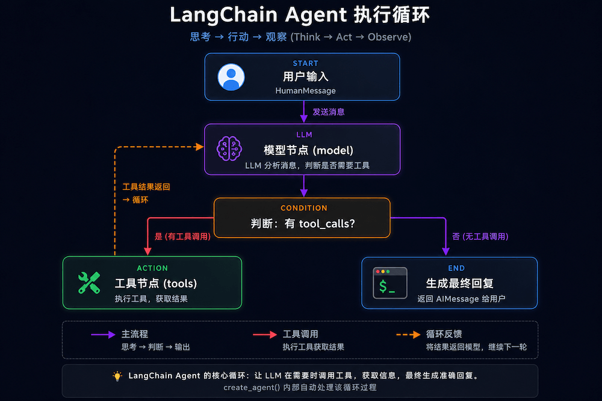

## Agent 执行流程解析

上面这个例子的完整执行过程如下：

1. 用户发送消息："杭州今天天气怎么样？"
2. 模型收到消息后判断：需要查询天气 → 返回一个 tool_call（调用 get_weather，参数 city="杭州"）
3. Agent 执行 get_weather 工具 → 返回 "晴，25°C，湿度 60%"
4. 模型收到工具结果 → 判断任务完成 → 生成最终回复

这就是 Agent 的 **思考-行动-观察** 循环。

